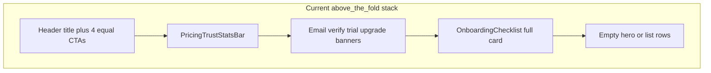
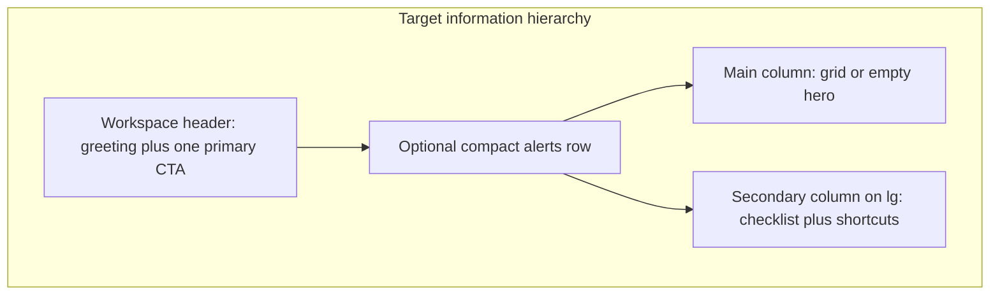

# Dashboard UX replan (My Resumes)

## Problem diagnosis

The current hub in [`src/app/dashboard/page.tsx`](src/app/dashboard/page.tsx) stacks **marketing trust stats**, **system banners**, **Getting started**, and **empty-state hero** before any real workspace content. The screenshot matches a **new-user, zero-resume** state where instructional UI dominates and the page reads like onboarding copy, not a resume workspace.

**Structural issues visible in code:**

- **Duplicate welcome**: layout `subtitle` (`Welcome, …`) plus a separate welcome card when `resumes.length > 0` ([`page.tsx` ~288–298](src/app/dashboard/page.tsx)).
- **Marketing inside the app**: [`PricingTrustStatsBar`](src/components/pricing/payment-value-sections.tsx) (`variant="inline"`) sits above product work on every visit.
- **Monolithic page**: empty state, banners, list rows, and header actions live in one ~500-line client component; no reusable resume card/grid.
- **List-first library**: rows use a generic `FileText` tile and text metadata only—no template preview, completion signal, or scannable grid ([`page.tsx` ~384–469](src/app/dashboard/page.tsx)).
- **Checklist weight**: [`OnboardingChecklist`](src/components/dashboard/onboarding-checklist.tsx) is a full card with four long rows; export step still links to `/pricing` instead of export in-editor.
- **Action clutter**: four header buttons compete at similar visual weight ([`page.tsx` ~134–165](src/app/dashboard/page.tsx)).

**Already in good shape (keep, don’t regress):** list error + retry, duplicate/delete toasts, import modal, dismissible checklist backed by [`/api/user/onboarding-status`](src/app/api/user/onboarding-status/route.ts) and [`src/lib/onboarding.ts`](src/lib/onboarding.ts).

---

## Target experience

**One mental model:** “My resume workspace” — see documents first, guidance second, upgrades third.

| State           | Above the fold                               | Main column                                            | Secondary (desktop)                    |
| --------------- | -------------------------------------------- | ------------------------------------------------------ | -------------------------------------- |
| **No resumes**  | Short personalized hero + single primary CTA | Aspirational empty panel (create / import / templates) | Compact 4-step checklist (collapsible) |
| **Has resumes** | “N resumes” summary + Create / Import        | **Visual grid** of resume cards                        | Next steps + optional Pro nudge        |

**Library layout (your choice): visual grid** — reuse preview patterns from [`src/app/templates/page.tsx`](src/app/templates/page.tsx) (`TemplateThumbnail` + [`ResumePreview`](src/components/resume-builder/resume-preview.tsx)), not the generic list row.

---

## Information architecture changes

### 1. Workspace header (layout + page)

Evolve [`UserDashboardLayout`](src/components/user-dashboard-layout.tsx) only as needed:

- Support an optional **description** slot or `eyebrow` under the title (e.g. “Built for Indian job seekers”) so the trust strip is not a separate full-width band.
- Keep `max-w-6xl` and app header from [`SiteHeader`](src/components/site-header.tsx) (`variant="app"`, `navVariant="dashboard"`).

In [`page.tsx`](src/app/dashboard/page.tsx):

- **Primary action:** `+ Create Resume` (solid).
- **Secondary:** `Import` (outline + icon).
- **Tertiary:** overflow menu or “More” for Cover Letters; Pro upgrade as a **text link or slim chip** when `!isPro`, not a second full-width outline button.
- Drop redundant “Welcome, …” from `subtitle` when a richer hero or summary exists.

### 2. Collapse the banner stack

- **Trust stats:** show **once** for new/empty users (inline in hero or a single slim strip); hide after first resume or after checklist dismissed. Do not repeat on every authenticated visit.
- **System alerts** (email verify, trial timer, impersonation, upgraded): render in one **alerts stack** with consistent `role="status"` / `role="alert"` styling; cap visible height (e.g. show highest-priority only + “View all” if multiple).
- **Remove** the extra welcome gradient card when resumes exist; replace with a one-line summary in the header region.

### 3. Onboarding checklist as companion, not centerpiece

Refactor [`onboarding-checklist.tsx`](src/components/dashboard/onboarding-checklist.tsx):

- **Desktop:** right column (~320px) beside grid/empty hero; **mobile:** collapsible “Getting started” below hero.
- Visual **progress bar** + step pills; shorten hint copy; keep auto-completion from existing API.
- Fix **Export** step `href` to open the first resume editor export flow (or pricing only when export is locked), aligned with [`buildSteps`](src/components/dashboard/onboarding-checklist.tsx).
- Surface **toast on dismiss failure** (failed PATCH today is silent).

### 4. Empty state = workspace invitation

Replace the current “card below checklist” pattern with a **single hero** in the main column:

- Headline tied to outcome (“Your first ATS-ready resume in under 5 minutes”).
- Two CTAs: Create / Import; tertiary “Browse templates” as text link.
- Optional subtle template mosaic (static or 2–3 `ResumePreview` thumbs) using existing template catalog fetch pattern from templates page—**no new asset pipeline**.

### 5. Visual resume grid

Extract components under [`src/components/dashboard/`](src/components/dashboard/):

| Component                        | Responsibility                                                             |
| -------------------------------- | -------------------------------------------------------------------------- |
| `dashboard-workspace-header.tsx` | Title, summary, primary/secondary actions                                  |
| `dashboard-alerts.tsx`           | Verify email, trial, upgraded, impersonation                               |
| `resume-library-grid.tsx`        | Responsive grid (`1` / `2` / `3` cols)                                     |
| `resume-library-card.tsx`        | Preview, title, template badge, updated time, completion, exports, actions |
| `dashboard-empty-state.tsx`      | First-visit hero                                                           |
| `dashboard-next-steps.tsx`       | ATS / cover letter / jobs chips when library non-empty                     |

**Card content (v1, minimal API change):**

- Preview from `templateId` + demo/placeholder sections (same approach as template picker). Optional **phase 2:** extend [`GET /api/resumes`](src/app/api/resumes/route.ts) with `progressPercent` (server-side `computeResumeProgress` from stored content) for a ring or label—only if grid feels too generic without it.
- Metadata: title, `getTemplateDisplayName`, `formatDistanceToNow`, export count from existing `_count.exportLogs`.
- Actions: Edit (whole card click), Duplicate, overflow Delete (keep [`ConfirmDialog`](src/components/ui/confirm-dialog.tsx)); preserve keyboard focus and `aria-label`s on icon buttons.

**Loading:** skeleton grid (pulse cards) modeled on [`src/app/jobs/page.tsx`](src/app/jobs/page.tsx), not a full-page “Loading resumes…” panel when session is already known.

---

## Visual and UX standards

Apply project tokens from [`tailwind.config.ts`](tailwind.config.ts) and [`src/app/globals.css`](src/app/globals.css): Poppins/Inter, `primary-*`, `rounded-xl`/`rounded-2xl`, 44px touch targets, dark mode parity.

- **Hierarchy:** one saturated CTA per viewport; secondary actions use border/outline.
- **Density:** more whitespace **between** regions, less **repeated** bordered cards.
- **Motion:** 150–200ms hover lift on grid cards; `prefers-reduced-motion` respected.
- **Accessibility:** skip link stays; grid cards are focusable links; overflow menus need Escape / focus trap consistent with existing patterns.

**Reference pages to mirror (app chrome, not marketing):** [`src/app/jobs/page.tsx`](src/app/jobs/page.tsx) (tabs, skeletons, card grid), [`src/components/settings/settings-content.tsx`](src/components/settings/settings-content.tsx) (section cards), [`src/app/interview-prep/page.tsx`](src/app/interview-prep/page.tsx) (roadmap + checklist density).

---

## Scope boundaries

- **In scope:** `/dashboard` UI/IA, small dashboard components, optional slim extension to resume list API for progress, checklist link/copy fixes.
- **Out of scope (separate tracks):** [`resume_link_phase2b.plan.md`](.cursor/plans/resume_link_phase2b.plan.md) view counts, global `UserDashboardLayout` redesign for all app routes, megamenu IA ([`megamenu_ia_and_build_ecde40f2.plan.md`](.cursor/plans/megamenu_ia_and_build_ecde40f2.plan.md)), admin cockpit.
- **Deploy:** commit and push to Git for Vercel; no local `npm run dev` per project rules.

---

## Implementation phases

### Phase A — Extract and re-order (no visual grid yet)

- Split [`page.tsx`](src/app/dashboard/page.tsx) into the components above; wire props from existing hooks (`useSession`, `useSubscription`, `useTrialTimer`, fetch state).
- Implement alerts stack + header action hierarchy; remove duplicate welcome; gate trust strip.
- Desktop two-column shell: main + checklist sidebar.

### Phase B — Visual grid + empty hero

- Implement `resume-library-grid` / `resume-library-card` with template previews.
- Replace list `<ul>` with grid; mobile remains single column of large cards.
- Empty-state hero in main column; checklist in sidebar/collapse.

### Phase C — Polish and correctness

- Skeleton loading; single loading story (avoid session + list double spinners).
- Checklist export deep link; dismiss error toast; clear `openImport` query on modal close (parity with `upgraded`).
- Row/menu a11y pass on card actions.

### Phase D — Optional data enrichment

- If cards need “% complete”, add `progressPercent` (and optionally `primaryColor`) to list API select; compute with [`computeResumeProgress`](src/lib/resume-utils.ts) server-side.

---

## Acceptance criteria

- First visit (0 resumes): user sees **one** clear primary CTA and a short hero before scrolling; checklist is visible but **not** the dominant full-width block.
- Returning user (1+ resumes): **grid of preview cards** is the focal content within the first screen on desktop; no redundant welcome card.
- Header shows **at most two** always-visible actions + overflow; Pro pitch is secondary.
- Trust/marketing strip does not appear on every visit once the user has a resume or dismissed onboarding.
- Duplicate/delete/import/create behaviors unchanged; failures still surfaced via toast or retry.
- Responsive: usable grid on tablet; checklist collapses on small viewports.
- No new routes; `/dashboard` remains the hub per [`project_blueprint.plan.md`](.cursor/plans/project_blueprint.plan.md).

---

## Verification (post-implementation)

- Manual pass: signed-in **empty**, **one resume**, **multiple resumes**; trial vs full account; `!isPro` upgrade chip; email-unverified banner.
- Keyboard: tab through header, cards, overflow, dismiss checklist.
- Deploy preview on Vercel after push; spot-check against the screenshot scenario.
