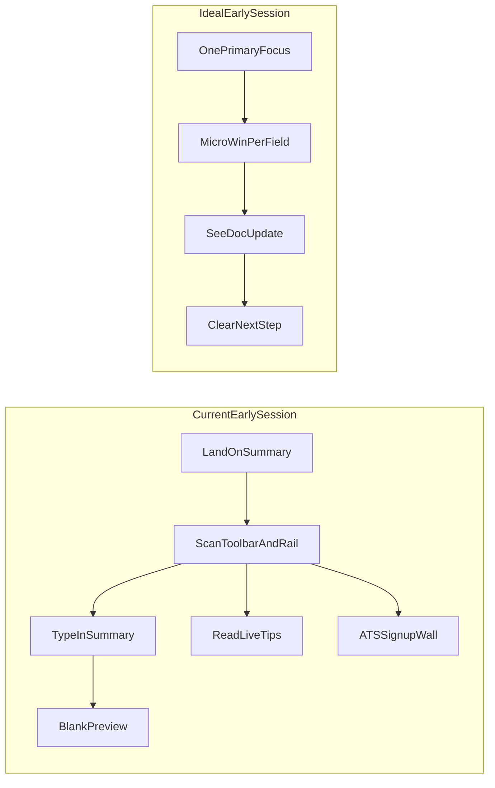

# Resume builder dashboard — UI/UX and usage-friendliness assessment

**Scope:** Authenticated resume editor at [`src/app/resumes/[id]/edit/page.tsx`](src/app/resumes/[id]/edit/page.tsx) (toolbar, left editor column, right coaching + preview rail). Screenshot state: trial user on **Summary**, **0% complete**, empty preview, stacked coaching panels, global app header visible.

**Method:** Nielsen-style heuristics, progressive-disclosure review, engagement-loop mapping (motivation → action → feedback → next step), and code-backed behavior from [`step-wizard.tsx`](src/components/resume-builder/step-wizard.tsx), [`live-feedback-panel.tsx`](src/components/resume-builder/live-feedback-panel.tsx), [`ats-score-panel.tsx`](src/components/resume-builder/ats-score-panel.tsx), [`summary-editor.tsx`](src/components/resume-builder/sections/summary-editor.tsx), [`add-section.tsx`](src/components/resume-builder/add-section.tsx), [`job-paste-panel.tsx`](src/components/resume-builder/job-paste-panel.tsx), and [`resume-utils.ts`](src/lib/resume-utils.ts) (`computeResumeProgress`).

**Severity key:** P0 = blocks trust or completion; P1 = high friction / weak engagement; P2 = polish and delight.

---

## Executive summary

The builder delivers a credible Zety-style split layout: autosave, live preview, coaching rail, and rich section tooling. For a first-time or trial user on an early Summary step, **progress signals disagree** (stepper highlights Summary while **0% complete** stays flat), the **toolbar is overcrowded**, the **right rail competes with writing**, and **preview gives little payoff** when the draft is empty. Coaching is useful but **not wired to fields** (no jump-to-section, no `?panel=ats` from onboarding). Tier and trial copy appear in many places without a single “what you can do now” story.

**Top fixes (highest ROI):** (1) align stepper, % complete, and field-level completion; (2) one **next-step orchestrator** instead of parallel Quick start, stepper, and rail tips; (3) **Write vs Review** modes so export, tailoring, and coaching defer until basics exist; (4) preview-first rail with editor↔preview section coupling; (5) actionable coaching (scroll/focus, `?panel=` deep links); (6) visual grouping so the canvas reads as the hero and chrome stays quiet.

---

## Engagement flow (current vs ideal)

---

## 1. Global app header and page context

| Item                   | Observation                                                                                                          | Gap                                                                                                                              | Improvement                                                                                                                               | Priority |
| ---------------------- | -------------------------------------------------------------------------------------------------------------------- | -------------------------------------------------------------------------------------------------------------------------------- | ----------------------------------------------------------------------------------------------------------------------------------------- | -------- |
| Dual navigation layers | [`SiteHeader`](src/components/site-header.tsx) (Product, Templates, Solutions, …) sits above editor-specific chrome. | Competing IA: marketing nav vs build task; trial badge + megamenu draw attention from the draft.                                 | Editor mode: slimmer header (logo, dashboard, account) or collapse marketing items behind “Menu”; keep trial/time in editor toolbar only. | P1       |
| Wayfinding             | “← Dashboard” in sticky toolbar.                                                                                     | No breadcrumb for resume title; returning users may not know which doc is open until they find the title field in a crowded bar. | `Dashboard / {title}` with editable title in one zone; truncate on small screens.                                                         | P2       |
| Skip link              | Skip to `#resume-editor-main` exists.                                                                                | Focus order still crosses full marketing header before editor.                                                                   | Second skip: “Skip to first empty section” or “Skip to preview”.                                                                          | P2       |

---

## 2. Sticky editor toolbar (density and scan)

| Item                     | Observation                                                                                                                                                                                                                 | Gap                                                                                                                    | Improvement                                                                                                                                          | Priority |
| ------------------------ | --------------------------------------------------------------------------------------------------------------------------------------------------------------------------------------------------------------------------- | ---------------------------------------------------------------------------------------------------------------------- | ---------------------------------------------------------------------------------------------------------------------------------------------------- | -------- |
| Horizontal density       | One row packs back link, trial timer, % complete, stepper, recruiter hint, title, template, customize, AI quota, cover letter, share, export, save status ([`edit/page.tsx`](src/app/resumes/[id]/edit/page.tsx) ~191–461). | Horizontal scroll on mid widths; low-priority items (recruiter hint, AI chip) crowd primary actions.                   | Two-row toolbar: **Row 1** wayfinding + title + save; **Row 2** template/customize + export/share; move hint to coaching rail.                       | P1       |
| Primary action hierarchy | Export/share sit right; writing is center-left.                                                                                                                                                                             | Export before content exists (screenshot: empty doc) feels premature; trial watermark reinforces paywall before value. | Gate export emphasis until Contact+Experience thresholds; “Continue building” primary until ~30% [`computeResumeProgress`](src/lib/resume-utils.ts). | P1       |
| Recruiter hint           | Static “~7 seconds” copy in toolbar.                                                                                                                                                                                        | Not actionable; adds noise during typing.                                                                              | One-time coach tip tied to Review step or first preview scroll.                                                                                      | P2       |
| Template picker          | Text list dropdown, no thumbnails.                                                                                                                                                                                          | Weak visual choice; Pro lock shows hint text easy to miss.                                                             | Thumbnail grid + lock badge; keep selection in preview sync.                                                                                         | P2       |
| Customize template       | Popover: color, font, size, spacing, India dates, Resume/CV.                                                                                                                                                                | Powerful but buried next to template name; no live “reset” summary.                                                    | “Design” drawer with preview highlight; disable until first contact line exists (optional).                                                          | P2       |

---

## 3. Progress, completion %, and stepper

| Item                  | Observation                                                                                                                                                                                                                | Gap                                                                                      | Improvement                                                                                            | Priority |
| --------------------- | -------------------------------------------------------------------------------------------------------------------------------------------------------------------------------------------------------------------------- | ---------------------------------------------------------------------------------------- | ------------------------------------------------------------------------------------------------------ | -------- |
| % complete vs stepper | `computeResumeProgress` weights sections present and “filled” (e.g. summary needs **≥50 chars**). [`StepWizard`](src/components/resume-builder/step-wizard.tsx) uses similar rules but **active step** = first incomplete. | Screenshot: Summary active but **0%** — user sees stagnation despite being “on” Summary. | Show **step progress** (“Summary 12/50 characters”) and/or **section chips** separate from document %. | P0       |
| Stepper interactivity | Chips are **read-only** (no click, no `aria-current`).                                                                                                                                                                     | Users treat it as navigation; click does nothing → broken mental model.                  | Click scrolls to section; keyboard roving tabindex; `aria-current="step"`.                             | P0       |
| Review step           | “Review” completes when contact + experience done; summary/skills optional.                                                                                                                                                | Label “Review” overpromises vs actual gate.                                              | Rename “Export-ready” or show checklist inside Review.                                                 | P1       |
| Completion thresholds | 50-char summary for “filled” may be unknown while placeholder is short.                                                                                                                                                    | Users think any text counts; % and tips feel arbitrary.                                  | Inline meter under textarea; live tips cite the rule once.                                             | P1       |
| Onboarding handoff    | Dashboard checklist links `?panel=ats` ([`onboarding-checklist.tsx`](src/components/dashboard/onboarding-checklist.tsx)); edit page **ignores** query.                                                                     | Broken deep link; engagement drop after checklist.                                       | Parse `panel=ats`, `tips`, or `tailor`; expand panel and focus control.                                | P1       |

---

## 4. Autosave and trust

| Item            | Observation                                                                                                     | Gap                                                                                                    | Improvement                                                                          | Priority |
| --------------- | --------------------------------------------------------------------------------------------------------------- | ------------------------------------------------------------------------------------------------------ | ------------------------------------------------------------------------------------ | -------- |
| Save visibility | States: Auto-save on / Saving / Saved / error + Retry ([`use-resume`](src/hooks/use-resume.ts) debounce ~2.5s). | “Auto-save on” while idle is weak reassurance; error copy is good but easy to miss in crowded toolbar. | Persistent subtle icon + last-saved time; toast on error.                            | P1       |
| Leave page      | Debounced PATCH may lag navigation.                                                                             | Risk of lost edits (called out in UX audit).                                                           | `beforeunload` + flush on route change; “Saving…” block on Dashboard link until ACK. | P0       |
| Trial expiry    | Full-screen modal then read-only overlay + bottom bar.                                                          | Hard stop may feel punitive mid-flow.                                                                  | Auto-save draft + email capture; soften to non-blocking banner with countdown.       | P1       |

---

## 5. Left column — job tailoring (`JobPastePanel`)

| Item              | Observation                                   | Gap                                                                | Improvement                                                         | Priority |
| ----------------- | --------------------------------------------- | ------------------------------------------------------------------ | ------------------------------------------------------------------- | -------- |
| Placement         | Collapsed “Tailor for job” above Quick start. | Advanced feature before basics; expands cognitive load on day one. | Hide until Contact exists or after first session; badge “Optional”. | P1       |
| Discoverability   | Chevron expand only.                          | Users on Summary may not connect tailoring to summary keywords.    | After Summary focus, one-line “Have a JD?” with expand.             | P2       |
| AI quota coupling | Shares daily AI limits with summary improve.  | Unclear which actions consume quota before click.                  | Per-action cost label (“Uses 1 AI action”).                         | P1       |
| Success loop      | Match/tailor results can apply suggestions.   | No celebratory tie to preview or ATS.                              | After apply: scroll preview + refresh live tips.                    | P2       |

---

## 6. Quick start and empty editor

| Item                     | Observation                                                | Gap                                                                       | Improvement                                                                                                                                     | Priority |
| ------------------------ | ---------------------------------------------------------- | ------------------------------------------------------------------------- | ----------------------------------------------------------------------------------------------------------------------------------------------- | -------- |
| Quick start card         | Shown when progress &lt;30%, &lt;4 sections, not imported. | Text-only; does not **add** Contact/Summary/Experience.                   | CTA buttons: “Add Contact”, “Add Summary” (respect unique-section rules in [`add-section.tsx`](src/components/resume-builder/add-section.tsx)). | P0       |
| Section list empty state | No dedicated empty list UI beyond Quick start.             | User with wrong section order sees only Summary card.                     | If Contact missing, inline warning on Summary card.                                                                                             | P1       |
| Imported path            | Violet callout when `importSource` set.                    | Good; Quick start hidden — ensure import users still get “next fix” tips. | Import-specific checklist (fix dates, trim length).                                                                                             | P2       |

---

## 7. Section cards, reorder, remove

| Item           | Observation                                                                                              | Gap                                                                                                        | Improvement                                                         | Priority |
| -------------- | -------------------------------------------------------------------------------------------------------- | ---------------------------------------------------------------------------------------------------------- | ------------------------------------------------------------------- | -------- |
| Card chrome    | [`SortableSection`](src/components/resume-builder/sortable-section.tsx): drag handle on full header row. | Drag handle lacks accessible name; entire header is grab target — accidental drags while aiming for label. | Dedicated handle control + `aria-label`; label not draggable.       | P1       |
| Remove section | “Remove section” as destructive text link.                                                               | No confirm; easy mis-tap; no undo.                                                                         | Confirm modal or undo toast; safer on mobile.                       | P1       |
| Section focus  | Single column lists all sections.                                                                        | Long scroll; stepper does not scroll into view.                                                            | “Jump to section” from stepper / live tips `(section)` suffix.      | P1       |
| Add section    | Rich grouped picker with descriptions.                                                                   | Opens upward overlay; on small viewports may cover active field.                                           | Sheet on mobile; after add, scroll to new card + focus first input. | P2       |

---

## 8. Field-level — Summary (representative micro-UX)

| Item                  | Observation                                                                                                                       | Gap                                                                                  | Improvement                                                                                                   | Priority |
| --------------------- | --------------------------------------------------------------------------------------------------------------------------------- | ------------------------------------------------------------------------------------ | ------------------------------------------------------------------------------------------------------------- | -------- |
| Label and placeholder | “Professional Summary” + generic placeholder ([`summary-editor.tsx`](src/components/resume-builder/sections/summary-editor.tsx)). | No India/fresher vs experienced branching (objective exists but not suggested here). | If no experience section: suggest Career Objective from add-section.                                          | P1       |
| Tips                  | Lightbulb toggles manual tips list.                                                                                               | Separate from Live tips rail — duplicate coaching channels.                          | Merge: rail tip clicks open field tips; dedupe messages from [`computeLiveFeedback`](src/lib/ats-checker.ts). | P1       |
| Improve with AI       | Shown only when text non-empty.                                                                                                   | Empty state: no AI assist to **draft** summary (only improve).                       | “Draft with AI” from role/title or job panel output.                                                          | P1       |
| Character feedback    | No visible counter toward 50-char completion.                                                                                     | Micro-engagement loop missing.                                                       | Counter + soft color at 50/80 words per manual tips.                                                          | P1       |
| Textarea sizing       | `rows={4}`.                                                                                                                       | Long summaries cramped; preview may jump.                                            | Auto-grow; max-height with scroll.                                                                            | P2       |

---

## 9. Right rail — information architecture

| Item            | Observation                                                                       | Gap                                                                                                                         | Improvement                                                                                         | Priority |
| --------------- | --------------------------------------------------------------------------------- | --------------------------------------------------------------------------------------------------------------------------- | --------------------------------------------------------------------------------------------------- | -------- |
| Stack order     | Live tips → ATS → India tips → Preview (desktop).                                 | Coaching **above** preview contradicts “see document while typing”; screenshot shows text-heavy stack before blank preview. | Default: **Preview top** (sticky mini), coaching collapsible below; or tabs: Preview / Coach / ATS. | P0       |
| Mobile          | “Coaching & ATS tools” toggle hides rail until opened.                            | Preview may be below fold; user may never open coaching.                                                                    | Sticky bottom preview thumb; coaching in sheet.                                                     | P1       |
| Upsell density  | Live tips footer + ATS trial wall + preview watermark + toolbar AI/pricing links. | Repeated pricing narrative → fatigue and distrust.                                                                          | Single **entitlements strip** (trial): what works today vs after signup.                            | P1       |
| Sticky behavior | `sticky top-4` on rail inner wrapper.                                             | Tall stack scrolls inside narrow column — preview fights for height.                                                        | Split scroll: preview fixed height viewport, coach scrolls independently.                           | P2       |

---

## 10. Live tips panel

| Item           | Observation                                             | Gap                                                                | Improvement                                                        | Priority |
| -------------- | ------------------------------------------------------- | ------------------------------------------------------------------ | ------------------------------------------------------------------ | -------- |
| Content        | Badge count + bullet list; section name in parentheses. | Tips not clickable; no link to fix in editor.                      | `button` per tip → scroll + focus field; mark resolved when fixed. | P0       |
| Empty state    | “Looking good!” when no tips.                           | Early session still has structural gaps but may not fire tips yet. | Distinguish “no issues” vs “not enough content to analyze”.        | P1       |
| Collapse       | `aria-expanded` on header button.                       | Good pattern; default expanded adds noise.                         | Remember collapse per resume in `localStorage`.                    | P2       |
| Non-Pro footer | Portal-ready PDF/Word + pricing link.                   | Long legalistic sentence in coaching area.                         | Short line + “What’s included in trial”.                           | P2       |

---

## 11. ATS checker panel

| Item           | Observation                                                                                           | Gap                                                                              | Improvement                                                                   | Priority |
| -------------- | ----------------------------------------------------------------------------------------------------- | -------------------------------------------------------------------------------- | ----------------------------------------------------------------------------- | -------- |
| Trial gate     | [`AtsScorePanel`](src/components/resume-builder/ats-score-panel.tsx): signup CTA when `trialBlocked`. | Blocks core promise before user invests in content; overlaps Live tips warnings. | Allow **read-only heuristic score** without account; full check after signup. | P1       |
| Basic teaser   | One check per resume on Basic.                                                                        | User may burn check on empty draft.                                              | Disable until minimum sections filled; explain why.                           | P1       |
| Pro auto-run   | Fetches on mount for Pro.                                                                             | Good for power users; ensure loading skeleton does not shift preview.            | Inline skeleton consistent height.                                            | P2       |
| Result actions | Suggestions list (when present).                                                                      | Same as live tips — no jump-to-fix.                                              | Unified suggestion component with deep links.                                 | P1       |

---

## 12. India job portals tips

| Item    | Observation                                                                         | Gap                                                       | Improvement                                            | Priority |
| ------- | ----------------------------------------------------------------------------------- | --------------------------------------------------------- | ------------------------------------------------------ | -------- |
| Panel   | Collapsible [`IndiaTipsPanel`](src/components/resume-builder/india-tips-panel.tsx). | Third coaching module; low urgency on first Summary pass. | Collapse by default until Experience or export intent. | P2       |
| Context | Generic India guidance.                                                             | Not tied to template meta (date format set in customize). | Cross-link when user picks MM/YYYY vs DD/MM/YYYY.      | P2       |

---

## 13. Live preview

| Item           | Observation                                        | Gap                                                             | Improvement                                                      | Priority |
| -------------- | -------------------------------------------------- | --------------------------------------------------------------- | ---------------------------------------------------------------- | -------- |
| Empty document | `ResumePreview` scaled `0.85` with empty sections. | Screenshot: large white area — weak reward loop while typing.   | Template skeleton with ghost lines; pulse on first character.    | P0       |
| Watermark      | “Upgrade to export” diagonal for non-Pro/trial.    | Obscures reading the layout; feels punitive during exploration. | Watermark only on export hover or bottom chip; preview readable. | P1       |
| Sync feedback  | Preview updates with content (expected).           | No explicit “updated” cue when user is focused left.            | Subtle flash or “Preview updated” once per debounce.             | P2       |
| Zoom           | Fixed scale.                                       | Small type on laptop; no user zoom.                             | Zoom control or fit-to-width toggle.                             | P2       |

---

## 14. Tier, trial, and monetization UX

| Item          | Observation                                                                                       | Gap                                                          | Improvement                                          | Priority |
| ------------- | ------------------------------------------------------------------------------------------------- | ------------------------------------------------------------ | ---------------------------------------------------- | -------- |
| Trial timer   | Shown in toolbar when `isTrial`.                                                                  | Anxiety without pairing to saved value (“3 sections saved”). | Pair countdown with autosave + signup benefit.       | P1       |
| Share         | Disabled on trial ([`ShareResumeButton`](src/components/resume-builder/share-resume-button.tsx)). | User may not discover why button disabled.                   | Tooltip: “Sign up to share link”.                    | P2       |
| Export        | Gated by Pro/pack/trial rules.                                                                    | Competes with toolbar before draft ready.                    | Progressive: TXT preview early; PDF after threshold. | P1       |
| AI quota chip | “0/5 used · Higher limit on Pro”.                                                                 | Good transparency; still adds toolbar noise.                 | Move to job/AI actions contextually.                 | P2       |

---

## 15. Accessibility and input modalities

| Item           | Observation                      | Gap                                                                             | Improvement                                 | Priority |
| -------------- | -------------------------------- | ------------------------------------------------------------------------------- | ------------------------------------------- | -------- |
| Keyboard       | Skip link + `main` focusable.    | Stepper, template/customize toggles missing `aria-expanded`; drag-only reorder. | Full keyboard reorder (move up/down).       | P1       |
| Color          | Status via green/amber/red text. | Not sole signal — mostly paired with labels (OK).                               | Ensure save error uses icon + text.         | P2       |
| Touch          | Grab handles small target.       | Hard on mobile.                                                                 | Larger touch target; optional reorder mode. | P1       |
| Screen readers | Live tips list is static text.   | Tips not announced on change.                                                   | `aria-live="polite"` on tip count changes.  | P2       |

---

## 16. Performance and perceived responsiveness

| Item              | Observation                               | Gap                                        | Improvement                                      | Priority |
| ----------------- | ----------------------------------------- | ------------------------------------------ | ------------------------------------------------ | -------- |
| Autosave debounce | 2.5s delay.                               | Preview/tips may feel laggy vs keystrokes. | Optimistic local preview; debounce network only. | P2       |
| Coaching compute  | `computeLiveFeedback` on section changes. | Usually fine; watch with large imports.    | Memoize per section id.                          | P2       |
| ATS fetch         | Network on Pro mount.                     | Can contend with resume load.              | Lazy-load when panel visible.                    | P2       |

---

## 17. Cross-surface consistency (dashboard → editor)

| Item          | Observation                                                                                                                                  | Gap                                                                                 | Improvement                                                | Priority |
| ------------- | -------------------------------------------------------------------------------------------------------------------------------------------- | ----------------------------------------------------------------------------------- | ---------------------------------------------------------- | -------- |
| Dashboard hub | Replan pending ([`dashboard_ux_replan_f1dfcb7c.plan.md`](.cursor/plans/dashboard_ux_replan_f1dfcb7c.plan.md)): list-first, heavy onboarding. | Editor expects user to self-navigate sections; dashboard does not pass “next step”. | Resume card shows same % and “Continue Summary” deep link. | P1       |
| Cover letter  | Toolbar link to new cover letter.                                                                                                            | Side quest during first resume.                                                     | De-emphasize until Review or dashboard.                    | P2       |

---

## 18. Logical workflow and task sequencing

| Item                   | Observation                                                                                                                 | Gap                                                                                          | Improvement                                                                                                                                                                              | Priority |
| ---------------------- | --------------------------------------------------------------------------------------------------------------------------- | -------------------------------------------------------------------------------------------- | ---------------------------------------------------------------------------------------------------------------------------------------------------------------------------------------- | -------- |
| Parallel guidance      | Quick start, stepper, live tips, ATS, and job tailor can all surface at once.                                               | No single source of truth for “what now”; users scan instead of act.                         | **Next-step orchestrator** from shared rules in [`resume-utils.ts`](src/lib/resume-utils.ts) / [`ats-checker.ts`](src/lib/ats-checker.ts); demote other prompts until dismissed or done. | P0       |
| Write vs Review        | All tools visible in one session.                                                                                           | Advanced actions (export, share, cover letter, full ATS) appear before the draft earns them. | **Write mode** (Contact → Experience core) vs **Review mode** (coach, tailor, export); auto-switch near export-ready threshold.                                                          | P1       |
| Section order logic    | Users can add Summary before Contact ([`add-section.tsx`](src/components/resume-builder/add-section.tsx) allows any order). | Preview and ATS expect header identity first; cognitive mismatch.                            | Soft gate: warn on Summary without Contact; optional “Recommended order” when reordering.                                                                                                | P1       |
| Fresher vs experienced | Summary and Objective are separate types with hints in add-section only.                                                    | Wrong narrative block for career stage; extra decision fatigue.                              | First-session branch: fresher → Objective path; experienced → Summary; one-tap switch with copy.                                                                                         | P1       |
| Completion gates       | Export/share/cover letter live in toolbar regardless of fill state.                                                         | Users attempt export on empty docs; errors feel like product failure.                        | Disable with reason + link to next empty section until minimum gate (Contact + one role block).                                                                                          | P1       |
| Session continuity     | Reload returns to top of section list.                                                                                      | Long resumes lose scroll position and active section.                                        | Persist `activeSectionId` + scroll in session storage per resume id.                                                                                                                     | P2       |
| Undo / safety          | AI improve and remove-section are one-way ([`section-editor.tsx`](src/components/resume-builder/section-editor.tsx)).       | Fear of AI or mis-tap blocks experimentation.                                                | Undo toast for AI and remove; optional diff before apply for job tailor.                                                                                                                 | P2       |
| Intent handoff         | Dashboard onboarding and editor use different progress signals.                                                             | Hub “continue” does not match editor step.                                                   | Shared `progressPercent` + deep link `?section=summary` from dashboard cards.                                                                                                            | P1       |

---

## 19. Visual hierarchy, layout rhythm, and design system

| Item               | Observation                                                                                                                                               | Gap                                                                      | Improvement                                                                                                 | Priority |
| ------------------ | --------------------------------------------------------------------------------------------------------------------------------------------------------- | ------------------------------------------------------------------------ | ----------------------------------------------------------------------------------------------------------- | -------- |
| Canvas vs chrome   | Editor column `max-w-2xl` on `bg-slate-50`; cards are white; rail is `bg-slate-100`.                                                                      | Page feels like three competing surfaces; hero column does not dominate. | **Canvas** treatment: slightly elevated editor column; flatter chrome; reduce rail saturation until Review. | P1       |
| Toolbar vs content | Sticky toolbar uses heavy shadow and full marketing header above.                                                                                         | Double chrome consumes vertical space before first field.                | Editor shell variant: single sticky band; lighter shadow; more content above fold.                          | P1       |
| Active section     | All [`SortableSection`](src/components/resume-builder/sortable-section.tsx) cards share identical border.                                                 | Hard to see what you are editing in a long stack.                        | Active card: ring + left accent; collapse completed sections to summary row.                                | P1       |
| Typography scale   | Form labels `text-sm`; preview uses template typography at `scale-[0.85]`.                                                                                | WYSIWYG trust gap; preview feels like a thumbnail not a document.        | Match preview scale to readable minimum; optional “Actual size” toggle.                                     | P1       |
| Icon language      | Add-section uses Unicode glyphs; panels use Lucide; preview uses Unicode map in [`resume-preview.tsx`](src/components/resume-builder/resume-preview.tsx). | Inconsistent iconography reads as unpolished.                            | One icon set for section types across add, cards, and preview.                                              | P2       |
| Semantic color     | Quick start primary, import violet, tips amber, errors red, trial amber, coaching green.                                                                  | Many alert colors at once; nothing feels calm.                           | Reserve amber/red for blocking issues; use neutral coaching for informational tips.                         | P1       |
| Density            | Toolbar `flex-nowrap` + `overflow-x-auto`; rail stacks four modules.                                                                                      | Screenshot: information banding without focal point.                     | Vertical rhythm tokens (8px grid); max one “loud” panel per viewport height.                                | P1       |
| Dark mode          | Editor supports dark; preview paper is often light-on-light in rail.                                                                                      | Night users get bright preview slab with low contrast chrome.            | Preview “paper” surface token; rail matches document contrast.                                              | P2       |
| Focus visibility   | Inputs use `focus:ring-primary-500`; stepper and template toggles lack expanded state styling.                                                            | Keyboard users lose position in dense toolbar.                           | Consistent focus ring + `aria-expanded` styles on all popovers.                                             | P1       |

---

## 20. Spatial layout and responsive behavior

| Item              | Observation                                                            | Gap                                                               | Improvement                                                                      | Priority |
| ----------------- | ---------------------------------------------------------------------- | ----------------------------------------------------------------- | -------------------------------------------------------------------------------- | -------- |
| Breakpoint flip   | `lg:flex-row` splits editor and rail.                                  | Near-lg widths: cramped rail or hidden coaching without guidance. | `md` preview dock (bottom sheet) before side rail; breakpoint QA matrix.         | P1       |
| Sticky offsets    | Toolbar `top-16` under [`SiteHeader`](src/components/site-header.tsx). | Jump on scroll when header height changes (trial badge, wrap).    | CSS variables for header + toolbar height; `scroll-margin-top` on section cards. | P2       |
| Preview viewport  | Preview in scrollable rail without fixed aspect.                       | Empty preview reads as broken whitespace (screenshot).            | Fixed aspect “page” frame + skeleton; min-height so layout does not jump.        | P0       |
| Mobile thumb zone | Primary inputs center-left; coaching toggle top of rail column.        | One-handed use favors bottom actions; coaching far from thumb.    | Sticky bottom preview strip + FAB “Add section” on small screens.                | P1       |
| Horizontal scroll | Toolbar scrolls horizontally.                                          | Hides save status and export off-screen.                          | Priority collapse: overflow menu for secondary actions.                          | P1       |
| Wide screens      | `max-w-[1600px]` on toolbar; editor `max-w-2xl` centered.              | Ultra-wide: dead margins and tiny preview relative to monitor.    | Optional centered three-column: section nav / editor / preview at xl.            | P2       |

---

## 21. Experience design, micro-interactions, and emotional tone

| Item               | Observation                                          | Gap                                                  | Improvement                                                                                              | Priority |
| ------------------ | ---------------------------------------------------- | ---------------------------------------------------- | -------------------------------------------------------------------------------------------------------- | -------- |
| Milestone feedback | Progress moves only on % and stepper chips.          | No moment of accomplishment; 0% feels stuck.         | Micro-win on first field saved, section complete, and export-ready (subtle check, not gamified clutter). | P1       |
| Deficit framing    | Live tips emphasize “too short”, missing verbs, etc. | Shame tone early in session; increases abandon risk. | Pair each warning with one **next action** button; ratio of positive to corrective tips.                 | P1       |
| Typing vs coaching | Tips recompute on every section change.              | Coaching can feel like surveillance while typing.    | Defer non-critical tips to field **blur**; show “Updating tips…” only in Review.                         | P1       |
| AI trust           | “Improve with AI” overwrites summary text.           | No preview of change magnitude.                      | Inline diff or apply/reject; show quota cost before run.                                                 | P1       |
| Trial anxiety      | Countdown in toolbar without paired value.           | Clock dominates over building.                       | “Autosaved · N sections” next to timer; signup CTA tied to preserved work.                               | P1       |
| Drag affordance    | Opacity change while dragging only.                  | Easy to miss drop target on long pages.              | Drop indicator line; keyboard alternative surfaced in UI.                                                | P2       |
| Save reassurance   | Text-only save state in toolbar corner.              | Users unsure data is safe on poor networks.          | Icon + “Saved just now”; offline banner when `navigator.onLine` false.                                   | P1       |
| Motion             | Limited transition on panels.                        | Abrupt expand/collapse; no `prefers-reduced-motion`. | Short height transitions; respect reduced motion for pulse/flash cues.                                   | P2       |
| Remove section     | Red text link below fields.                          | Destructive action visually weak but always visible. | Move to card menu; confirm; undo.                                                                        | P1       |

---

## 22. Editor ↔ preview coupling (WYSIWYG logic)

| Item               | Observation                                                                                                       | Gap                                                           | Improvement                                                                    | Priority |
| ------------------ | ----------------------------------------------------------------------------------------------------------------- | ------------------------------------------------------------- | ------------------------------------------------------------------------------ | -------- |
| One-way sync       | Editor updates preview; preview is not interactive.                                                               | Users cannot validate layout by tapping the document.         | Click preview block → scroll editor to section; hover highlights block.        | P0       |
| Section visibility | Empty sections may still render structure in [`ResumePreview`](src/components/resume-builder/resume-preview.tsx). | Blank preview does not teach what will appear where.          | Ghost placeholders per template region until first content.                    | P0       |
| Template switch    | Template id changes via dropdown.                                                                                 | Sudden layout jump without explanation.                       | Brief “Layout updated” with undo; highlight moved blocks (e.g. skills column). | P2       |
| Customize feedback | Meta changes apply immediately.                                                                                   | Hard to see which control affected which preview region.      | Hover color/font chips → temporary highlight on preview heading.               | P2       |
| Page length        | No page-break or overflow hint.                                                                                   | Users discover multi-page issues only at export.              | Overflow indicator when content exceeds one page at current spacing.           | P2       |
| Initials fallback  | Preview uses `YN` when name empty.                                                                                | Looks like real content; confusing in screenshot empty state. | Neutral “Your name” placeholder styling distinct from real text.               | P1       |

---

## 23. Field-level logic beyond Summary (representative gaps)

| Item                 | Observation                                                                                            | Gap                                                                  | Improvement                                                                         | Priority |
| -------------------- | ------------------------------------------------------------------------------------------------------ | -------------------------------------------------------------------- | ----------------------------------------------------------------------------------- | -------- |
| Contact              | [`ContactEditor`](src/components/resume-builder/sections/contact-editor.tsx) fields are flat.          | No India-specific ordering (phone, city) or link validation preview. | Group “Reach you” vs “Profiles”; inline LinkedIn/GitHub validation.                 | P1       |
| Experience           | Entries with bullets and AI per bullet.                                                                | Highest cognitive load section without stepper sub-progress.         | Per-entry checklist (title, company, dates, 2 bullets); collapse completed entries. | P1       |
| Skills               | List/tag patterns vary by template variant.                                                            | Users do not know how skills render in chosen template.              | Mini preview chip row under skills editor tied to template variant.                 | P2       |
| Dates                | [`month-year-picker.tsx`](src/components/resume-builder/month-year-picker.tsx) + India format in meta. | Two sources of date truth (field vs meta).                           | Single date format indicator in Experience/Education headers.                       | P1       |
| Objective vs Summary | Both can exist; unique-section rules differ.                                                           | Duplicate narrative blocks possible if user adds both.               | Mutual exclusivity prompt when adding second narrative section.                     | P1       |
| Custom sections      | Freeform heading and body.                                                                             | ATS and tips may not reference custom content.                       | Include custom blocks in live feedback where possible.                              | P2       |

---

## 24. Coaching intelligence and content strategy

| Item           | Observation                                                                                                  | Gap                                                          | Improvement                                                                              | Priority |
| -------------- | ------------------------------------------------------------------------------------------------------------ | ------------------------------------------------------------ | ---------------------------------------------------------------------------------------- | -------- |
| Tip volume     | Live tips list can show multiple warnings at once.                                                           | Overwhelms working memory; screenshot shows 3+ simultaneous. | **One prioritized tip** with “Show all” expander; resolve tip when field satisfies rule. | P1       |
| Duplication    | Summary manual tips, live tips, and ATS suggestions overlap.                                                 | Same advice in three places feels noisy.                     | Central tip catalog keyed by rule id; render once in best surface.                       | P1       |
| Timing         | ATS trial wall beside live tips on empty draft.                                                              | User asked to sign up before experiencing value.             | Coach panels hidden until Contact + 1 narrative field touched.                           | P1       |
| India tips     | Static Naukri/Indeed bullets ([`india-tips-panel.tsx`](src/components/resume-builder/india-tips-panel.tsx)). | Generic; not tied to user city or target portal.             | Show after Experience exists; link to date format control when Indeed tip relevant.      | P2       |
| Positive tips  | “Looking good” only when tip array empty.                                                                    | Binary success; no graded encouragement.                     | Partial credit copy (“Contact looks solid — add 2 bullets to Experience”).               | P1       |
| External links | India panel opens Naukri/Indeed in new tab.                                                                  | Context switch without save reminder.                        | “Save first” nudge if `saveStatus !== saved`.                                            | P2       |

---

## 25. Export, share, and document-completion experience

| Item             | Observation                                                                           | Gap                                                                                    | Improvement                                                        | Priority |
| ---------------- | ------------------------------------------------------------------------------------- | -------------------------------------------------------------------------------------- | ------------------------------------------------------------------ | -------- |
| Export entry     | [`ExportButtons`](src/components/resume-builder/export-buttons.tsx) in toolbar early. | Format choice before user has a complete story.                                        | Review-mode primary CTA; formats explained in modal not toolbar.   | P1       |
| Pre-flight       | No consolidated missing-field report.                                                 | PDF fails or looks empty; user blames template.                                        | Pre-export checklist with jump links to empty required fields.     | P2       |
| Filename         | Uses resume title.                                                                    | “Untitled Resume” propagates to download.                                              | Suggest filename from Contact name; warn on untitled.              | P2       |
| Share narrative  | Share disabled on trial without inline story.                                         | Missed chance to explain link value ([`MESSAGING-BRIEF.md`](docs/MESSAGING-BRIEF.md)). | Tooltip + Review card: “One link, always updated”.                 | P2       |
| Watermark timing | Preview watermark always on non-Pro/trial.                                            | Blocks layout evaluation.                                                              | Show watermark on export action only; preview chip “Free preview”. | P1       |
| Cover letter     | Toolbar link always visible.                                                          | Diverts from first resume completion.                                                  | Surface after Experience threshold or from Review checklist only.  | P2       |

---

## Prioritized improvement backlog (implementation-oriented)

**P0 — Trust, completion, and WYSIWYG loops**

- Unify progress signaling (%, stepper, inline field meters).
- Next-step orchestrator replacing competing Quick start + rail noise.
- Actionable Quick start CTAs and missing-Contact warnings on Summary.
- Clickable stepper + tip → scroll/focus; `?panel=` / `?section=` deep links.
- Preview-first rail, skeleton empty preview, fixed page frame.
- Editor ↔ preview section highlight and click-to-jump.
- Save flush on navigation.

**P1 — Cognitive load, logic, and visual hierarchy**

- Write vs Review modes; gate export, tailor, ATS, cover letter.
- Toolbar IA split; single entitlements strip for trial upsell.
- Coaching prioritization (one tip, blur timing, positive partial credit).
- Visual grouping: canvas hero, active section affordance, calmer color semantics.
- Field-logic parity: fresher vs experienced branch, Contact-first soft gates, date format clarity.
- Milestone micro-wins; reframe deficit tips as next actions.
- ATS minimum content gate; trial heuristic teaser.
- Merge duplicate tip surfaces; draft-with-AI on Summary.
- Mobile preview dock + thumb-zone actions.
- Dashboard ↔ editor shared progress and continue deep links.

**P2 — Polish, safety, and power-user depth**

- Template thumbnails and design drawer with preview emphasis.
- Pre-export checklist and filename suggestion.
- Undo for AI/remove; tailor diff before apply.
- Keyboard reorder, drag a11y, reduced-motion.
- Preview zoom, page overflow hint, template switch undo.
- Session scroll restore; India tips deferred and contextual.
- xl three-column optional layout; dark-mode preview paper token.

---

## Suggested success metrics (micro-engagement)

| Signal                                                    | Indicates                             |
| --------------------------------------------------------- | ------------------------------------- |
| Time to first non-zero `computeResumeProgress`            | Quick start + field meters working    |
| Next-step CTA click-through rate                          | Orchestrator replacing scan-heavy UI  |
| Write vs Review mode transition rate                      | Logical gating matched user readiness |
| Stepper click / scroll-to-section rate                    | Navigation mental model fixed         |
| Preview block click → editor focus                        | WYSIWYG coupling success              |
| Tip click-through → field focus                           | Coaching integrated with editing      |
| Tips shown per session (avg)                              | Prioritization reduced fatigue        |
| Summary chars at session end                              | Micro-guidance effectiveness          |
| Preview visible % of session (IntersectionObserver)       | Rail IA success                       |
| Save error rate + retry clicks                            | Trust                                 |
| Trial signup from editor vs bounce at ATS wall            | Monetization without blocking value   |
| Export attempts blocked by preflight vs successful export | Completion gates working              |

---

## Relationship to existing plans

- **[`ux_improvement_audit_a92702ac.plan.md`](.cursor/plans/ux_improvement_audit_a92702ac.plan.md):** Reliability (save flush, onboarding API) complements this IA/engagement assessment.
- **[`dashboard_ux_replan_f1dfcb7c.plan.md`](.cursor/plans/dashboard_ux_replan_f1dfcb7c.plan.md):** Hub workspace + `progressPercent` on list API aligns with editor progress consistency.
- **Megamenu IA (complete):** Reduces global nav confusion only if editor shell variant is added.

This document is the **assessment deliverable**; implementation can be phased P0 → P1 → P2 without changing backend contracts except optional list `progressPercent` and query `panel` handling on the edit route.
