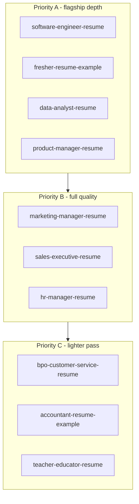

# Resume examples: quality plan (role-prioritized)

## Role tiers (“best roles” for this product)

Prioritize **depth** (sample bullets, mistakes, tailored ATS keywords, longer tips) where search demand, Naukri/LinkedIn volume, and fit with ResumeDoctor’s builder audience overlap most.

### Priority A — Flagship (do these first; editorial + schema + UI)

| Slug                       | Rationale                                                              |
| -------------------------- | ---------------------------------------------------------------------- |
| `software-engineer-resume` | Highest-intent tech searches; core user overlap with product.          |
| `fresher-resume-example`   | Largest entry-level segment in India; pairs with campus/lateral blogs. |
| `data-analyst-resume`      | Strong growth role; clear tool/keyword story for ATS content.          |
| `product-manager-resume`   | High-value white-collar tech role; differentiator vs generic builders. |

### Priority B — Strong second wave (full quality after A ships)

| Slug                       | Rationale                                                                    |
| -------------------------- | ---------------------------------------------------------------------------- |
| `marketing-manager-resume` | Broad corporate demand; metrics-led resume story fits “example” format well. |
| `sales-executive-resume`   | Very high volume on Indian boards; quant-heavy bullets showcase quality.     |
| `hr-manager-resume`        | Distinct keyword set (TA, HRIS, ATS); good long-tail SEO.                    |

### Priority C — Keep indexed; lighter pass or template-only until bandwidth

| Slug                          | Rationale                                                                                |
| ----------------------------- | ---------------------------------------------------------------------------------------- |
| `bpo-customer-service-resume` | Large volume but different positioning; still useful—avoid flagship polish blocking A/B. |
| `accountant-resume-example`   | Qualification-heavy (CA/CMA); structure matters more than long prose.                    |
| `teacher-educator-resume`     | More credential/district-specific; smaller overlap with core SaaS funnel.                |

**Practical rule:** **Priority A** pages should set the bar (length, sample snippets, unique ATS block). **B** matches that bar. **C** gets corrected copy, schema compatibility, and shorter expansion unless analytics show outsized traffic.

---

## Per-example exclusive rework plans

Each URL must feel **purpose-built**: shared schema and layout, but **non-overlapping** coaching copy, sample snippets, mistakes, and ATS keyword lists. Below is the exclusive plan per slug (what to write, what to show, what makes it different).

### 1. `software-engineer-resume` (Priority A)

- **Reader:** Developers targeting product companies, IT services, or startups in India (Naukri + LinkedIn heavy).
- **Exclusive angle:** Tech stack **truthfulness** vs keyword stuffing; **impact bullets** (latency, reliability, scale) vs task lists; fresher **projects/GitHub** vs experienced **production ownership**.
- **Content blocks:** Short **sample summary** (2 lines) with placeholder stack; **3 sample bullets** (one services-style delivery, one technical depth, one collaboration); **“India hiring realities”** mini-callout (off-campus, OA, referrals—one paragraph, not generic).
- **Mistakes section:** Buzzwords without proof; overlong CVs for campus PDFs; employer names garbled by bad templates; irrelevant hobbies/filler.
- **ATS keywords block:** Role variants (Software Engineer, SDE, Backend, Full Stack), frameworks by stack family, **system design** only if seniority matches.
- **Must not clone:** Generic “mirror JD” only—tie to **engineering** proof (repos, releases, metrics).

### 2. `fresher-resume-example` (Priority A)

- **Reader:** Final-year students and recent grads with little or no full-time experience.
- **Exclusive angle:** **Education and projects first**; internship vs coursework projects; **mass recruiting** one-page discipline; CGPA presentation without apology storytelling.
- **Content blocks:** Sample **objective/summary** (2 lines, role-agnostic); **project card** pattern (problem → stack → outcome); optional **table-ready** skills row guidance (comma-separated tools).
- **Mistakes section:** Long objectives; fake experience; unrelated hobbies; cluttered layouts for campus PDF uploads.
- **ATS keywords block:** Entry-level titles (Graduate Engineer Trainee, GET, Analyst Trainee), tools from academic projects, **internship** spelled consistently.
- **Must not clone:** Senior-level metrics; leadership claims without college evidence.

### 3. `data-analyst-resume` (Priority A)

- **Reader:** Analysts and BI-adjacent roles across IT, banking, e-commerce, GCCs.
- **Exclusive angle:** **SQL + one viz tool + spreadsheets** as minimum credible story; **metrics that matter** (accuracy, cycle time, adoption) vs vanity charts.
- **Content blocks:** Sample summary emphasizing **stakeholders + dashboards**; bullets showing **question → analysis → decision**; mention **Excel vs Python/R** honestly by level.
- **Mistakes section:** Listing every BI tool shallowly; “passionate about data” fluff; no numbers.
- **ATS keywords block:** SQL, Python/R, Power BI, Tableau, Excel (advanced), KPI, dashboard, stakeholder—**curated**, not a dictionary dump.
- **Must not clone:** Engineering deployment bullets; marketing campaign language.

### 4. `product-manager-resume` (Priority A)

- **Reader:** PMs in SaaS, fintech, consumer, or GCC product pods.
- **Exclusive angle:** **Outcomes over meetings**; roadmap tied to metrics; **stakeholder triangulation** without buzzword soup.
- **Content blocks:** Summary with **domain + metric** (retention, revenue, adoption); bullets: discovery → prioritization → launch → outcome; tools (**Jira**, analytics, research) aligned to seniority.
- **Mistakes section:** “Responsible for PRDs” without impact; confusing PM with project coordinator; fake ownership of engineering delivery.
- **ATS keywords block:** Product Owner vs PM clarity for India JDs; roadmap, backlog, OKR, GTM where truthful.
- **Must not clone:** Pure engineering implementation bullets as PM wins.

### 5. `marketing-manager-resume` (Priority B)

- **Reader:** Brand, growth, digital, or performance leads in agencies and in-house teams.
- **Exclusive angle:** **Channel ownership** (paid/organic/brand) stated clearly; **ROI, CAC, ROAS, reach** where applicable; agency vs client-side framing.
- **Content blocks:** Summary naming **channels + years**; campaign bullets with **before/after** metrics; stack (Google Ads, Meta, SEO tools) as proof.
- **Mistakes section:** Vanity metrics without business link; vague “managed social media”; missing budgets/scale when senior.
- **ATS keywords block:** Performance marketing, brand, growth, campaign, funnel, attribution—aligned to India digital ad landscape.
- **Must not clone:** Sales quota language; HR people metrics.

### 6. `sales-executive-resume` (Priority B)

- **Reader:** B2B enterprise, channel, retail, insurance, telecom sales in India.
- **Exclusive angle:** **Quota, pipeline, win rate, ACV** language used honestly; **CRM hygiene**; territory vs inside sales.
- **Content blocks:** Summary with **domain + motion** (hunter/farmer); bullets: targets %, new logos, revenue, cycle; tools (Salesforce, Zoho CRM, CPQ) if used.
- **Mistakes section:** Only activity metrics (calls made); confidential numbers stated precisely—use ranges or % where needed.
- **ATS keywords block:** B2B, enterprise, SMB, revenue, pipeline, CRM, account management—match JD family.
- **Must not clone:** Marketing campaign optimization copy.

### 7. `hr-manager-resume` (Priority B)

- **Reader:** HRBP, TA leads, people ops in corporates and scaling startups.
- **Exclusive angle:** **TA vs HR ops vs L&D** clarity; **volume hiring** and **compliance** for India context; tools (**HRIS**, ATS, payroll partners).
- **Content blocks:** Summary with **years + specialization**; bullets: offer-to-join, TAT, engagement, policy rollouts; scale (headcount supported).
- **Mistakes section:** Only generic “handled recruitment”; missing compliance/statutory awareness at senior level.
- **ATS keywords block:** Talent acquisition, onboarding, HRIS, payroll, employee engagement, POSH awareness where appropriate—no legal advice phrasing.
- **Must not clone:** Sales revenue bullets.

### 8. `bpo-customer-service-resume` (Priority C)

- **Reader:** Voice/chat/email support, KPO adjacent, GCC operations roles.
- **Exclusive angle:** **Languages**, shift flexibility, **CSAT/NPS**, handle times; **voice vs non-voice** clarity.
- **Content blocks:** Summary emphasizing **reliability + quality metrics**; bullets on resolution, escalation, QA scores; typing speed when relevant.
- **Mistakes section:** Over-formatting for ATS; omitting languages; vague “customer handling.”
- **ATS keywords block:** Customer service, voice process, chat support, SLA, CSAT, multilingual—India BPO terminology.
- **Must not clone:** Technical stack dumps from IT roles.

### 9. `accountant-resume-example` (Priority C)

- **Reader:** Article students, accountants in SME/industry, audit-adjacent.
- **Exclusive angle:** **Qualification stage** (CA inter/final, CMA, commerce degrees); **Tally / GST / SAP** truthfulness; audit vs industry CV differences.
- **Content blocks:** Summary with **qualification + domain** (tax, audit, FP&A); bullets on closes, reconciliations, audits, compliance milestones.
- **Mistakes section:** Responsibilities without scope; missing articleship detail for CA pipeline roles.
- **ATS keywords block:** GST, Tally, reconciliation, audit, IFRS/Ind AS awareness (truthful level only), SAP FI keywords if applicable.
- **Must not clone:** Generic “finance professional” without credential context.

### 10. `teacher-educator-resume` (Priority C)

- **Reader:** School teachers, tutors, institutional roles; boards (CBSE/ICSE/State) matter.
- **Exclusive angle:** **Subject + grade band**; pedagogy and outcomes without unethical grade promises; certifications (B.Ed, CTET where relevant).
- **Content blocks:** Summary with **subjects + experience band**; bullets: curriculum, assessments, parent engagement, co-curricular; workshops.
- **Mistakes section:** Long philosophy paragraphs; missing board/syllabus clarity; informal tone.
- **ATS keywords block:** Board names, subjects, classroom, curriculum, assessment, B.Ed—aligned to institution JDs.
- **Must not clone:** Corporate KPI language unless international school context fits.

### Cross-cutting rules for all ten

- Each page gets **its own** `mistakesToAvoid`, `atsKeywords`, and **sample copy** in JSON—no copy-paste between slugs except one shared **one-line** disclaimer about ATS hygiene if needed.
- **`content-links.ts`:** When expanding copy, verify [`EXAMPLE_TO_BLOG`](src/lib/content-links.ts) still pairs each slug with the right articles; add links in prose where natural.

---

## Honest assessment (unchanged substance)

- **Strengths:** Index layout, JSON-LD, breadcrumbs, internal linking via [`content-links.ts`](src/lib/content-links.ts).
- **Gaps:** Titles promise “examples” but [`content/examples/index.json`](content/examples/index.json) is outline-only (three short tips). Identical ATS block on every detail page. Broken CTA copy (“Start with Try”). [`SECTION_SUGGESTIONS`](src/app/examples/[slug]/page.tsx) is hardcoded by slug.

---

## Implementation order (updated)

1. **Fix CTA** on [`src/app/examples/[slug]/page.tsx`](src/app/examples/[slug]/page.tsx) (all roles, one edit).
2. **Extend schema** in [`src/lib/examples.ts`](src/lib/examples.ts) + [`content/examples/index.json`](content/examples/index.json): e.g. `suggestedSections`, `sampleSummary`, `sampleBullets`, `mistakesToAvoid`, `atsKeywords` (names TBD in implementation).
3. **Expand JSON content** in tier order: **A → B → C**.
4. **Detail page:** Render new fields; replace generic ATS section with per-example `atsKeywords` + short intro, or link to relevant blog posts.
5. **Index** [`src/app/examples/page.tsx`](src/app/examples/page.tsx): Optionally surface **Priority A** in a “Featured” row above the grid, or group by tier—only if it improves scanability without clutter.

---

## Success criteria

- **Priority A** pages read as genuine **examples** (visible sample lines + role-specific guidance), not three-bullet outlines.
- Each of the **ten slugs** satisfies its **Per-example exclusive rework plan** (distinct mistakes, keywords, and samples—not clone pages).
- No duplicate boilerplate ATS wall on every URL unless shortened to one line + link.
- No broken “Try” strings in sidebar CTAs.
- New examples can be added by editing JSON only (`suggestedSections` in data, not React maps).

---

## Mermaid: tiered effort

