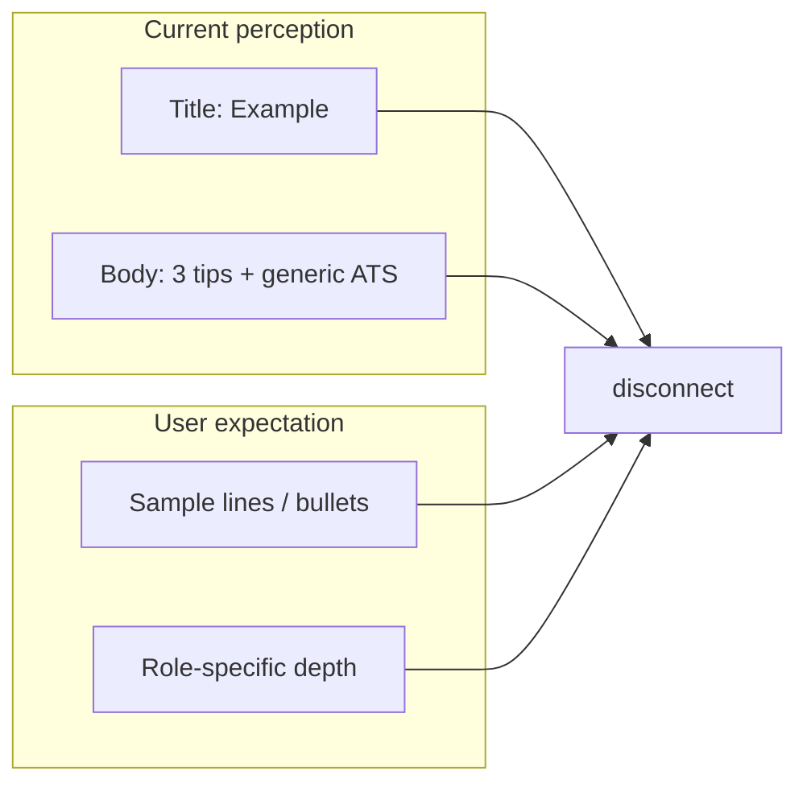

# Resume examples: quality assessment and upgrade direction

## Honest read (after reviewing the implementation)

**What works**

- **[Examples index](src/app/examples/page.tsx)** — Strong visual hierarchy (hero gradient, pill badge, card grid), India positioning, JSON-LItemList for SEO, and a sensible blog cross-link block.
- **[Example detail](src/app/examples/[slug]/page.tsx)** — Clear layout (tips list, section chips, sidebar CTAs, prev/next nav), [`BreadcrumbJsonLd`](src/components/seo/json-ld.tsx) + [`ExampleHowToJsonLd`](src/components/seo/json-ld.tsx), and [`getRelatedPostsForExample`](src/lib/content-links.ts) for editorial linking (WBS 12.8).

**Where quality falls short**

1. **Expectation mismatch** — Titles say “Resume **Example**” but [`content/examples/index.json`](content/examples/index.json) only stores short descriptions and **three tips per role**. There is no sample summary paragraph, no sample bullets, no before/after, no “fill-in” phrases. Users comparing to Zety / Indeed examples will feel the gap immediately. The index hero honestly says “Outlines for Indian roles,” which is closer to reality than “examples.”

2. **Content depth** — Tips are useful but **generic and compressed** (often one long sentence per array item). They read like checklist stubs, not editorial guidance. For SEO and trust, competitor-grade pages usually carry **role-specific keyword clusters**, common mistakes, seniority variants (e.g. junior vs senior SWE), and India-specific notes (campus placement vs lateral).

3. **Templated repetition** — The **ATS keyword** block on the detail page is **identical on every slug** ([lines 163–181](src/app/examples/[slug]/page.tsx)). That reads as filler and dilutes perceived quality.

4. **Copy defects** — Sidebar CTA text is broken: “**Start with Try**” / “Start **with Try** using our ATS-ready templates” ([lines 194–199](src/app/examples/[slug]/page.tsx)) — likely a bad merge of the `/try` route name with marketing copy. This hurts “class” more than spacing or fonts.

5. **Presentation** — The UI is clean but **generic documentation-style**. There is no visual “resume preview,” quoted sample lines, or monospace snippet block—anything that signals “example” beyond tips.

6. **Maintainability** — [`SECTION_SUGGESTIONS`](src/app/examples/[slug]/page.tsx) is a large hardcoded `Record` keyed by slug. Adding examples requires editing React code instead of [`ResumeExample`](src/lib/examples.ts) / JSON only.

## Recommended directions (when you implement)

| Priority | Change                                                                                                                                                                                                      | Rationale                                        |
| -------- | ----------------------------------------------------------------------------------------------------------------------------------------------------------------------------------------------------------- | ------------------------------------------------ |
| P0       | Fix CTA copy on detail sidebar                                                                                                                                                                              | Removes an obvious quality stain                 |
| P1       | Expand [`content/examples/index.json`](content/examples/index.json) (or split per-slug MD/JSON): more tips, optional **sampleSummary**, **sampleBullets**, **mistakesToAvoid**, **keywordsForATS** per role | Delivers real “example” substance and better SEO |
| P1       | Replace or parameterize the shared ATS block using **per-example** keywords/mistakes from content (or shorten to one sentence + link to blog)                                                               | Stops repetitive filler                          |
| P2       | Extend [`ResumeExample`](src/lib/examples.ts) + detail template: render **sample snippet** (semantic `<pre>` or styled quote block), optional **seniority** note                                            | Visual proof of “example”                        |
| P2       | Move **recommended sections** into content (`suggestedSections` on each entry) and remove hardcoded `SECTION_SUGGESTIONS` from the page                                                                     | Safer scaling                                    |
| P3       | Index page: optional **industry filter** or grouped sections if the library grows                                                                                                                           | Better scanability                               |

## Files to touch in an implementation pass

- [`content/examples/index.json`](content/examples/index.json) (and possibly [`src/lib/examples.ts`](src/lib/examples.ts) for new fields)
- [`src/app/examples/[slug]/page.tsx`](src/app/examples/[slug]/page.tsx) — CTA copy, ATS section, new sections from schema
- Optionally [`src/app/examples/page.tsx`](src/app/examples/page.tsx) — richer card excerpts if descriptions lengthen

## Bottom line

Your instinct is right: **class** is fine at the layout/CSS level; **content** is underpowered and **naming** oversells “example.” Fixing the broken CTA is quick; the meaningful lift is editorial + structured fields (sample text, role-specific ATS notes) so the pages match user expectations and the Zety-style positioning in the PRD.
