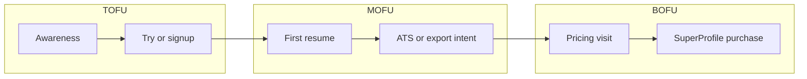

# Introduction HTML email + conversion funnel plan

## Context from the repo

- **Brand and copy:** Follow [docs/MESSAGING-BRIEF.md](docs/MESSAGING-BRIEF.md) (India-first job seekers, outcomes not hype, primary CTAs: `/try`, builder, `/pricing`).
- **Plans and checkout:** SuperProfile-only purchases; **same email** on checkout as ResumeDoctor account is required ([docs/BILLING.md](docs/BILLING.md), [src/components/pricing/payment-value-sections.tsx](src/components/pricing/payment-value-sections.tsx) `EmailMatchNote`).
- **On-site “payment” look:** [src/components/pricing/payment-value-sections.tsx](src/components/pricing/payment-value-sections.tsx) uses `PaymentSectionBackdrop` (soft blobs + dot grid) and `PricingTrustStatsBar` (30+ templates, ATS, India portals, “&lt; 5 min” stat strip)—**no PNGs in [public/](public/)** for that section. Replicating this in email means **table layout + `bgcolor` / border** approximations, plus optional **one hosted hero** (screenshot or designed banner) at an absolute `https://www.resumedoctor.in/...` URL.
- **SuperProfile imagery:** Do **not** rely on embedding assets from `superprofile.bio` without explicit permission and stable URLs; use **exported screenshots or Figma-derived tiles** uploaded to **your** CDN/site so links don’t break and clients don’t block third-party domains.
- **Existing sequence thinking:** [docs/LIFECYCLE-EMAIL.md](docs/LIFECYCLE-EMAIL.md) already defines segments and 3–5 flows; this plan extends that into explicit **TOFU / MOFU / BOFU** stages and ties the intro email to stage 1.

---

## Deliverable 1: HTML email file

**Suggested location:** new file [`email-templates/introduction-resumedoctor.html`](email-templates/introduction-resumedoctor.html) (kebab-case folder; keeps marketing assets out of Next.js bundles unless you later promote to React/Resend).

**Email HTML rules (non-negotiable for compatibility):**

- **Layout:** Fluid **600px max** outer table; nested tables for sections; avoid CSS grid/flex for structure (use for minor spacing only where supported).
- **Styles:** **Inline** critical styles; fallback font stack: `Arial, Helvetica, sans-serif` (Poppins is fine as first choice with fallbacks—many clients ignore web fonts).
- **Images:** `width`/`height`, **descriptive `alt`**, hosted on **HTTPS** same domain as sending reputation when possible; **text-to-image ratio** biased toward text (avoid one giant image-as-email).
- **CTA:** One **primary** button (bulletproof: `bgcolor` + `arc`/`VML` optional for Outlook if you want parity); secondary as plain link.
- **Links:** Full absolute URLs (`https://www.resumedoctor.in/try`, `https://www.resumedoctor.in/pricing`). **Do not** use SuperProfile URLs in-repo literals—use placeholders like `{{SUPERPROFILE_PRO_MONTHLY_URL}}` or “See latest plans on Pricing” linking to `/pricing` (matches how env-driven links work in code: [src/components/pricing/superprofile-pricing-links.tsx](src/components/pricing/superprofile-pricing-links.tsx)).
- **Legal/footer:** Physical address / company identity if broadcast; **unsubscribe** and **preference center** language if non-transactional; **plain-text MIME part** when sent via ESP (Resend supports `text`; see patterns in [src/lib/email.ts](src/lib/email.ts)).
- **Preheader:** Hidden preview text row (snippet that shows next to subject).
- **Dark mode:** Optional `meta color-scheme` + simple fallbacks (`#ffffff` backgrounds, sufficient contrast)—full dark parity is optional.

**Proposed intro email content blocks (introduction = TOFU-heavy):**

1. **Hero:** Short headline + subline aligned with messaging brief (“Apply with confidence—portal-ready resume, ATS-aware layouts”).
2. **Trust strip:** Recreate stats bar intent in a **two-column or four-cell table** (30+ templates | ATS layouts | India portals | quick first draft)—wording consistent with site, no unverified claims.
3. **What you get (3 bullets):** PDF/DOCX, no watermarks on Pro, JD/keyword tuning—mirror [payment-value-sections](src/components/pricing/payment-value-sections.tsx) export bullets without copying internal labels.
4. **Plan snapshot (email-safe “pricing cards”):** Two or three **table “cards”** (Try / Basic idea / Pro path)—**prices as “from” or “see pricing page”** unless you commit to static INR/USD in the template and a process to update them (pricing is geotargeted on [src/app/pricing/page.tsx](src/app/pricing/page.tsx)).
5. **SuperProfile callout:** Single highlighted row: “Pay on SuperProfile—**use the same email** as your ResumeDoctor account” (product truth from billing doc).
6. **Primary CTA:** `Start with Try` → `/try`; secondary `Compare plans` → `/pricing`.
7. **Footer:** Help link, social (if any), compliance line.

**Optional hosted image:** One **600px-wide** composite (hero or “plan cards” visual) exported from Figma or a cropped **pricing page** screenshot—compress (WebP not universal in email; prefer **JPEG/PNG** for hero).

---

## Deliverable 2: Anti-spam and inbox placement (process + copy discipline)

| Area               | Action                                                                                                          |
| ------------------ | --------------------------------------------------------------------------------------------------------------- |
| **Authentication** | SPF + DKIM + DMARC on the **sending domain** (e.g. Resend-verified domain for `resumedoctor.in`).               |
| **Reputation**     | Warm domain/IP if new; consistent volume; avoid sudden spikes.                                                  |
| **Content**        | No ALL CAPS subjects, minimal `!!!`, no deceptive “Re:”/false urgency; honest preheader; **clear sender** name. |
| **Structure**      | Balanced HTML + **plain text**; working **List-Unsubscribe** for marketing; one primary ask.                    |
| **Lists**          | **Double opt-in** for cold lists; remove bounces/complaints; segment by engagement.                             |
| **Compliance**     | If India + global: respect applicable marketing rules; include identity and opt-out for promotional mail.       |

Copy should stay in the **MESSAGING-BRIEF** voice (plain, encouraging, no fake review counts).

---

## Deliverable 3: Email funnel and conversion system (TOFU / MOFU / BOFU)

Map to measurable stages and reuse [docs/LIFECYCLE-EMAIL.md](docs/LIFECYCLE-EMAIL.md) events where possible.

| Stage    | Goal                            | Example emails (1–2 each)                                                                        | Key CTA                                  |
| -------- | ------------------------------- | ------------------------------------------------------------------------------------------------ | ---------------------------------------- |
| **TOFU** | Problem awareness → try product | **Intro (this HTML)**, “Templates for Indian portals”                                            | `/try`, templates                        |
| **MOFU** | Activation → value proof        | Stuck without export (already in lifecycle map), ATS tip, “PDF vs TXT”                           | Builder, `/pricing` with outcome subject |
| **BOFU** | Purchase                        | India pass midpoint checklist, “Unlock exports” (same-email SuperProfile), optional trial-ending | `/pricing` → SuperProfile checkout       |

**Conversion system (operational):**

1. **ESP** (e.g. Resend for transactional + broadcast or dedicated tool) with **templates** + **segments** from [docs/LIFECYCLE-EMAIL.md](docs/LIFECYCLE-EMAIL.md).
2. **Events** to sync: `sign_up`, `trial_start`, `resume_created`, `first_export`, `payment_success`, `ats_check_completed` (as noted in lifecycle doc)—drives branching.
3. **Attribution:** UTM on links (`utm_source=email`, `utm_medium=intro`, `utm_campaign=...`); land on same host (`www`) to avoid redirect issues noted in [docs/DEPLOYMENT-REQUIREMENTS.md](docs/DEPLOYMENT-REQUIREMENTS.md) for webhooks—**tracking links for email can still use www-only**.
4. **Experiments:** A/B subject and primary CTA (Try vs Pricing) on intro; measure open, click, `/try` start, signup, `first_export`, SuperProfile webhook success.

---

## Implementation order (after you approve plan)

1. Create `email-templates/introduction-resumedoctor.html` with table layout, preheader, trust strip, plan table, bullets, footer, placeholder image `src`.
2. Add a short **`email-templates/README.md`** only if you want send instructions (plain-text companion, ESP variables)—**skip** if you prefer zero extra markdown per repo convention.
3. Optionally add `introduction-resumedoctor.txt` plain-text sibling for multipart sending.

No app code changes required unless you later wire this HTML into Resend sends in [src/lib/email.ts](src/lib/email.ts).
