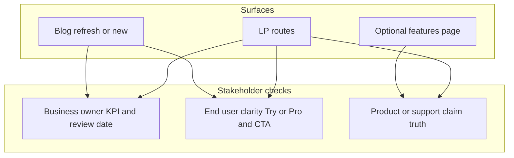
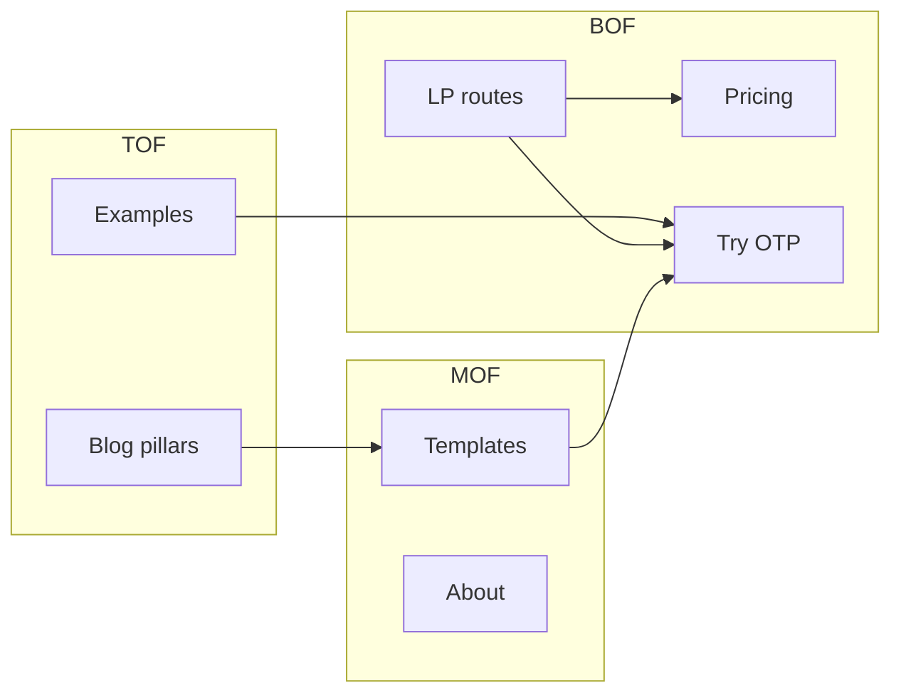

# Marketing: additional pages and blog priorities (refined)

## Lens summary

| Lens                      | Question to satisfy                                                                    | Plan implication                                                                                                          |
| ------------------------- | -------------------------------------------------------------------------------------- | ------------------------------------------------------------------------------------------------------------------------- |
| **Business owner**        | Does this reduce CAC, lift conversion, or defend margin without exploding maintenance? | Prefer **few high-intent LPs** + **pillar refresh** over many thin URLs; every page needs an owner and a metric.          |
| **End user (job seeker)** | Can I trust this, understand Try vs paid, and get a win in one session?                | LPs must reduce anxiety (plain language, India context, honest proof), **one primary CTA**, obvious path to export/value. |
| **Product / support**     | Will this create wrong expectations or ticket volume?                                  | Avoid hype; align copy with actual exports, limits, and ATS behavior; link to **pricing** for tier truth.                 |
| **Content / SEO**         | Does this add a distinct query or strengthen a pillar?                                 | New blog only for **clear intent gaps**; otherwise **refresh** pillars and internal links per CONTENT-PILLARS.            |

---

## What you already have (baseline)

- **Public funnel:** home, [pricing](src/app/pricing/page.tsx), [templates](src/app/templates/page.tsx), [try](src/app/try/page.tsx), [about](src/app/about/page.tsx), [blog index](src/app/blog/page.tsx), [examples](src/app/examples/page.tsx).
- **Blog:** 12 posts under [`content/blog/`](content/blog/) aligned with [`docs/CONTENT-PILLARS.md`](docs/CONTENT-PILLARS.md) and [`src/lib/content-links.ts`](src/lib/content-links.ts).
- **Paid/BOFU:** [`/lp/resume-builder-india`](src/app/lp/resume-builder-india/page.tsx) per [`docs/PPC-AND-BOFU-LANDING.md`](docs/PPC-AND-BOFU-LANDING.md).
- **Features narrative:** concentrated on homepage and pricing compare table—**no** standalone `/features` today.

**Owner discipline:** You do **not** need more pages for vanity. You need pages that **move a defined segment** and that someone will **update when pricing or product changes**.

---

## Business owner refinements

1. **ROI rule:** Each new URL (LP or blog) should tie to **one primary metric**—e.g. LP → click-through to `/try` or signup; blog pillar → assisted conversions or time on site to `/try`/`/pricing` (however you measure today). If you cannot name the metric, defer the page.

2. **Cost of complexity:** Every LP duplicates risk—stale Pro benefits, wrong trial wording (messaging brief: **Try** vs **14-day pass**), legal/regional claims. Budget **quarterly copy review** in the same rhythm as pricing updates.

3. **Cannibalization:** New LPs should target **paid or high-intent organic** angles, not replace the homepage for brand traffic. Use **distinct H1s** so Search Console does not blur impressions between `/` and `/lp/...`.

4. **Partnerships / B2B2C (optional):** If colleges or bootcamps ever send traffic, a single **`/for-educators` or partner one-pager** (not a blog) can sit beside `/features`—only when you have a real partner pipeline; otherwise it is shelf-ware.

5. **Defer until substantiated:** “Vs competitor” and fake breadth (dozens of city pages) **increase** legal and SEO risk for **uncertain** return—business owner says no until you have capacity to maintain truthfully.

---

## End user refinements

1. **Job to be done:** User is not buying “AI” or “ATS”—they want **to apply without embarrassment** and **to be parsed**. Headlines on new LPs should state **outcome + context** (India, fresher, portal-ready file), not feature dumps.

2. **Trust without cringe:** Use **real** testimonials and stats already on site; do not invent rankings. If proof is thin, LPs should lean on **clear process** (“Build → check against JD → export”) instead of superlatives.

3. **Try vs Pro anxiety:** Messaging brief already separates **OTP Try**, **Basic**, **Pro**, **14-day pass**. New surfaces must **repeat the same distinctions** in a short strip or footer link to pricing—reduces “I thought PDF was free” support pain.

4. **Time-to-value:** End users bail if the CTA is vague. Primary CTA = **Try** (TOF) or **Pricing** (BOF ready to pay)—secondary links **templates** / **examples** for browsers who fear commitment.

5. **Accessibility:** Many ICP users read English as a second language—**short paragraphs**, **scannable bullets**, **one idea per section** on LPs; blog can go deeper.

---

## When to use LP vs blog vs refresh (decision)

| Situation                                             | Best vehicle                                                                  |
| ----------------------------------------------------- | ----------------------------------------------------------------------------- |
| Paid keyword or ad group needs **message match**      | Dedicated `/lp/...`                                                           |
| Evergreen educational query; **SEO** cluster          | Blog post + `content-links`                                                   |
| Existing post ranking but **stale** or thin           | **Refresh** same slug (date, FAQ, links)—new slug only if intent truly splits |
| Explaining stack for **LinkedIn ads / partner email** | `/features` or short LP, not a 2k-word blog                                   |

---

## Recommended **pages** (non-blog), priority order (unchanged core, sharper guardrails)

1. **BOFU landing pages** (same pattern as `resume-builder-india`): fresher/campus; ATS/tailor-to-JD (copy **truthful** to product); optional export-focused LP for “portal-ready PDF/DOCX” angle. Register in [`src/app/sitemap.ts`](src/app/sitemap.ts); use **consistent UTM** naming per [`docs/PPC-AND-BOFU-LANDING.md`](docs/PPC-AND-BOFU-LANDING.md).

2. **Optional `/features` or “How it works”**—for retargeting and partners; keep short; link to pricing for limits.

3. **Defer:** competitor pages; programmatic city spam; generic “resources hub” with no distribution plan.

---

## Recommended **blog** work (extend or refresh, not duplicate)

Same intent gaps as before, with **owner** note: portal/Naukri depth, career-change angle distinct from gap article, MOFU “how to read ATS / JD match” bridge to product.

**Refresh-first rule:** Before adding slug 13, open the two **pillar** posts and top cluster posts—update intros, FAQs, internal links to `/pricing` and `/try`, and one **fresh example** link—per [`docs/CONTENT-PILLARS.md`](docs/CONTENT-PILLARS.md) cadence. That often beats a new post for **business** and **SEO**.

---

## Sitemap, linking, and governance

- New routes → [`src/app/sitemap.ts`](src/app/sitemap.ts).
- New or refreshed posts → [`content/blog/`](content/blog/) + [`src/lib/content-links.ts`](src/lib/content-links.ts).
- **Governance:** Each live LP listed in a simple internal doc: URL, audience, primary KPI, last reviewed date, owner (even if that is you).

---

## Summary

- **Pages:** Yes—**1–3 BOFU LPs** with **metrics and review owners**; optional **`/features`** when distribution needs a stable URL.
- **Blog:** **Refresh pillars on a schedule**; add **only** posts that fill a proven intent gap; keep internal linking graph coherent.
- **Roles:** Business owner owns **ROI and maintenance**; end user owns **clarity and trust**; product/support owns **claim accuracy**—all three must sign off on LP copy before spend.

