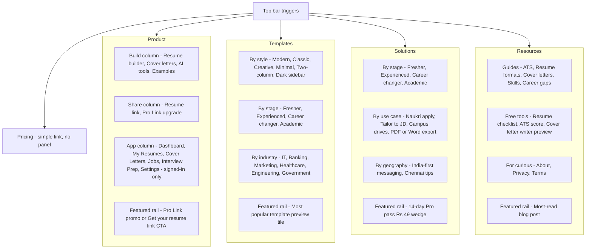
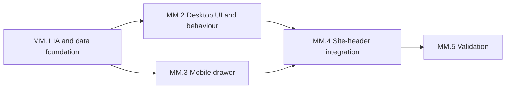

# Megamenu — information architecture and engineering plan

## 1. IA at a glance



## 2. Top-level items

Five items, in this order — left of the auth side, hover-or-click to open the panel:

- **Product** (mega panel)
- **Templates** (mega panel)
- **Solutions** (mega panel)
- **Resources** (mega panel)
- **Pricing** (simple link, opens `/pricing`)

The right side of the header keeps today's `AuthNav` + `UserMenu` + `Create Resume` CTA exactly as-is — no behaviour change there. The subscription pill on dashboard pages also stays.

## 3. Per-panel content (citing existing destinations)

### Product panel

3-column link grid + featured rail. Column 3 (App) is hidden for signed-out visitors so the panel is 2-column for them.

- **Build** — `Resume builder` ([src/app/resumes/new/page.tsx](src/app/resumes/new/page.tsx)), `Try with OTP` ([src/app/try/page.tsx](src/app/try/page.tsx)), `Cover letters` ([src/app/cover-letters/page.tsx](src/app/cover-letters/page.tsx)), `AI capabilities` (`/features#capabilities` — verified anchor), `Examples` ([src/app/examples/page.tsx](src/app/examples/page.tsx))
- **Share** — `Resume link` ([src/app/resume-link/page.tsx](src/app/resume-link/page.tsx)), `Pro Link upgrade` (`/pricing#pro-link` — verified anchor)
- **App (signed-in only)** — `Dashboard` ([src/app/dashboard/page.tsx](src/app/dashboard/page.tsx)), `My resumes` (dashboard listing), `Cover letters`, `Jobs` ([src/app/jobs/page.tsx](src/app/jobs/page.tsx)), `Interview prep` ([src/app/interview-prep/page.tsx](src/app/interview-prep/page.tsx)), `Settings` ([src/app/settings/page.tsx](src/app/settings/page.tsx))
- **Featured rail** — Pro Link promo card. Title "Pro Link", three benefit bullets reused from the pricing band (Custom URL, View analytics, No footer), CTA `Get Pro Link - Rs 99/mo` linking to `/pricing#pro-link`. When `useSubscription().proLink.active === true`, swap to a "Pro Link active - Manage in Settings" status card.

### Templates panel

3-column grid + featured rail.

- **By style** — `Modern`, `Classic`, `Creative`, `Minimal`, `Executive`, `ATS-friendly`. All link to `/templates?category=<slug>` — slug values verified against the `CATEGORIES` const in [src/app/templates/page.tsx](src/app/templates/page.tsx) lines 69-80 (valid: `professional, modern, creative, classic, minimal, ats, fresher, tech, executive`).
- **By career stage** — `Fresher`, `Experienced`, `Career changer`, `Academic`. Link to `/templates?stage=<slug>` (we'll add `stage` filter support to the templates page in a follow-up; for v1 link to `/templates` and let the user filter).
- **By industry** — `IT and software`, `Banking and finance`, `Marketing`, `Healthcare`, `Engineering`, `Government and PSU`. Same v1 simplification — link to `/templates`.
- **Featured rail** — "Most popular - Professional" preview tile reusing the `TemplateShowcaseCard` styling from `src/app/page.tsx`. CTA `See all 30 templates -> /templates`.

### Solutions panel

3-column grid + featured rail.

- **By career stage** — Same four stages, but each links to `/try` with intent context (later: dedicated landing pages).
- **By use case** — `Apply on Naukri` ([src/app/lp/resume-builder-india/page.tsx](src/app/lp/resume-builder-india/page.tsx)), `Tailor to job description` ([src/app/lp/tailor-resume-job-description/page.tsx](src/app/lp/tailor-resume-job-description/page.tsx)), `Campus drives` ([src/app/lp/fresher-campus-resume-india/page.tsx](src/app/lp/fresher-campus-resume-india/page.tsx)), `Export PDF and DOCX` ([src/app/lp/resume-export-pdf-docx-india/page.tsx](src/app/lp/resume-export-pdf-docx-india/page.tsx))
- **By geography** — `India-first features` (`/features` — page is India-targeted at root; no anchor used to avoid duplicating `/features#capabilities` from Product panel), `Chennai job seekers` (link to `/blog/resume-tips-chennai-job-seekers` — verified blog slug)
- **Featured rail** — "Try Pro for 14 days - Rs 49" wedge card, CTA links to `/pricing#trial`. Hidden when `useSubscription().isPro === true`.

### Resources panel

3-column grid + featured rail.

- **Guides** — Top 5 articles from `content/blog/`: `ATS-friendly resume guide`, `How to write CV for freshers`, `Cover letter examples India`, `Resume formats India guide`, `How to write professional summary`. (All exist in `content/blog/`.)
- **Free tools** — `Resume checklist` (`/blog/resume-checklist-before-you-apply` — verified blog slug), `ATS score check` (`/features#ats-support` — verified anchor; was `#ats` typo), `Cover letter writer preview` (`/cover-letters/new`)
- **For the curious** — `About` ([src/app/about/page.tsx](src/app/about/page.tsx)), `Privacy` ([src/app/privacy/page.tsx](src/app/privacy/page.tsx)), `Terms` ([src/app/terms/page.tsx](src/app/terms/page.tsx)), `Blog` ([src/app/blog/page.tsx](src/app/blog/page.tsx))
- **Featured rail** — "Latest from the blog" card, hardcoded for v1 (rotate manually) — set to `/blog/ats-friendly-resume-complete-guide` initially.

### Pricing — simple link

No panel. Just `/pricing`. Keeps it click-friendly for high-intent visitors.

## 4. Work breakdown structure (WBS)

Five phases, ~33 hours total. MM.1 unlocks both MM.2 and MM.3 in parallel; MM.4 needs both; MM.5 is the gate to ship.

### Phase overview

| WBS ID | Phase                                              | Effort | Dependencies |
| ------ | -------------------------------------------------- | ------ | ------------ |
| MM.1   | Link health + Visual tokens + IA & data foundation | 7h     | —            |
| MM.2   | Desktop megamenu UI & behaviour                    | 16h    | MM.1         |
| MM.3   | Mobile drawer                                      | 5.5h   | MM.1         |
| MM.4   | Site-header integration                            | 2.5h   | MM.2, MM.3   |
| MM.5   | Validation                                         | 2h     | MM.4         |

### MM.1 — Link health + Visual tokens + IA & data foundation

| ID  | Task                                                                                                                                                                                                                                                                                                                                     | Effort | Deliverable                                                |
| --- | ---------------------------------------------------------------------------------------------------------------------------------------------------------------------------------------------------------------------------------------------------------------------------------------------------------------------------------------- | ------ | ---------------------------------------------------------- |
| 1.A | Link health audit — re-verify the 7 destination resolutions already applied to §3 panel spec (retarget AI features → `#capabilities`, India-first → `/features` root, fix `#ats` → `#ats-support`, retarget Two-column → `executive`, Dark sidebar → `ats`, drop Custom URL + QR sub-links). See §6 for the verified destinations table. | 1h     | Verified destinations referenced in §6                     |
| 1.0 | Author megamenu surface tokens — two variants (A glassy dark over blue header, B light over white header), column heading style, link states, featured rail recipes, motion classes — see §5                                                                                                                                             | 1h     | `src/components/site-header/mega-menu-tokens.ts`           |
| 1.1 | TypeScript types: `MegaMenuTopItem`, `MegaMenuPanel`, `MegaMenuColumn`, `MegaMenuFeaturedRail`, `MegaMenuLink`                                                                                                                                                                                                                           | 1h     | `src/components/site-header/mega-menu-data.ts` types block |
| 1.2 | Author Product panel data (Build, Share, App columns + Pro Link rail)                                                                                                                                                                                                                                                                    | 1h     | `MEGA_MENU_ITEMS[0]`                                       |
| 1.3 | Author Templates panel data (style, stage, industry + featured tile)                                                                                                                                                                                                                                                                     | 1h     | `MEGA_MENU_ITEMS[1]`                                       |
| 1.4 | Author Solutions panel data (stage, use case, geography + Rs 49 wedge rail)                                                                                                                                                                                                                                                              | 1h     | `MEGA_MENU_ITEMS[2]`                                       |
| 1.5 | Author Resources panel data (guides, free tools, curious + featured blog rail) and Pricing simple link                                                                                                                                                                                                                                   | 1h     | `MEGA_MENU_ITEMS[3]` and `[4]`                             |

### MM.2 — Desktop megamenu UI & behaviour

| ID  | Task                                                                                                                    | Effort | Deliverable                                      |
| --- | ----------------------------------------------------------------------------------------------------------------------- | ------ | ------------------------------------------------ |
| 2.1 | `MegaMenuPanel` component — multi-column grid layout, section headings, link descriptions (uses tokens from §5.1, §5.2) | 3h     | `src/components/site-header/mega-menu-panel.tsx` |
| 2.2 | `MegaMenuFeaturedRail` — three states (signed-out CTA, Pro Link upsell, Pro Link active) (uses tokens from §5.3)        | 2h     | Inside `mega-menu-panel.tsx`                     |
| 2.3 | Subscription gating — `useSubscription()` drives App column visibility + featured rail variant + Rs 49 card hide        | 1h     | Conditional renders in panel                     |
| 2.4 | `MegaMenu` shell — 5 triggers, shared overlay, panel switching without flicker                                          | 3h     | `src/components/site-header/mega-menu.tsx`       |
| 2.5 | Hover-intent timers (150ms open, 200ms close on cursor leave)                                                           | 2h     | Timer refs + cleanup in `mega-menu.tsx`          |
| 2.6 | Keyboard handling — ArrowDown enters panel, Esc closes + refocuses trigger, Tab/Shift+Tab cycles                        | 3h     | Event handlers in `mega-menu.tsx`                |
| 2.7 | Click-outside detection + translucent backdrop dim (panel `z-40`, backdrop `z-30`)                                      | 1h     | Backdrop element + outside-click hook            |
| 2.8 | Respect `prefers-reduced-motion: reduce` on slide animations                                                            | 1h     | CSS media query in panel transitions             |

### MM.3 — Mobile drawer

| ID  | Task                                                                                                                      | Effort | Deliverable                                       |
| --- | ------------------------------------------------------------------------------------------------------------------------- | ------ | ------------------------------------------------- |
| 3.1 | `MobileMegaMenu` shell — right-slide drawer, full viewport height, header + body + footer regions (uses tokens from §5.5) | 2h     | `src/components/site-header/mobile-mega-menu.tsx` |
| 3.2 | Accordion sections — one open at a time, smooth height transition, chevron rotation (uses tokens from §5.5)               | 1h     | Same file                                         |
| 3.3 | `useBodyScrollLock` hook with mount/unmount cleanup                                                                       | 1h     | `src/hooks/use-body-scroll-lock.ts`               |
| 3.4 | Pin auth CTAs at drawer bottom (Sign in, Sign up, primary Create Resume) (uses tokens from §5.5)                          | 0.5h   | Footer region in mobile drawer                    |
| 3.5 | Dismiss paths — Esc, X button, backdrop tap, route change all close + release scroll lock                                 | 1h     | Effect cleanup hooks                              |

### MM.4 — Site-header integration

| ID  | Task                                                                                                                   | Effort | Deliverable                                |
| --- | ---------------------------------------------------------------------------------------------------------------------- | ------ | ------------------------------------------ |
| 4.1 | Refactor `site-header.tsx` `navVariant === "public"` block — replace flat link list (lines 97-110) with `<MegaMenu />` | 1h     | Updated public branch in `site-header.tsx` |
| 4.2 | Refactor `site-header.tsx` `showDashboardNav` block — replace flat link list (lines 153-174) with `<MegaMenu />`       | 1h     | Updated dashboard branch                   |
| 4.3 | Swap `<MobileNavMenu>` imports for `<MobileMegaMenu>` in `site-header.tsx`                                             | 0.25h  | Two import + JSX swaps                     |
| 4.4 | Add `@deprecated` JSDoc on `src/components/mobile-nav-menu.tsx` (file kept for safety; deletion in follow-up PR)       | 0.25h  | JSDoc block at top of file                 |

### MM.5 — Validation

| ID  | Task                                                                                                                          | Effort | Deliverable                |
| --- | ----------------------------------------------------------------------------------------------------------------------------- | ------ | -------------------------- |
| 5.1 | `tsc --noEmit` + `ReadLints` across all touched files; resolve any new lint errors                                            | 0.5h   | Clean type + lint output   |
| 5.2 | Eyeball pass: `/`, `/pricing`, `/features`, `/dashboard`, `/resumes/[id]/edit`, `/r/<slug>` in light + dark, mobile + desktop | 1h     | Visual sanity confirmation |
| 5.3 | Keyboard-only walkthrough — Tab, ArrowDown, Esc, Shift+Tab; verify no focus loss or trap                                      | 0.5h   | A11y sanity confirmation   |

### Dependency graph



## 5. Visual design system

Audited against `[src/app/page.tsx](src/app/page.tsx)` (hero + Resume Link Showcase), `[src/app/pricing/page.tsx](src/app/pricing/page.tsx)` (Pro Link card), and `[src/components/site-header.tsx](src/components/site-header.tsx)` (existing header tokens). The megamenu speaks the same language, not a new one.

### 5.1 Surface tokens — two variants

`navVariant="public"` → **Variant A** (glassy dark over blue header, reads as a deeper layer of the hero/Resume Link section).
`navVariant="dashboard"` → **Variant B** (light over white header, reads as a layered card on slate-50 dashboards).

| Token                   | Variant A (over blue header)                                                      | Variant B (over white/slate header)                                                                                                                        |
| ----------------------- | --------------------------------------------------------------------------------- | ---------------------------------------------------------------------------------------------------------------------------------------------------------- |
| Panel surface           | `bg-slate-950/95 backdrop-blur-xl ring-1 ring-white/10`                           | `bg-white/98 dark:bg-slate-950/98 backdrop-blur-xl ring-1 ring-slate-900/[0.04] dark:ring-white/[0.06]`                                                    |
| Panel shadow            | `shadow-[0_30px_80px_rgba(0,0,0,0.5)]`                                            | `shadow-[0_20px_50px_-12px_rgba(15,23,42,0.12)] dark:shadow-[0_20px_50px_-12px_rgba(0,0,0,0.45)]`                                                          |
| Panel top accent        | `border-t border-cyan-400/20` (cyan echoes Resume Link section)                   | Header's existing `via-primary-500/50` gradient line (no extra)                                                                                            |
| Backdrop dim            | `bg-slate-950/40 backdrop-blur-[2px]`                                             | `bg-slate-950/30 backdrop-blur-[2px]`                                                                                                                      |
| Column heading          | `text-[10px] font-bold uppercase tracking-[0.18em] text-cyan-200/80`              | `text-[10px] font-bold uppercase tracking-[0.18em] text-slate-500 dark:text-slate-400`                                                                     |
| Link default            | `text-white/85 hover:text-white`                                                  | `text-slate-700 dark:text-slate-300 hover:text-primary-600 dark:hover:text-primary-400`                                                                    |
| Link description        | `text-xs text-white/55`                                                           | `text-xs text-slate-500 dark:text-slate-400`                                                                                                               |
| Active route indicator  | `text-white` + `before:bg-cyan-300 before:w-1 before:h-1 before:rounded-full`     | `text-primary-600 dark:text-primary-400` + `before:bg-primary-600`                                                                                         |
| Hover background        | `hover:bg-white/5`                                                                | `hover:bg-primary-50/60 dark:hover:bg-primary-950/30`                                                                                                      |
| Vertical column divider | `border-l border-white/10`                                                        | `border-l border-slate-200/80 dark:border-slate-800`                                                                                                       |
| Top trigger active      | `text-white after:bg-white after:scale-x-100` (existing)                          | `text-primary-600 after:bg-primary-600 after:scale-x-100` (existing)                                                                                       |
| Focus ring              | `focus-visible:ring-2 focus-visible:ring-cyan-300/70 focus-visible:ring-offset-0` | `focus-visible:ring-2 focus-visible:ring-primary-500 focus-visible:ring-offset-2 focus-visible:ring-offset-white dark:focus-visible:ring-offset-slate-950` |

All tokens exported as constants from `src/components/site-header/mega-menu-tokens.ts` (delivered by MM.1.0). No ad-hoc class strings inside `mega-menu-panel.tsx` — every visual decision is locked at one address.

### 5.2 Typography rhythm

- Column heading — `text-[10px] font-bold uppercase tracking-[0.18em]` (mirrors pricing band eyebrows and the Resume Link section pill at lines 162-165 of `src/app/page.tsx`).
- Link label — `text-sm font-medium` (mirrors `publicNavLinks` map at line 97-110 of `site-header.tsx`).
- Link description — `text-xs leading-snug` (one-liner, only on richer items like "Tailor to job description"; not on terse links like "Pricing").
- Featured rail headline — `text-base font-extrabold tracking-tight`.
- Featured rail body — `text-sm` with the link-description colour for the active variant.
- Panel-wide max content width — none; columns auto-fit. Outer padding: `p-6 sm:p-8`.

### 5.3 Featured rail — visual fingerprint

Mirrors the existing Pro Link card on `/pricing#pro-link` so the upsell feels like _the same upsell_, not a new one.

**Variant A — Pro Link upsell card (signed-out or basic plan):**

```
+---------------------------------------+
| [pill: cyan ring + cyan-200]          |
|  Pro Link                             |
|                                       |
|  Custom URL · View analytics ·        |
|  No footer                            |
|                                       |
|  [ Get Pro Link — Rs 99/mo  → ]       |  amber CTA, matches hero
+---------------------------------------+
```

- Card: `rounded-2xl border border-cyan-400/30 bg-gradient-to-br from-cyan-500/10 via-indigo-500/10 to-violet-500/10 backdrop-blur-md ring-1 ring-cyan-400/20 p-5`
- Pill: `inline-flex items-center gap-2 px-3 py-1 rounded-full border border-cyan-400/30 bg-cyan-500/10 text-[10px] font-bold uppercase tracking-[0.18em] text-cyan-200`
- CTA: `bg-accent hover:bg-accent-hover text-accent-dark font-bold rounded-xl shadow-lg` (reuses the existing amber CTA from hero — `Build My Resume — Try` button at line 113-116)

**Variant B — same card on white pages:**

- Card: `rounded-2xl border-2 border-primary-200 bg-gradient-to-br from-primary-50/80 via-white to-primary-50/40 dark:border-primary-800 dark:from-primary-950/30 dark:via-slate-900/40 dark:to-primary-950/15 p-5` — **literally the existing Pro Link card** at `pricing/page.tsx` line 821 scaled down.
- CTA: `bg-primary-600 hover:bg-primary-700 text-white`.

**Pro Link active state** (both variants):

- Emerald dot, label: "Pro Link active until <date>"
- Ghost CTA: `Manage in Settings →` linking to `/settings#billing`
- Card de-saturates: `border-emerald-200 bg-emerald-50/40 dark:border-emerald-800 dark:bg-emerald-950/20`

### 5.4 Other featured rails

- **Templates panel — "Most popular" tile** — reuses the `TemplateShowcaseCard` styling already in `src/app/page.tsx`. Glassy frame on Variant A; soft white card on Variant B. CTA: `See all 30 templates →` linking to `/templates`.
- **Solutions panel — Rs 49 wedge card** — amber-tinted to match the existing trial wedge at `pricing/page.tsx` line 106:
  - Variant A: `border-amber-400/30 bg-gradient-to-br from-amber-500/10 via-amber-400/5 to-orange-500/10 ring-1 ring-amber-400/20`
  - Variant B: `border border-amber-300/90 bg-gradient-to-b from-amber-100 to-amber-50/90 dark:border-amber-700/50 dark:from-amber-950/50 dark:to-amber-950/30`
  - Hidden when `useSubscription().isPro === true`.
- **Resources panel — featured blog tile** — clean, content-forward. Thumbnail (square, 80px), title (`text-sm font-semibold`), one-line summary, `Read →` link. Hardcoded for v1; auto-derivation is in §10 Out of scope.

### 5.5 Mobile drawer surface

- Drawer body: `bg-white dark:bg-slate-950` (solid, not glass — performance + the scrim is already dark)
- Header strip (drawer top): thin `bg-gradient-to-r from-primary-600 via-primary-700 to-indigo-900` with white logo + close button — echoes the home hero, signals "this is ResumeDoctor's primary nav"
- Section accordion border: `border-b border-slate-200 dark:border-slate-800`
- Section heading default: `text-base font-semibold text-slate-700 dark:text-slate-200`
- Section heading expanded: `text-primary-600 dark:text-primary-400 bg-primary-50/60 dark:bg-primary-950/30`
- Section sublinks: `text-sm text-slate-600 dark:text-slate-400` with `pl-4` indent and chevron-style left border `border-l border-slate-200 dark:border-slate-800`
- Pinned bottom CTAs: `border-t-2 border-primary-100 dark:border-primary-900/40 bg-white dark:bg-slate-950 px-4 py-4`
- Primary CTA in pinned bar: `bg-accent hover:bg-accent-hover text-accent-dark font-bold rounded-xl py-3 text-base` (matches hero CTA exactly)
- Backdrop scrim: `bg-slate-950/60 backdrop-blur-sm`

### 5.6 Motion

- Panel open: `transition-[opacity,transform] duration-150 ease-out` — `opacity-0 translate-y-1` → `opacity-100 translate-y-0`. 150ms is intentionally fast — matches the existing `transition-all duration-200` on the header logo.
- Panel close: same, reversed.
- Mobile drawer slide: `transition-transform duration-200 ease-out`, `translate-x-full` → `translate-x-0`.
- Accordion expand/collapse: `transition-[height,opacity] duration-150 ease-out`.
- Cross-panel swap (hovering Templates while Product is open): no exit/enter — just instant content swap inside the same shared panel. Avoids flicker, matches Stripe / Linear behaviour.
- `prefers-reduced-motion: reduce` → all `duration-*` collapse to `duration-0`, no transforms. (Wired by MM.2.8.)
- No bounces, no springs. Calm and confident, not flashy.

### 5.7 Visual harmony checklist (verifiable in MM.5.2)

- [ ] On `/`, opening a public-header megamenu reads as continuous with the hero — same blue/cyan/amber palette, same pill style on column headings, same CTA shape.
- [ ] On `/dashboard`, opening a dashboard-header megamenu reads as a layered card — same elevation (`shadow-[0_4px_20px_-4px_rgba(13,101,217,0.08)]` family), same rounded radii (`rounded-2xl` on featured rails, matching pricing cards), same active-link colour (`text-primary-600`).
- [ ] Pro Link rail card is visually recognisable as "the Pro Link card from /pricing" — same border treatment, same gradient, same CTA colour. User scanning the megamenu and the pricing page sees one product, not two.
- [ ] Mobile drawer's pinned `Create Resume` button is the same amber CTA the user sees in the hero — zero visual divergence between "I want to start" entry points.
- [ ] No element introduces a colour, radius, shadow, or font-weight not already in use elsewhere on the site.

## 6. Link health & destinations

Audited every destination in §3 against `src/app/**/page.tsx`, `content/blog/**/*.md`, and the `CATEGORIES` const in [src/app/templates/page.tsx](src/app/templates/page.tsx) lines 69-80. Anchor IDs were verified by grepping `id="..."` in the target page source. Seven broken destinations were caught and resolved before authoring `mega-menu-data.ts`.

### 6.1 Verified destinations table

| Panel · Column · Item                                | Destination                                | Backing file / anchor                                                                                    |
| ---------------------------------------------------- | ------------------------------------------ | -------------------------------------------------------------------------------------------------------- |
| Product · Build · Resume builder                     | `/resumes/new`                             | [src/app/resumes/new/page.tsx](src/app/resumes/new/page.tsx)                                             |
| Product · Build · Try with OTP                       | `/try`                                     | [src/app/try/page.tsx](src/app/try/page.tsx)                                                             |
| Product · Build · Cover letters                      | `/cover-letters`                           | [src/app/cover-letters/page.tsx](src/app/cover-letters/page.tsx)                                         |
| Product · Build · AI capabilities                    | `/features#capabilities`                   | [src/app/features/page.tsx](src/app/features/page.tsx) line 212 (`id="capabilities"`)                    |
| Product · Build · Examples                           | `/examples`                                | [src/app/examples/page.tsx](src/app/examples/page.tsx)                                                   |
| Product · Share · Resume link                        | `/resume-link`                             | [src/app/resume-link/page.tsx](src/app/resume-link/page.tsx)                                             |
| Product · Share · Pro Link upgrade                   | `/pricing#pro-link`                        | [src/app/pricing/page.tsx](src/app/pricing/page.tsx) line 820 (`id="pro-link"`)                          |
| Product · App · Dashboard                            | `/dashboard`                               | [src/app/dashboard/page.tsx](src/app/dashboard/page.tsx)                                                 |
| Product · App · Cover letters                        | `/cover-letters`                           | (same as Build column entry — appears in App column when signed in)                                      |
| Product · App · Jobs                                 | `/jobs`                                    | [src/app/jobs/page.tsx](src/app/jobs/page.tsx)                                                           |
| Product · App · Interview prep                       | `/interview-prep`                          | [src/app/interview-prep/page.tsx](src/app/interview-prep/page.tsx)                                       |
| Product · App · Settings                             | `/settings`                                | [src/app/settings/page.tsx](src/app/settings/page.tsx)                                                   |
| Templates · By style · Modern                        | `/templates?category=modern`               | `CATEGORIES` slug verified                                                                               |
| Templates · By style · Classic                       | `/templates?category=classic`              | `CATEGORIES` slug verified                                                                               |
| Templates · By style · Creative                      | `/templates?category=creative`             | `CATEGORIES` slug verified                                                                               |
| Templates · By style · Minimal                       | `/templates?category=minimal`              | `CATEGORIES` slug verified                                                                               |
| Templates · By style · Executive                     | `/templates?category=executive`            | `CATEGORIES` slug verified (was "Two-column" — invalid slug)                                             |
| Templates · By style · ATS-friendly                  | `/templates?category=ats`                  | `CATEGORIES` slug verified (was "Dark sidebar" — invalid slug)                                           |
| Templates · By stage · _(all)_                       | `/templates`                               | v1: links to base page; `stage=` filter not yet supported                                                |
| Templates · By industry · _(all)_                    | `/templates`                               | v1: links to base page; `industry=` filter not yet supported                                             |
| Solutions · By stage · _(all)_                       | `/try`                                     | v1: per-stage landing pages don't exist yet                                                              |
| Solutions · By use case · Apply on Naukri            | `/lp/resume-builder-india`                 | [src/app/lp/resume-builder-india/page.tsx](src/app/lp/resume-builder-india/page.tsx)                     |
| Solutions · By use case · Tailor to JD               | `/lp/tailor-resume-job-description`        | [src/app/lp/tailor-resume-job-description/page.tsx](src/app/lp/tailor-resume-job-description/page.tsx)   |
| Solutions · By use case · Campus drives              | `/lp/fresher-campus-resume-india`          | [src/app/lp/fresher-campus-resume-india/page.tsx](src/app/lp/fresher-campus-resume-india/page.tsx)       |
| Solutions · By use case · Export PDF and DOCX        | `/lp/resume-export-pdf-docx-india`         | [src/app/lp/resume-export-pdf-docx-india/page.tsx](src/app/lp/resume-export-pdf-docx-india/page.tsx)     |
| Solutions · By geography · India-first features      | `/features`                                | features page is India-targeted at root (was `#india` — anchor doesn't exist)                            |
| Solutions · By geography · Chennai job seekers       | `/blog/resume-tips-chennai-job-seekers`    | [content/blog/resume-tips-chennai-job-seekers.md](content/blog/resume-tips-chennai-job-seekers.md)       |
| Resources · Guides · ATS-friendly resume guide       | `/blog/ats-friendly-resume-complete-guide` | [content/blog/ats-friendly-resume-complete-guide.md](content/blog/ats-friendly-resume-complete-guide.md) |
| Resources · Guides · CV for freshers                 | `/blog/how-to-write-cv-for-freshers`       | [content/blog/how-to-write-cv-for-freshers.md](content/blog/how-to-write-cv-for-freshers.md)             |
| Resources · Guides · Cover letter examples           | `/blog/cover-letter-examples-india`        | [content/blog/cover-letter-examples-india.md](content/blog/cover-letter-examples-india.md)               |
| Resources · Guides · Resume formats India            | `/blog/resume-formats-india-guide`         | [content/blog/resume-formats-india-guide.md](content/blog/resume-formats-india-guide.md)                 |
| Resources · Guides · Professional summary            | `/blog/how-to-write-professional-summary`  | [content/blog/how-to-write-professional-summary.md](content/blog/how-to-write-professional-summary.md)   |
| Resources · Free tools · Resume checklist            | `/blog/resume-checklist-before-you-apply`  | [content/blog/resume-checklist-before-you-apply.md](content/blog/resume-checklist-before-you-apply.md)   |
| Resources · Free tools · ATS score check             | `/features#ats-support`                    | [src/app/features/page.tsx](src/app/features/page.tsx) line 279 (`id="ats-support"`) — was `#ats` typo   |
| Resources · Free tools · Cover letter writer preview | `/cover-letters/new`                       | [src/app/cover-letters/new/page.tsx](src/app/cover-letters/new/page.tsx)                                 |
| Resources · For curious · About                      | `/about`                                   | [src/app/about/page.tsx](src/app/about/page.tsx)                                                         |
| Resources · For curious · Privacy                    | `/privacy`                                 | [src/app/privacy/page.tsx](src/app/privacy/page.tsx)                                                     |
| Resources · For curious · Terms                      | `/terms`                                   | [src/app/terms/page.tsx](src/app/terms/page.tsx)                                                         |
| Resources · For curious · Blog                       | `/blog`                                    | [src/app/blog/page.tsx](src/app/blog/page.tsx)                                                           |
| Pricing (top-level link)                             | `/pricing`                                 | [src/app/pricing/page.tsx](src/app/pricing/page.tsx)                                                     |
| Featured rail · Pro Link CTA (signed-out / basic)    | `/pricing#pro-link`                        | (same anchor as Product · Share)                                                                         |
| Featured rail · 14-day Pro pass (Solutions)          | `/pricing#trial`                           | [src/app/pricing/page.tsx](src/app/pricing/page.tsx) line 647 (`id="trial"`)                             |
| Featured rail · See all 30 templates (Templates)     | `/templates`                               | [src/app/templates/page.tsx](src/app/templates/page.tsx)                                                 |
| Featured rail · Latest from the blog (Resources)     | `/blog/ats-friendly-resume-complete-guide` | (same as Guides entry — hardcoded for v1)                                                                |

### 6.2 Resolutions applied (from audit)

| #   | Was                         | Is                       | Reason                                                                                      |
| --- | --------------------------- | ------------------------ | ------------------------------------------------------------------------------------------- |
| 1   | `/features#ai`              | `/features#capabilities` | Anchor `#ai` doesn't exist; AI content lives under `id="capabilities"` (line 212)           |
| 2   | `/features#india`           | `/features` (root)       | Anchor `#india` doesn't exist; features page is India-first at root                         |
| 3   | `/features#ats`             | `/features#ats-support`  | Typo — actual anchor ID is `ats-support` (line 279)                                         |
| 4   | `/resume-link#how-it-works` | _dropped from menu_      | Anchor doesn't exist; Custom URL is a Pro Link feature, covered by `Pro Link upgrade` entry |
| 5   | `/resume-link#qr`           | _dropped from menu_      | Anchor doesn't exist; QR is a feature note on the page, not a destination                   |
| 6   | `?category=two-column`      | `?category=executive`    | `two-column` not in `CATEGORIES`; Executive is the closest valid label                      |
| 7   | `?category=dark-sidebar`    | `?category=ats`          | `dark-sidebar` not in `CATEGORIES`; ATS-friendly is the closest valid label                 |

### 6.3 v1 simplifications (called out so future work has a clear hook)

- **Templates "by stage" / "by industry"** → all link to `/templates` base page. When the templates page adds `stage=` or `industry=` filter params, update `mega-menu-data.ts` to deep-link.
- **Solutions "by stage"** → all link to `/try`. When per-stage landing pages ship (e.g., `/lp/fresher`, `/lp/career-changer`), retarget.
- **Featured "Latest from the blog"** → hardcoded to `ats-friendly-resume-complete-guide`. Auto-derivation from a content index is a follow-up.
- **Featured "Most popular template"** → hardcoded to "Professional" preview. Auto-derivation from analytics is a follow-up.

### 6.4 Why no programmatic check script in v1

Considered a `scripts/megamenu-link-check.ts` to walk `MEGA_MENU_ITEMS` and assert every href resolves. Scoped out for this build because:

- The destinations table above is exhaustive and audited at plan time.
- The eyeball pass in MM.5.2 covers regression of new edits.
- Adding a CI guardrail belongs in a dedicated link-health PR with proper test infra (no test runner currently configured for this concern).

If anchor drift becomes a real problem in production, see §10 Risk register for the mitigation hook.

## 7. Files

New files:

- `src/components/site-header/mega-menu-tokens.ts` — single source of truth for visual tokens (panel surface, column heading, link states, featured rail recipes, motion classes). Two variant exports: `tokensA` (over blue header) and `tokensB` (over white header). All other megamenu components import from here — no inline class strings.
- `src/components/site-header/mega-menu-data.ts` — single source of truth for IA. Exports `MEGA_MENU_ITEMS: MegaMenuTopItem[]`. Pure TS (no JSX), so SEO sitemap or footer can later import the same structure.
- `src/components/site-header/mega-menu.tsx` — desktop trigger + panel orchestrator. Owns open state, hover-intent delay (150ms open, 200ms close), Esc/Tab/Arrow keyboard handling, focus restoration on close.
- `src/components/site-header/mega-menu-panel.tsx` — renders one panel given data: left N-column grid, right featured rail. Reads `useSubscription()` for the App column visibility and Pro Link rail swap.
- `src/components/site-header/mobile-mega-menu.tsx` — full-screen-from-right drawer for `< lg` breakpoints. Same data, accordion sections (one open at a time, click to expand). Pinned auth CTAs at the drawer bottom.

Edited files:

- `src/components/site-header.tsx` — replace the desktop link list (lines 97-110 for `isPublicHeader`, lines 153-174 for dashboard variant) with `<MegaMenu navVariant=... />`. Keep `Logo`, `AuthNav`, `UserMenu`, sticky behaviour and gradient accent line untouched. Drop `dashboardNavLinks` const — those links migrate into the Product panel "App" column. Replace `<MobileNavMenu>` import with `<MobileMegaMenu>`.
- `src/components/mobile-nav-menu.tsx` — leave file in place but stop importing it from `site-header`. Mark as deprecated in a JSDoc; delete in a follow-up cleanup PR.

No changes to `auth-nav.tsx`, `user-menu.tsx`, or `useSubscription`.

## 8. Behavioural details (the "robust" part)

- **Open trigger**: hover (with 150ms intent delay to avoid accidental opens on cursor sweeps) or focus (keyboard) or click/tap. Once open, stays open until cursor leaves both trigger and panel for 200ms, or click outside, or Esc.
- **Cross-panel navigation**: hovering a different trigger swaps panels instantly without close/reopen flicker (single shared overlay element).
- **Keyboard**: trigger has `aria-haspopup="true"` and `aria-expanded`. ArrowDown enters the open panel; Tab cycles forward; Shift+Tab cycles back; Esc closes and refocuses the trigger. Works without a mouse.
- **Backdrop**: when a panel is open, a translucent backdrop dims the page below the header (`bg-slate-950/30 backdrop-blur-sm`). Click backdrop closes. Backdrop reuses the existing `z-30` layering — panels go to `z-40`, backdrop to `z-30`.
- **Reduced motion**: panel slide-in respects `prefers-reduced-motion: reduce` (instant open, no animation).
- **Sticky header math**: panels are absolutely positioned beneath the header so they never push page content. Max panel height capped to `calc(100vh - var(--header-h))` with internal scroll on small viewports.
- **Mobile drawer**: slides in from the right, full height, body scroll locked while open. Section headers are accordion buttons (one open at a time). Auth CTAs pinned to drawer bottom; sticky on the `Create Resume` primary CTA.

## 9. Mobile drawer wireframe (text)

```
+-------------------------------+
| Resume Doctor          [X]    |   <- header
+-------------------------------+
|                               |
|  Product                  v   |   <- accordion, one open
|    Build                      |
|      Resume builder           |
|      Try with OTP             |
|      Cover letters            |
|      ...                      |
|    Share                      |
|      Resume link              |
|      ...                      |
|                               |
|  Templates                >   |   <- collapsed
|  Solutions                >   |
|  Resources                >   |
|  Pricing                  ->  |
|                               |
+-------------------------------+
| Sign in   Sign up             |   <- pinned bottom
| [ Create Resume - primary ]   |
+-------------------------------+
```

## 10. Risk register

- **Hover-on-touch**: on iPad/Surface, `:hover` is sticky. Mitigated by also wiring click — touching once opens, touching outside closes. No `onMouseLeave`-only logic.
- **z-index conflicts with hero blobs**: hero in `src/app/page.tsx` uses `absolute` blobs at `opacity-10`. Megamenu panels at `z-40` are above; verified the hero section uses no `z-30`+ elements.
- **Panel content drift over time**: hardcoded "latest blog" / "most popular template" can go stale. Acceptable for v1 — the data file is one place to edit. Auto-derivation from a content index is a follow-up.
- **Mobile drawer body scroll lock leaking**: must remove the lock on every dismount path (Esc, click outside, route change, X button). Will use a small `useBodyScrollLock` hook with cleanup.
- **Existing tests / Storybook for `SiteHeader`**: none found in the workspace, so no test churn — but visual regression on `/`, `/pricing`, `/dashboard`, `/resumes/[id]/edit` should be eyeballed before merge.
- **Anchor drift**: a future content edit to `/features` (currently has `#capabilities`, `#ats-support`, `#trust`, `#faq`, etc.), `/pricing` (currently has `#trial`, `#pro-link`), or `/templates` (currently has the `CATEGORIES` const) could rename or remove an anchor / category slug, silently breaking the megamenu. Mitigation: a follow-up PR can wire `scripts/megamenu-link-check.ts` (out of scope for this build per §6.4) into `predeploy` so Vercel build fails on broken links. For now, MM.5.2 eyeball pass is the safety net.

## 11. Out of scope (called out)

- Live blog/template fetching for the featured rails — v1 is hardcoded inside `mega-menu-data.ts`.
- Search bar inside the megamenu — site has no global search yet; future plan.
- Localising labels beyond INR/USD region copy.
- Animating the "App" column in/out when sign-in state changes mid-session — refresh handles it.
- Replacing the existing `MobileNavMenu` file (left in place, marked deprecated; cleanup is a separate PR).
- Adding a `stage=` or `industry=` filter to `/templates` to make the Templates panel deep-link properly. v1 links go to `/templates` for now and the user filters by hand.

## 12. Acceptance check (post-build)

- Megamenu renders on home, `/pricing`, `/features`, `/dashboard`, `/resumes/[id]/edit`, `/r/<slug>`.
- Tab + Esc + Arrow keys behave per spec; no focus traps; no double-trigger.
- App column shows for signed-in only; Pro Link rail card flips to "Active" state when `proLink.active === true`.
- Mobile drawer accordion: only one section open; auth CTAs pinned bottom; body scroll locked while open and released on close.
- Lighthouse a11y score on `/` does not regress vs current header (currently passes); axe-core finds 0 violations on the open panel.
- `tsc --noEmit` and ESLint clean.
- **Visual harmony** (full §5.7 checklist passes): public-header megamenu reads as continuous with the hero on `/`; dashboard-header megamenu reads as a layered card on `/dashboard`; Pro Link rail card is visually recognisable as the same product as `/pricing#pro-link`; mobile pinned `Create Resume` CTA matches hero CTA exactly; no new colour/radius/shadow/font-weight introduced.
- **Link health**: every destination in `MEGA_MENU_ITEMS` resolves to a real page or anchor per §6.1 destinations table. Manual click-through on each panel link in MM.5.2 confirms 200 OK + (if anchored) the page scrolls to the named section. Zero broken links at merge time.
