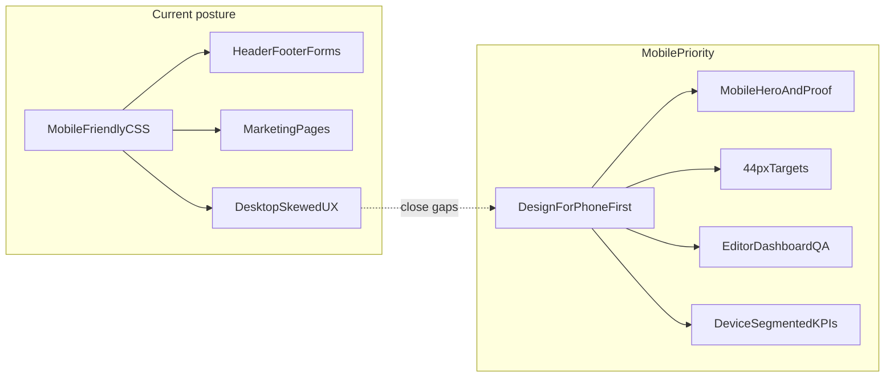

# Mobile-friendly vs mobile-priority assessment

## Direct answer

**You have a mobile-friendly (responsive) site, not a fully mobile-priority product.**

- **Mobile-friendly:** Layouts stack on small screens, viewport is correct, horizontal overflow is guarded, primary nav becomes a touch-oriented drawer below `lg`, and most marketing pages use single-column defaults with `sm`/`md`/`lg` upgrades.
- **Mobile-priority:** Would mean mobile/tablet users get the _best_ version first—hero proof on phones, simplified header actions, touch-sized controls everywhere, mobile-native patterns on product flows, and explicit acceptance criteria tied to real devices. Several high-traffic surfaces still hide desktop-only visuals, rely on horizontal scroll, or use app layouts tuned for wider viewports.

Your ~80% mobile/tablet share is **higher than what the implementation consistently optimizes for**. The stack is responsive; the **prioritization** (what ships on small screens, what gets QA, what gets hidden) still often favors desktop.



## Evidence in the codebase

### Foundations that support mobile users

| Area                    | What exists                                                                                                                             | Key files                                                                                                                                                                                                |
| ----------------------- | --------------------------------------------------------------------------------------------------------------------------------------- | -------------------------------------------------------------------------------------------------------------------------------------------------------------------------------------------------------- |
| Viewport                | `device-width`, `initialScale: 1`, zoom allowed to 5                                                                                    | [`src/app/layout.tsx`](src/app/layout.tsx)                                                                                                                                                               |
| Global touch/overflow   | `overflow-x: hidden` on `html`/`body`; `touch-action: manipulation` on interactive elements                                             | [`src/app/globals.css`](src/app/globals.css)                                                                                                                                                             |
| Breakpoint model        | Tailwind v3 defaults (`sm` 640, `md` 768, `lg` 1024); widespread **min-width** utilities; no `max-*` breakpoint variants under `src/`   | [`tailwind.config.ts`](tailwind.config.ts), components under [`src/components/`](src/components/)                                                                                                        |
| Site chrome             | Sticky header; desktop mega menu `hidden lg:flex`; mobile drawer `lg:hidden` with scroll lock, backdrop/Esc dismiss, accordion sections | [`src/components/site-header.tsx`](src/components/site-header.tsx), [`src/components/site-header/mobile-mega-menu.tsx`](src/components/site-header/mobile-mega-menu.tsx)                                 |
| Marketing layout        | Stacked CTAs, responsive type (`text-4xl sm:text-5xl`), grids that start at 1 column                                                    | [`src/components/home/home-landing.tsx`](src/components/home/home-landing.tsx), [`src/app/features/page.tsx`](src/app/features/page.tsx), [`src/app/resume-link/page.tsx`](src/app/resume-link/page.tsx) |
| Conversion forms        | Narrow `max-w-md` columns, full-width fields; OTP uses `inputMode="numeric"`                                                            | [`src/app/try/page.tsx`](src/app/try/page.tsx), [`src/app/signup/page.tsx`](src/app/signup/page.tsx)                                                                                                     |
| Mobile-only affordances | Features sticky bottom CTA `lg:hidden`; blog floating chrome / mobile nav on smaller viewports                                          | [`src/components/features/features-sticky-cta.tsx`](src/components/features/features-sticky-cta.tsx), blog components under [`src/components/blog/`](src/components/blog/)                               |

### Written intent (qualitative, not device KPIs)

- [`docs/PRD-ROLE-BASED.md`](docs/PRD-ROLE-BASED.md): builder stacks vertically on mobile with editor first; template grid 1 column on mobile.
- [`docs/DESIGN-PLAN-HOMEPAGE.md`](docs/DESIGN-PLAN-HOMEPAGE.md): “responsive elegance”; mobile = single column + stacked CTAs (layout intent, not tied to Tailwind token names).
- [`docs/WBS-WORK-BREAKDOWN-STRUCTURE.md`](docs/WBS-WORK-BREAKDOWN-STRUCTURE.md): no dedicated mobile/responsive QA task—acceptance is mostly implied.

### Where behavior is **not** mobile-priority (highest impact for 80% traffic)

1. **Home hero product proof is desktop-only** — hero artwork is `hidden lg:block`, so phones/tablets get copy and CTAs without the main visual proof.

```94:106:src/components/home/home-landing.tsx
            <motion.div className="relative hidden lg:block">
              <div className="relative -ml-[12%] w-[120%] max-w-none">
                <Image
                  src={heroArtwork}
                  alt="ResumeDoctor resume builder preview"
                  ...
                />
              </motion.div>
            </motion.div>
```

2. **Navigation breakpoint favors desktop** — primary information architecture lives in the desktop mega menu until `lg` (1024px). Many tablets in portrait still use the drawer; header auth can stay crowded (`AuthNav` hides some links until `xl`).
3. **Touch targets are uneven** — drawer/menu and primary CTAs often target ~44px; home template filter chips and some `text-sm` controls are smaller.
4. **Wide data on small screens** — pricing compare uses horizontal scroll (`min-w-[56rem]`); privacy/admin tables similar—usable but not mobile-native.
5. **Product surfaces lag marketing** — resume editor and dashboard follow responsive stacking ([`src/app/resumes/[id]/edit/page.tsx`](src/app/resumes/[id]/edit/page.tsx), [`src/components/user-dashboard-layout.tsx`](src/components/user-dashboard-layout.tsx)) but lack the same mobile-first polish as home/LPs; [`src/app/interview-prep/page.tsx`](src/app/interview-prep/page.tsx) is app-shell UI, not a slim mobile landing.
6. **Legacy inconsistency** — deprecated [`src/components/mobile-nav-menu.tsx`](src/components/mobile-nav-menu.tsx) uses `md:hidden` while live header uses `lg:hidden` (768px vs 1024px) if anything still imports the old component.
7. **No mobile-segmented quality bar** — analytics may show 80% mobile/tablet, but WBS/PRD do not require device-specific acceptance (LCP, tap targets, funnel completion on phone).

## Surface-by-surface read (marketing + services)

| Surface                             | Mobile/tablet posture                                       | Notes                                                                                                                                  |
| ----------------------------------- | ----------------------------------------------------------- | -------------------------------------------------------------------------------------------------------------------------------------- |
| Home                                | Strong stacking and CTAs; weak hero proof on small screens  | [`src/components/home/home-landing.tsx`](src/components/home/home-landing.tsx), [`landing-ui.tsx`](src/components/home/landing-ui.tsx) |
| Features, resume-link, LPs          | Generally strong                                            | [`src/app/features/page.tsx`](src/app/features/page.tsx), [`src/app/lp/`](src/app/lp/)                                                 |
| Pricing                             | Plans responsive; compare table scrolls sideways            | [`src/app/pricing/page.tsx`](src/app/pricing/page.tsx)                                                                                 |
| Templates                           | Grid OK; category control and preview modal need phone pass | [`src/app/templates/page.tsx`](src/app/templates/page.tsx)                                                                             |
| Try / signup / login                | Good narrow forms                                           | [`src/app/try/page.tsx`](src/app/try/page.tsx)                                                                                         |
| Blog                                | Mobile chrome and reader patterns                           | [`src/components/blog/`](src/components/blog/)                                                                                         |
| Dashboard / editor / interview prep | Responsive, not mobile-first                                | editor + dashboard layouts                                                                                                             |
| Admin                               | Wide tables; internal-only                                  | [`src/app/admin/`](src/app/admin/)                                                                                                     |

## Recommended direction (if you align product with 80% mobile/tablet)

Work in phases; each phase should define **device-segmented success** (e.g. home CTA tap rate, try-start rate, editor step completion on mobile vs desktop).

### Phase 1 — Highest-traffic marketing and conversion (fastest ROI)

- Add a **mobile/tablet hero proof** on home (compact mock, stepped `StepDeviceMock`, or lighter image)—do not rely on `hidden lg:block` alone.
- Enlarge **filter chips and secondary controls** to consistent ~44px min height on home and templates.
- Fix **trust badge contrast** on the blue hero ([`src/components/trust-badges.tsx`](src/components/trust-badges.tsx)).
- **Pricing compare:** card-based comparison on `md` and below, or fewer columns with progressive disclosure instead of only horizontal scroll.
- **Header auth cluster:** reduce visible chrome on small widths; ensure critical paths (Try, Templates, Pricing) are one tap from drawer/footer.

### Phase 2 — Product flows (where users actually build resumes)

- **Resume editor:** validate editor-first stacking, preview access, and export/share on phone-sized viewports (PRD already states editor-first on mobile).
- **Dashboard:** apply patterns from [`.cursor/plans/dashboard_ux_replan_f1dfcb7c.plan.md`](.cursor/plans/dashboard_ux_replan_f1dfcb7c.plan.md) (tablet grids, checklist collapse).
- **Interview prep:** either a dedicated mobile entry narrative or explicit small-screen layout pass.

### Phase 3 — Governance and regression prevention

- Document breakpoint intent in one place (map `sm`/`md`/`lg` to phone / tablet / desktop).
- Add **mobile/tablet QA checklist** to WBS or PRD (touch targets, no unintended horizontal scroll, primary CTA visible without desktop-only content).
- Segment **Vercel Analytics / Speed Insights** and funnel events by device class so fixes are measured against the 80% cohort.
- Remove or quarantine **deprecated `mobile-nav-menu.tsx`** so only `lg` cutoff remains.

### Phase 4 — Optional hardening

- Container queries for dense cards (home template rail, pricing).
- Real-device pass on mid-size tablets (768–1023px)—often the awkward zone between drawer nav and desktop mega menu.

## What we are **not** proposing in this pass

- Rewriting the stack or adopting a new UI kit.
- Running local dev servers (per [`.cursor/rules/deploy-to-git.mdc`](.cursor/rules/deploy-to-git.mdc)); validate via Git push and Vercel preview plus device checks.
- Treating admin tables as mobile-priority unless internal mobile admin use is confirmed.

## Bottom line

**Yes, the site is designed to be mobile-friendly** through Tailwind mobile-first CSS, correct viewport metadata, a dedicated mobile navigation drawer, and responsive marketing layouts. **No, it is not yet consistently mobile-priority** for an audience that is mostly on phones and tablets: key proof and navigation patterns still assume desktop, touch and table UX is uneven, and product flows lack the same bar as top marketing pages. Closing that gap is mostly **prioritization, content on small screens, and device-segmented QA**—not rebuilding responsiveness from scratch.
