# ResumeDoctor — Project Blueprint

**Purpose:** Single map of the codebase: product scope, features, routes, APIs, data model, integrations, and end-to-end user flows. Use this as the “where does X live?” index before diving into the PRD/WBS or source.

**Product:** India-first, Zety-style resume/CV builder SaaS (freemium, Pro subscriptions, trials).  
**Production domain:** resumedoctor.in  
**Last updated:** 2026-05-01  

**Diagrams:** This document uses [Mermaid](https://mermaid.js.org/) (`flowchart`, `sequenceDiagram`, `stateDiagram`, `classDiagram`, `erDiagram`, `mindmap`). GitHub renders them in Markdown; local editors may need a Mermaid-capable preview.

### Table of contents

| Section | Contents |
|---------|----------|
| [§1–2](#1-tech-stack) | Tech stack, repository map |
| [§3–5](#3-feature-map) | Feature map, route catalog, API surface |
| [§6–8](#6-data-model-prisma--conceptual-map) | ER + **UML class**, data notes, middleware + **activity**, end-to-end flows |
| [**§9**](#9-advanced-architecture--uml-reference) | **System context, deployment, layers, components, state machines, extended UML sequences, mindmap** |
| [§10–13](#10-scheduled-jobs-vercel-cron) | Cron jobs, content, environment, maintenance |

**Companion docs**

| Document | Use for |
|----------|---------|
| [`PRD-ROLE-BASED.md`](../../docs/PRD-ROLE-BASED.md) | Role scopes, acceptance criteria |
| [`WBS-WORK-BREAKDOWN-STRUCTURE.md`](../../docs/WBS-WORK-BREAKDOWN-STRUCTURE.md) | Task IDs, phases, effort |
| [`AGENTS.md`](../../AGENTS.md) | Agent workflow, path conventions |
| [`DEPLOYMENT-REQUIREMENTS.md`](../../docs/DEPLOYMENT-REQUIREMENTS.md) | Production checklist |
| [`LOCAL-DEVELOPMENT-SETUP.md`](../../docs/LOCAL-DEVELOPMENT-SETUP.md) | Env vars, local setup |

---

## 1. Tech stack

| Layer | Technology |
|-------|------------|
| Framework | Next.js 14 (App Router), React 18, TypeScript |
| UI | Tailwind CSS, Radix UI, Lucide icons |
| Data | PostgreSQL, Prisma ORM |
| Auth | NextAuth.js (JWT sessions), Google & LinkedIn OAuth, credentials + email verification, optional TOTP 2FA |
| Payments | Stripe (checkout + webhooks); manual/UPI flows where configured |
| AI | OpenAI (resume/cover improvements, ATS-style logic, interview prep) |
| Email | Resend |
| Hosting | Vercel (`vercel.json` crons); assets/uploads via Vercel Blob where used |
| Observability | Sentry, Vercel Analytics / Speed Insights, Microsoft Clarity |
| Testing | Playwright (dev dependency) |

**Runtime:** Node 20.x (`package.json` engines).

### 1a. Logical layers (implementation view)

How responsibilities stack inside the deployed app (not a deployment diagram — see [§9](#9-advanced-architecture--uml-reference) for containers and layers).

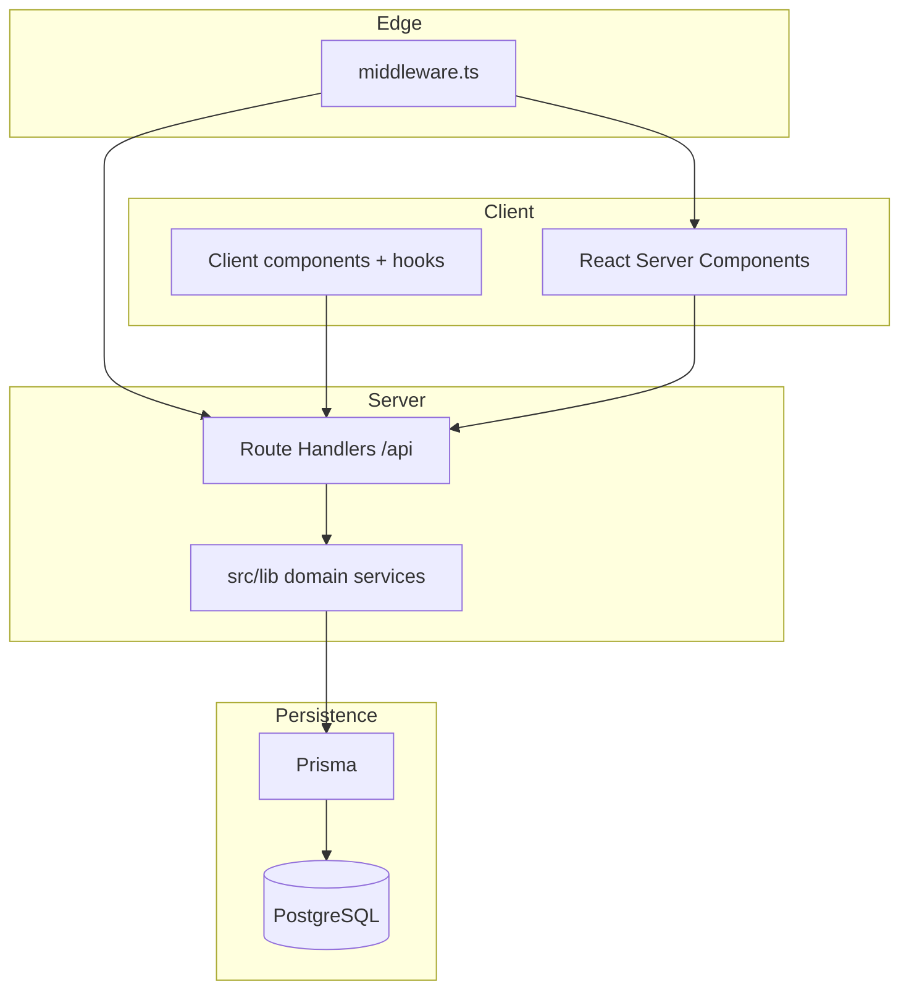
```mermaid
flowchart TB
  subgraph client [Client]
    RSC[React Server Components]
    RCC[Client components + hooks]
  end

  subgraph edge [Edge]
    MW[middleware.ts]
  end

  subgraph server [Server]
    RH[Route Handlers /api]
    LIB[src/lib domain services]
  end

  subgraph persistence [Persistence]
    PR[Prisma]
    PG[(PostgreSQL)]
  end

  MW --> RSC
  MW --> RH
  RCC --> RH
  RSC --> RH
  RH --> LIB
  LIB --> PR
  PR --> PG
```

---

## 2. Repository map (high level)

```
├── prisma/                 # schema.prisma, migrations
├── content/                # MDX/Markdown blog posts, examples index, job seed JSON
├── docs/                   # PRD, WBS, deployment
├── .cursor/plans/          # Cursor plans (this file: project_blueprint.plan.md)
├── public/                 # Static assets
├── scripts/                # promote-admin, thumbnails, email test, git helpers
├── src/
│   ├── app/                # App Router: pages, layouts, API routes
│   ├── components/        # Feature + shared UI (resume-builder/, settings/, admin/, blog/, pricing/)
│   ├── hooks/             # use-resume, use-subscription, use-trial-timer
│   └── lib/               # auth, prisma, billing, AI, ATS, SEO, trial JWT, admin helpers
├── vercel.json             # Cron schedules
└── package.json
```

### 2a. Package-style dependency (src/)

Conceptual “depends on” edges: UI and routes call into `lib/` and Prisma; avoid cycles (`lib` should not import `app`).

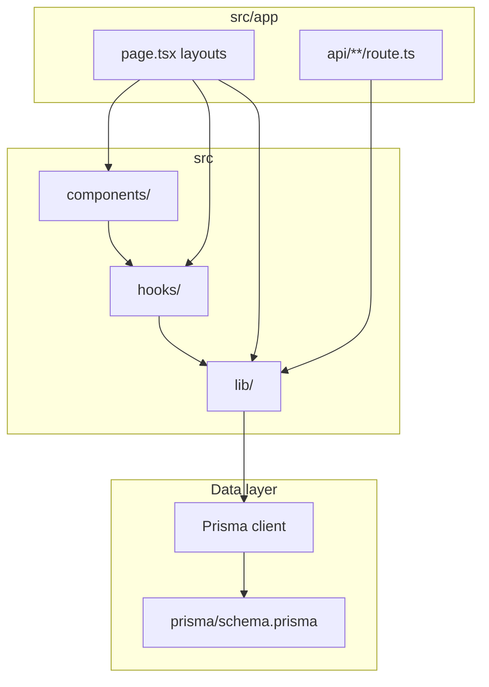
```mermaid
flowchart TB
  subgraph app_router [src/app]
    PAGES[page.tsx layouts]
    API_Routes[api/**/route.ts]
  end

  subgraph shared [src]
    COMP[components/]
    HOOKS[hooks/]
    LIB[lib/]
  end

  subgraph data [Data layer]
    PRISMA_FILE[prisma/schema.prisma]
    CLIENT[Prisma client]
  end

  PAGES --> COMP
  PAGES --> HOOKS
  PAGES --> LIB
  API_Routes --> LIB
  COMP --> HOOKS
  HOOKS --> LIB
  LIB --> CLIENT
  CLIENT --> PRISMA_FILE
```

---

## 3. Feature map

Features are grouped by user-visible area and mapped to primary code locations.

| Area | What it does | Primary surfaces |
|------|----------------|------------------|
| **Marketing & SEO** | Home, pricing, templates gallery, landing page (`/lp/resume-builder-india`), trust/CTA | `src/app/page.tsx`, `pricing/`, `templates/`, `lp/`, `components/site-header.tsx`, `footer.tsx`, `seo/` |
| **Auth & identity** | Sign up/in, OAuth, email verification, password reset, 2FA, session | `login/`, `signup/`, `verify-email/`, `forgot-password/`, `reset-password/`, `login/2fa/`, `api/auth/*`, `lib/auth.ts` |
| **Free trial (OTP)** | Email OTP trial session, template try, conversion to full account | `try/`, `try/templates/`, `api/auth/trial/*`, `lib/trial-jwt.ts`, middleware trial cookie |
| **Dashboard** | Resume list, onboarding checklist, entry to builder | `dashboard/`, `components/dashboard/`, `api/user/onboarding-status` |
| **Resume builder** | Sections, DnD reorder, live preview, templates, import (PDF/DOCX), share link | `resumes/new/`, `resumes/[id]/edit/`, `components/resume-builder/*`, `api/resumes/*`, `api/resumes/import/*` |
| **Export** | TXT / HTML / PDF / DOCX, tier gating, export logging | `api/resumes/[id]/export/*`, `components/resume-builder/export-buttons.tsx`, `lib/export-*` |
| **AI assistance** | Improve bullets/summary, suggest bullets, tailor for job, cover letter customize | `api/resumes/[id]/ai/*`, `api/cover-letters/[id]/customize`, `lib/ai-*`, rate limits in DB |
| **ATS & feedback** | Score, suggestions, live feedback panel | `api/resumes/[id]/ats`, `components/resume-builder/ats-score-panel.tsx`, `live-feedback-panel.tsx`, `lib/ats-checker.ts` |
| **Cover letters** | CRUD, templates (system + user-saved), export | `cover-letters/`, `api/cover-letters/*` |
| **Jobs (MVP)** | Job list, apply tracking, optional URL fetch | `jobs/`, `api/jobs/*`, `content/jobs/seed.json` |
| **Interview prep** | AI Q&A helper | `interview-prep/`, `api/interview-prep/answer` |
| **Examples** | Resume example pages (content-driven) | `examples/`, `lib/examples.ts` |
| **Blog** | MD content, SEO, lead magnet, feedback | `blog/`, `content/blog/*.md`, `lib/blog.ts`, `api/blog/*` |
| **Account & settings** | Profile, password, email change, connected accounts, avatar, notifications, delete account, churn capture | `settings/`, `api/user/*` |
| **Billing & pricing** | Plans, Stripe checkout, webhooks, promos, trial activation (incl. manual flows), region/pricing helpers | `pricing/`, `pricing/verify-trial/`, `api/billing/*`, `api/pricing/*`, `lib/billing/stripe.ts` |
| **Public resume** | Share by slug | `r/[slug]/`, `api/resumes/by-slug/[slug]` |
| **Admin** | Users, impersonation, analytics, export logs, jobs, promos, trial sessions/activations, purchases, system health, audit | `admin/**`, `api/admin/*`, `lib/admin-auth.ts`, `master-admin-config.ts` |
| **First-party analytics** | Product events | `api/analytics/event`, `lib/product-events.ts`, `lib/analytics-event-names.ts` |
| **Integrations** | SuperProfile webhook fulfillment | `api/webhooks/superprofile`, `lib/superprofile-fulfillment.ts` |

---

## 4. Route catalog (App Router pages)

### Public (marketing & content)

| Path | Notes |
|------|--------|
| `/` | Home |
| `/about`, `/pricing`, `/templates` | Marketing |
| `/lp/resume-builder-india` | Landing page |
| `/try`, `/try/templates` | Trial funnel (middleware: `/try/templates` requires trial JWT cookie if not logged in) |
| `/blog`, `/blog/[slug]` | Blog |
| `/examples`, `/examples/[slug]` | Resume examples |
| `/jobs` | Job board MVP |
| `/interview-prep` | Interview helper |
| `/login`, `/signup`, `/forgot-password`, `/reset-password`, `/verify-email` | Auth |
| `/terms`, `/privacy` | Legal |

### Authenticated (middleware-protected: `/dashboard`, `/settings`, `/resumes`, `/cover-letters`)

| Path | Notes |
|------|--------|
| `/dashboard` | Hub |
| `/settings`, `/settings/change-email/verify` | Account |
| `/resumes/new`, `/resumes/[id]/edit` | Builder |
| `/cover-letters`, `/cover-letters/new`, `/cover-letters/[id]/edit` | Cover letters |
| `/login/2fa` | 2FA step (post-credential challenge) |

### Other

| Path | Notes |
|------|--------|
| `/r/[slug]` | Public shared resume |
| `/pricing/verify-trial` | Trial verification UX |
| `/admin`, `/admin/login`, `/admin/users`, `/admin/users/[id]`, `/admin/view-user/[id]`, `/admin/jobs`, `/admin/promos`, `/admin/export-logs`, `/admin/trial-activations`, `/admin/trial-sessions`, `/admin/purchases`, `/admin/system-health`, `/admin/audit-log` | Admin cockpit (role `admin` + optional master-admin email allowlist + optional IP allowlist) |
| `/dev/preview/[templateId]` | Template preview (dev-oriented) |

---

## 5. API surface (Route Handlers)

Base path: `/api`. Below is the complete route tree as implemented under `src/app/api` (each segment is a `route.ts`).

### Auth & session

- `/api/auth/[...nextauth]` — NextAuth
- `/api/auth/signup`, `verify-email`, `request-verification-email`, `resend-verification`
- `/api/auth/forgot-password`, `reset-password`, `change-password`
- `/api/auth/trial/send-otp`, `verify-otp`, `status`

### User account

- `/api/user/profile`, `avatar/upload`, `accounts`, `accounts/[provider]`
- `/api/user/change-email/request`, `change-email/verify`
- `/api/user/2fa/status`, `setup`, `verify`, `disable`
- `/api/user/onboarding-status`, `export-data`, `export-history`, `invoices`, `delete-account`, `churn-feedback`

### Resumes

- `/api/resumes` (collection), `/api/resumes/[id]` (item)
- `/api/resumes/[id]/duplicate`, `share`, `export/txt`, `export/html`, `export/docx`, `export/log`
- `/api/resumes/[id]/ats`
- `/api/resumes/[id]/ai/improve-bullet`, `improve-summary`, `suggest-bullets`, `tailor-for-job`
- `/api/resumes/by-slug/[slug]`
- `/api/resumes/import`, `import/parse`, `import/create`

### Cover letters

- `/api/cover-letters`, `/api/cover-letters/[id]`, `[id]/customize`, `[id]/export/txt`, `[id]/export/docx`
- `/api/cover-letters/templates`, `templates/[id]`

### Jobs & interview

- `/api/jobs`, `/api/jobs/[id]/apply`, `applications`, `fetch-url`
- `/api/interview-prep/answer`

### Billing & pricing

- `/api/billing/checkout`, `webhook`
- `/api/pricing/region`, `trial-activation`, `validate-promo`

### Content & misc

- `/api/templates` — template metadata for UI
- `/api/structured-data` — structured data helpers
- `/api/blog/lead`, `blog/feedback`
- `/api/analytics/event` — product analytics

### Admin

- `/api/admin/users`, `users/[id]`, `users/[id]/activity`, `users/[id]/revoke-sessions`
- `/api/admin/impersonate`, `impersonate/end`
- `/api/admin/analytics`, `stats`, `system-metrics`, `security-audit`, `export-logs`, `export`
- `/api/admin/jobs`, `jobs/[id]`
- `/api/admin/promos`, `promos/[id]`
- `/api/admin/trial-activations`, `trial-activations/[id]/approve`, `trial-activations/[id]/reject`
- `/api/admin/trial-sessions`
- `/api/admin/purchases`

### Webhooks & cron

- `/api/webhooks/superprofile`
- `/api/cron/trial-expiry-reminders`, `trial-expired-downgrade`

### Health

- `/api/health`

---

## 6. Data model (Prisma) — conceptual map

Core entities and how they relate (detail in `prisma/schema.prisma`):

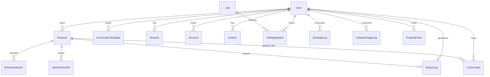
```mermaid
erDiagram
  User ||--o{ Resume : owns
  User ||--o{ CoverLetter : owns
  User ||--o{ CoverLetterTemplate : saves
  User ||--o{ Session : has
  User ||--o{ Account : oauth
  User ||--o{ Invoice : has
  User ||--o{ JobApplication : tracks
  User ||--o{ ExportLog : generates
  User ||--o{ AiUsageLog : consumes
  User ||--o{ FeatureUsageLog : consumes
  User ||--o{ ProductEvent : emits
  Resume ||--o{ ResumeVersion : versions
  Resume ||--o{ ExportLog : exports
  Resume ||--o{ AtsScoreCache : scores
  Resume ||--o{ CoverLetter : optional_link
  Job ||--o{ JobApplication : receives
```

### UML class diagram (conceptual aggregates)

UML-style view of the same domain (attributes abbreviated; see `prisma/schema.prisma` for full types). Multiplicity matches Prisma relations.

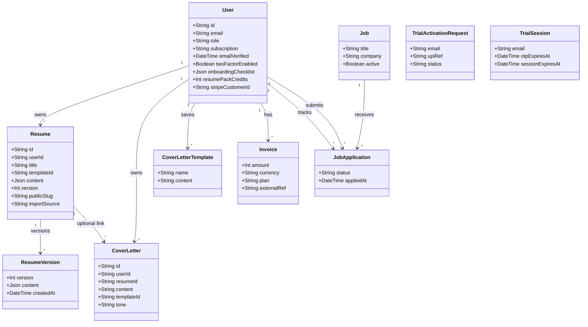
```mermaid
classDiagram
  direction TB

  class User {
    +String id
    +String email
    +String role
    +String subscription
    +DateTime emailVerified
    +Boolean twoFactorEnabled
    +Json onboardingChecklist
    +Int resumePackCredits
    +String stripeCustomerId
  }

  class Resume {
    +String id
    +String userId
    +String title
    +String templateId
    +Json content
    +Int version
    +String publicSlug
    +String importSource
  }

  class ResumeVersion {
    +Int version
    +Json content
    +DateTime createdAt
  }

  class CoverLetter {
    +String id
    +String userId
    +String resumeId
    +String content
    +String templateId
    +String tone
  }

  class CoverLetterTemplate {
    +String name
    +String content
  }

  class Job {
    +String title
    +String company
    +Boolean active
  }

  class JobApplication {
    +String status
    +DateTime appliedAt
  }

  class Invoice {
    +Int amount
    +String currency
    +String plan
    +String externalRef
  }

  class TrialActivationRequest {
    +String email
    +String upiRef
    +String status
  }

  class TrialSession {
    +String email
    +DateTime otpExpiresAt
    +DateTime sessionExpiresAt
  }

  User "1" --> "*" Resume : owns
  User "1" --> "*" CoverLetter : owns
  User "1" --> "*" CoverLetterTemplate : saves
  User "1" --> "*" Invoice : has
  User "1" --> "*" JobApplication : tracks
  Resume "1" --> "*" ResumeVersion : versions
  Resume "1" --> "*" CoverLetter : optional link
  Job "1" --> "*" JobApplication : receives
  User "1" --> "*" JobApplication : submits
```

**Notable fields / enums (string-backed in DB):**

- **User:** `role` (`user` | `admin`), `subscription` (`basic` | `trial` | `pro_*` variants), billing provider, Stripe customer id, onboarding JSON, 2FA fields, `resumePackCredits`, trial reminder timestamps.
- **Resume:** `content` JSON, `templateId`, `publicSlug`, `importSource`.
- **Operational:** `TrialActivationRequest`, `TrialSession` (OTP trial), `PromoCode`, `ChurnFeedback`, `SuperprofilePurchaseEvent`, `SecurityAuditLog`, `IpRateLimit`.

---

## 7. Middleware and access control

Implemented in `src/middleware.ts`:

- **Protected paths:** `/dashboard`, `/settings`, `/resumes`, `/cover-letters` — require NextAuth JWT **or** (limited) valid **trial JWT cookie** for resume paths and dashboard (trial users redirected from `/login` vs `/try` per logic).
- **Auth pages:** `/login`, `/signup` — logged-in users redirected to `/dashboard`.
- **Admin paths:** `/admin/*` — requires `role === "admin"`; optional **master admin email allowlist** and **admin IP allowlist** (`ADMIN_IP_ALLOWLIST`); unauthenticated admins go to `/admin/login`.

### 7a. Middleware decision — UML activity-style flow

High-level branching implemented in `middleware.ts` (simplified; omit query-param edge cases).

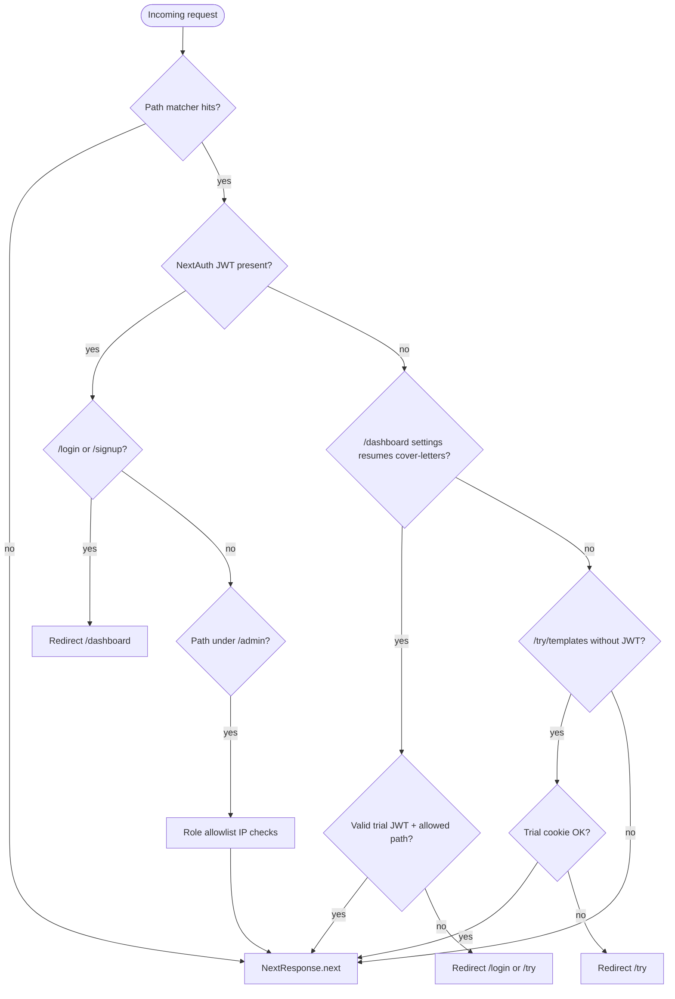
```mermaid
flowchart TD
  Start([Incoming request]) --> Match{Path matcher hits?}
  Match -->|no| Next[NextResponse.next]
  Match -->|yes| Token{NextAuth JWT present?}

  Token -->|yes| AuthPages{/login or /signup?}
  AuthPages -->|yes| DashRedirect[Redirect /dashboard]
  AuthPages -->|no| AdminBlock{Path under /admin?}

  AdminBlock -->|yes| AdminGate[Role allowlist IP checks]
  AdminGate --> Next

  Token -->|no| Protected{/dashboard settings resumes cover-letters?}
  Protected -->|yes| TrialCookie{Valid trial JWT + allowed path?}
  TrialCookie -->|yes| Next
  TrialCookie -->|no| LoginRedirect[Redirect /login or /try]

  Protected -->|no| TryTpl{/try/templates without JWT?}
  TryTpl -->|yes| TryGate{Trial cookie OK?}
  TryGate -->|yes| Next
  TryGate -->|no| TryStart[Redirect /try]

  TryTpl -->|no| Next
```

---

## 8. End-to-end user flow maps

Extended **UML sequence diagrams**, **state machines**, **deployment**, and **C4-style** views are in [§9](#9-advanced-architecture--uml-reference).

### 8.1 New visitor → signed-up user → first resume

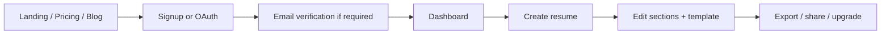
```mermaid
flowchart LR
  A[Landing / Pricing / Blog] --> B[Signup or OAuth]
  B --> C[Email verification if required]
  C --> D[Dashboard]
  D --> E[Create resume]
  E --> F[Edit sections + template]
  F --> G[Export / share / upgrade]
```

### 8.2 Trial (OTP) → convert or expire

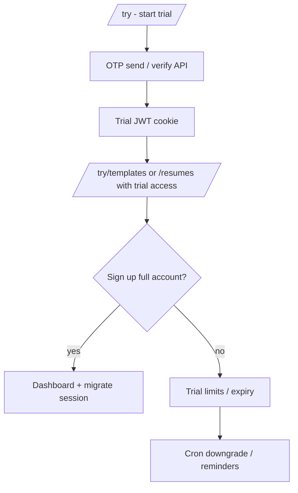
```mermaid
flowchart TD
  T1[/try - start trial/] --> T2[OTP send / verify API]
  T2 --> T3[Trial JWT cookie]
  T3 --> T4[/try/templates or /resumes with trial access/]
  T4 --> T5{Sign up full account?}
  T5 -->|yes| D[Dashboard + migrate session]
  T5 -->|no| T6[Trial limits / expiry]
  T6 --> T7[Cron downgrade / reminders]
```

*(Exact policy is enforced in API routes + cron jobs; see `api/auth/trial/*`, `api/cron/*`.)*

### 8.3 Resume editing loop (core product)

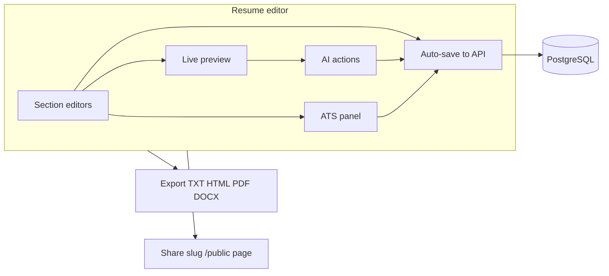
```mermaid
flowchart LR
  subgraph builder [Resume editor]
    E[Section editors] --> P[Live preview]
    E --> S[Auto-save to API]
    P --> AI[AI actions]
    AI --> S
    E --> ATS[ATS panel]
    ATS --> S
  end
  S --> DB[(PostgreSQL)]
  builder --> X[Export TXT HTML PDF DOCX]
  builder --> SH[Share slug /public page]
```

### 8.4 Upgrade / billing (Stripe)

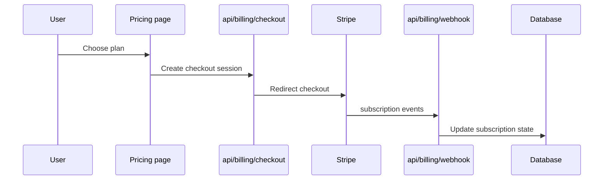
```mermaid
sequenceDiagram
  participant U as User
  participant P as Pricing page
  participant API as api/billing/checkout
  participant S as Stripe
  participant W as api/billing/webhook
  participant DB as Database

  U->>P: Choose plan
  P->>API: Create checkout session
  API->>S: Redirect checkout
  S->>W: subscription events
  W->>DB: Update subscription state
```

### 8.5 Admin support journey

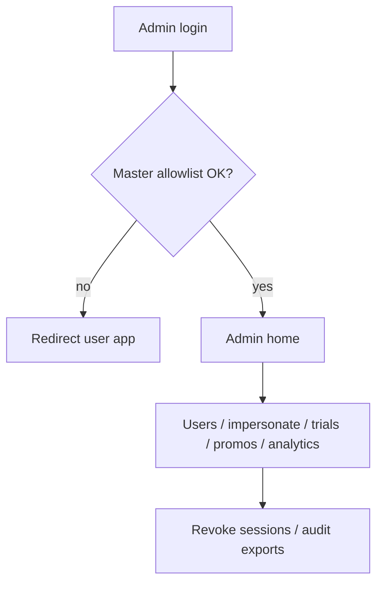
```mermaid
flowchart TD
  A1[Admin login] --> A2{Master allowlist OK?}
  A2 -->|no| U[Redirect user app]
  A2 -->|yes| A3[Admin home]
  A3 --> A4[Users / impersonate / trials / promos / analytics]
  A4 --> A5[Revoke sessions / audit exports]
```

### 8.6 Collaboration boundary — who touches what (UML-ish)

Conceptual **boundary diagram**: external actors vs application packages (mirrors PRD role mapping).

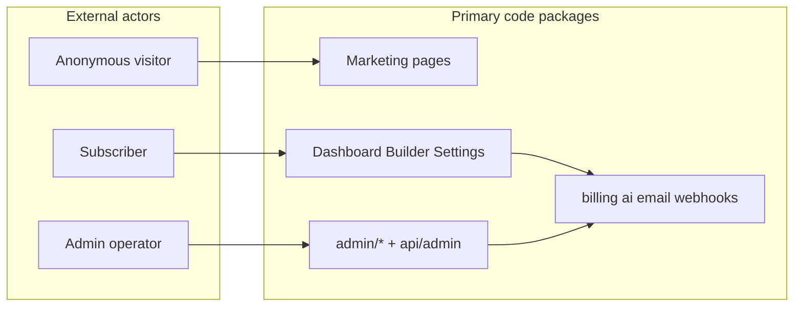
```mermaid
flowchart LR
  subgraph external [External actors]
    VISITOR[Anonymous visitor]
    CUSTOMER[Subscriber]
    OPS[Admin operator]
  end

  subgraph app_packages [Primary code packages]
    MKT[Marketing pages]
    APP_USER[Dashboard Builder Settings]
    APP_ADMIN[admin/* + api/admin]
    INT[billing ai email webhooks]
  end

  VISITOR --> MKT
  CUSTOMER --> APP_USER
  OPS --> APP_ADMIN
  APP_USER --> INT
  APP_ADMIN --> INT
```

---

## 9. Advanced architecture & UML reference

Broader **visual blueprint**: system landscape, containers, deployment, richer **UML** sequences and states. Use this section for onboarding architects and for aligning integrations.

### 9.1 System context (C4-style — landscape)

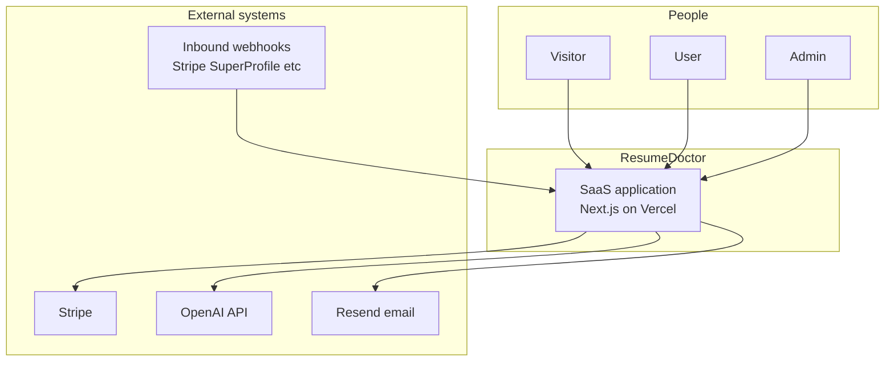
```mermaid
flowchart TB
  subgraph people [People]
    VIS[Visitor]
    USR[User]
    ADM[Admin]
  end

  subgraph system [ResumeDoctor]
    APP[SaaS application\nNext.js on Vercel]
  end

  subgraph org [External systems]
    STRIPE[Stripe]
    OAI[OpenAI API]
    EMAIL[Resend email]
    EXT_WH[Inbound webhooks\nStripe SuperProfile etc]
  end

  VIS --> APP
  USR --> APP
  ADM --> APP
  APP --> STRIPE
  APP --> OAI
  APP --> EMAIL
  EXT_WH --> APP
```

### 9.2 Container view (runtime units)

What runs “inside” the shipped artifact versus managed services.

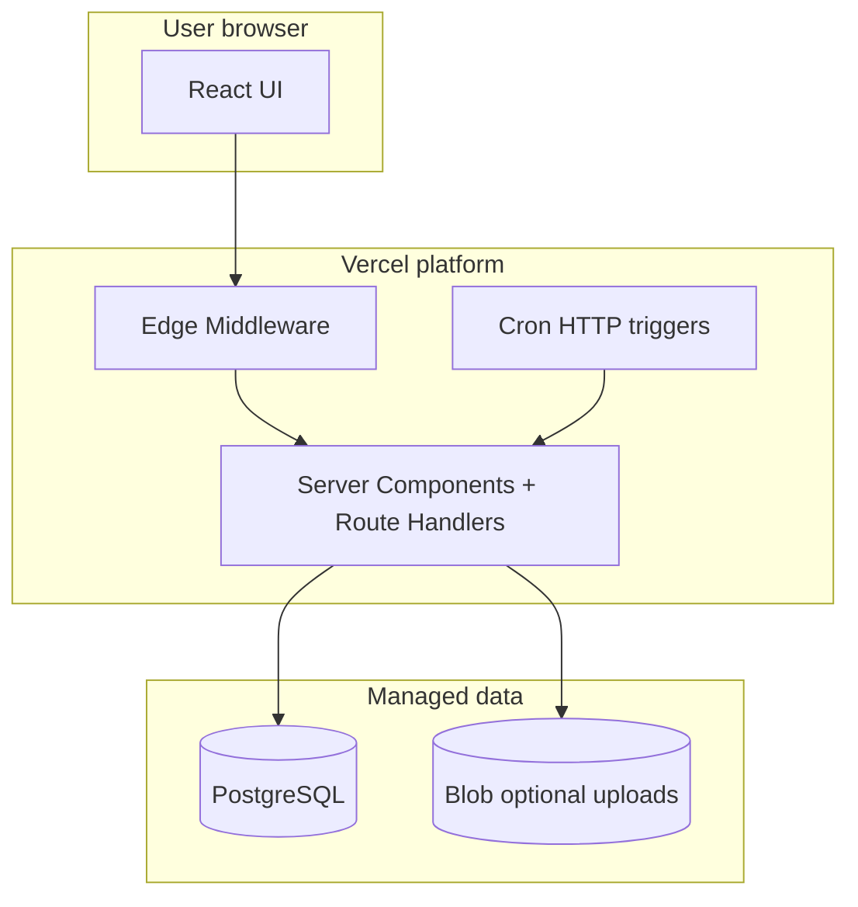
```mermaid
flowchart TB
  subgraph browser [User browser]
    UI[React UI]
  end

  subgraph vercel [Vercel platform]
    EDGE[Edge Middleware]
    SSR[Server Components + Route Handlers]
    CRON_TRIG[Cron HTTP triggers]
  end

  subgraph data_services [Managed data]
    PG[(PostgreSQL)]
    VBlob[(Blob optional uploads)]
  end

  UI --> EDGE
  EDGE --> SSR
  SSR --> PG
  SSR --> VBlob
  CRON_TRIG --> SSR
```

### 9.3 Deployment topology (production)

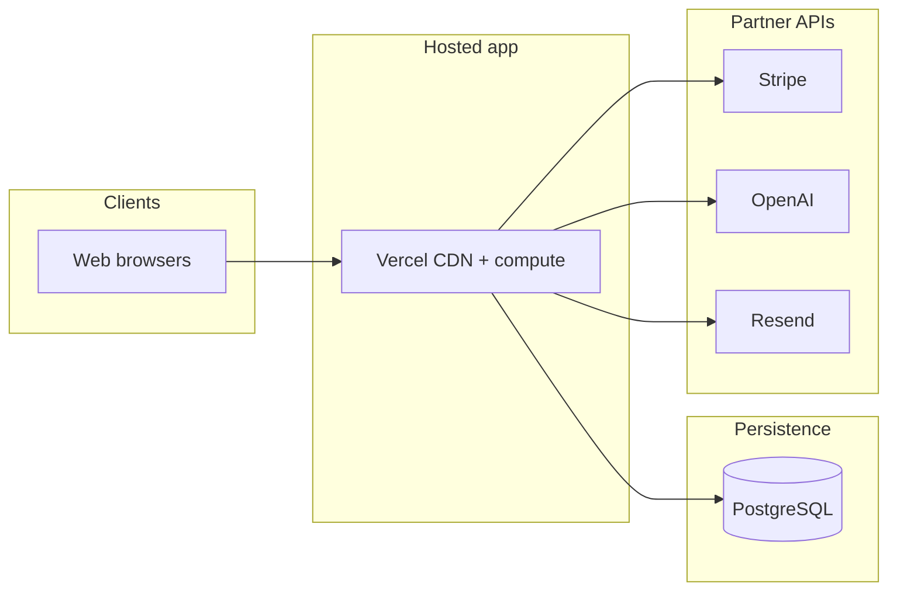
```mermaid
flowchart LR
  subgraph users [Clients]
    WEB[Web browsers]
  end

  subgraph hosted [Hosted app]
    VC[Vercel CDN + compute]
  end

  subgraph persistence [Persistence]
    DB[(PostgreSQL)]
  end

  subgraph partners [Partner APIs]
    ST[Stripe]
    AI[OpenAI]
    RS[Resend]
  end

  WEB --> VC
  VC --> DB
  VC --> ST
  VC --> AI
  VC --> RS
```

### 9.4 Layered architecture — detail

Same idea as [§1a](#1a-logical-layers-implementation-view), expanded with auth + integrations.

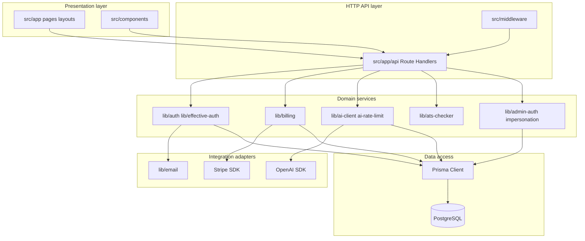
```mermaid
flowchart TB
  subgraph presentation [Presentation layer]
    ROUTES[src/app pages layouts]
    CMP[src/components]
  end

  subgraph api_layer [HTTP API layer]
    RH[src/app/api Route Handlers]
    MW[src/middleware]
  end

  subgraph domain [Domain services]
    AUTH_LIB[lib/auth lib/effective-auth]
    BILL[lib/billing]
    AI_LIB[lib/ai-client ai-rate-limit]
    ATS_LIB[lib/ats-checker]
    ADMIN_LIB[lib/admin-auth impersonation]
  end

  subgraph integration [Integration adapters]
    STRIPE_AD[Stripe SDK]
    OAI_AD[OpenAI SDK]
    MAIL[lib/email]
  end

  subgraph store [Data access]
    PRISMA[Prisma Client]
    PG[(PostgreSQL)]
  end

  ROUTES --> RH
  CMP --> RH
  MW --> RH
  RH --> AUTH_LIB
  RH --> BILL
  RH --> AI_LIB
  RH --> ATS_LIB
  RH --> ADMIN_LIB
  BILL --> STRIPE_AD
  AI_LIB --> OAI_AD
  AUTH_LIB --> MAIL
  ADMIN_LIB --> PRISMA
  AUTH_LIB --> PRISMA
  BILL --> PRISMA
  AI_LIB --> PRISMA
  PRISMA --> PG
```

### 9.5 UML component diagram — integration boundaries

Major **component** clusters and dependency direction (stable inward toward `lib` + DB).

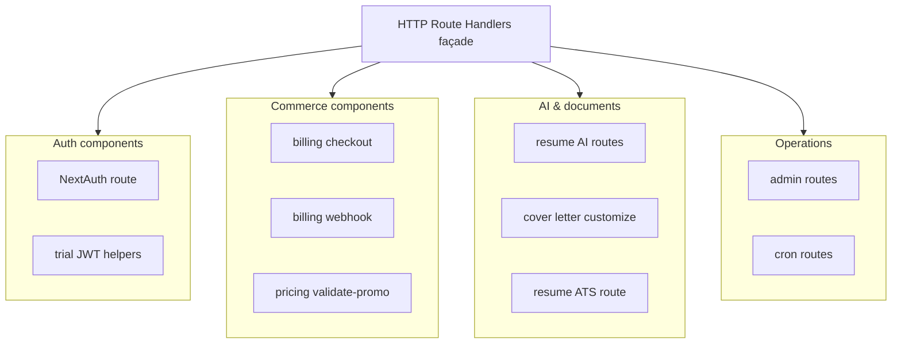
```mermaid
flowchart TB
  subgraph boundary_auth [Auth components]
    NEXTAUTH[NextAuth route]
    TRIAL[trial JWT helpers]
  end

  subgraph boundary_commerce [Commerce components]
    CHECKOUT[billing checkout]
    WH_STRIPE[billing webhook]
    PROMO[pricing validate-promo]
  end

  subgraph boundary_content [AI & documents]
    RES_AI[resume AI routes]
    CL_AI[cover letter customize]
    ATS_API[resume ATS route]
  end

  subgraph boundary_ops [Operations]
    ADMIN_API[admin routes]
    CRON[cron routes]
  end

  GATEWAY[HTTP Route Handlers façade]

  GATEWAY --> boundary_auth
  GATEWAY --> boundary_commerce
  GATEWAY --> boundary_content
  GATEWAY --> boundary_ops
```

### 9.6 User subscription — UML state machine (simplified)

Not every transition is explicit in code paths; cron and webhooks drive several edges.

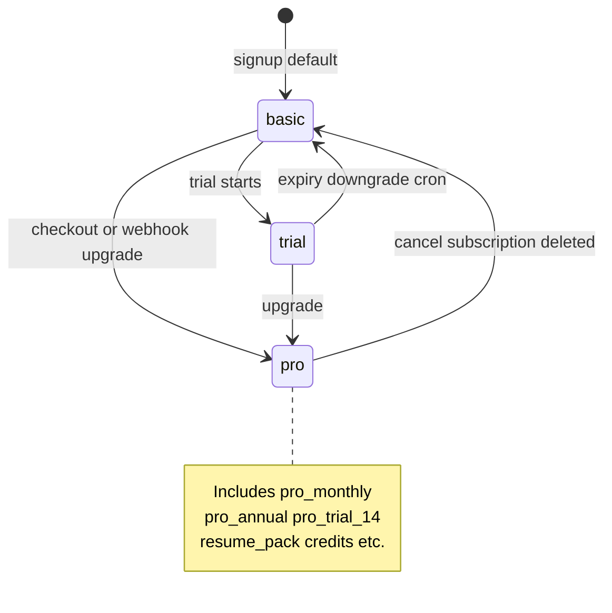
```mermaid
stateDiagram-v2
  [*] --> basic: signup default
  basic --> trial: trial starts
  basic --> pro: checkout or webhook upgrade
  trial --> pro: upgrade
  trial --> basic: expiry downgrade cron
  pro --> basic: cancel subscription deleted
  note right of pro
    Includes pro_monthly
    pro_annual pro_trial_14
    resume_pack credits etc.
  end note
```

### 9.7 TrialActivationRequest — state machine

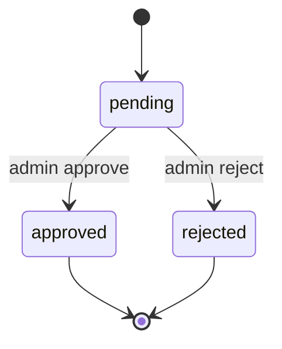
```mermaid
stateDiagram-v2
  [*] --> pending
  pending --> approved: admin approve
  pending --> rejected: admin reject
  approved --> [*]
  rejected --> [*]
```

### 9.8 UML sequence — credentials login with 2FA branch

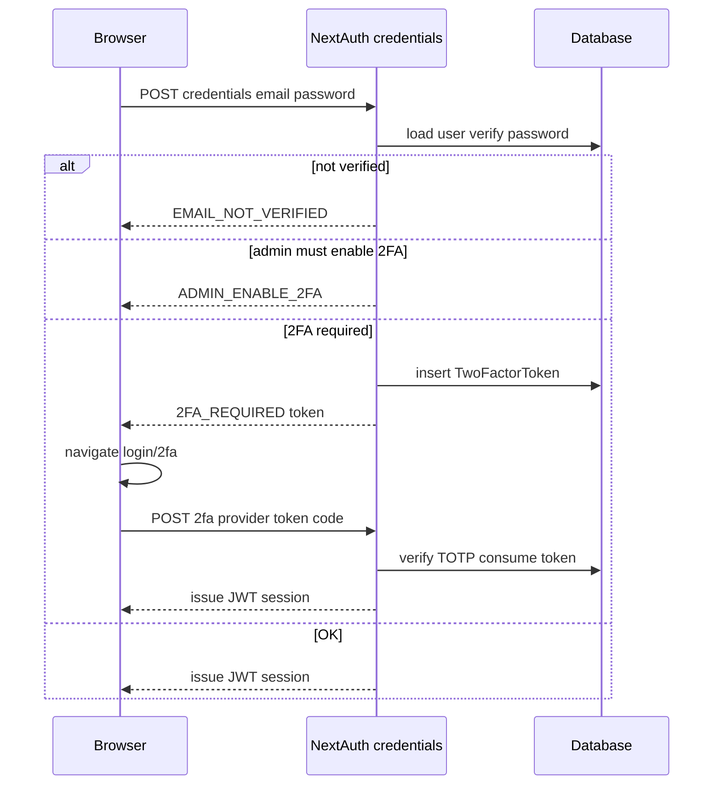
```mermaid
sequenceDiagram
  participant B as Browser
  participant NA as NextAuth credentials
  participant DB as Database

  B->>NA: POST credentials email password
  NA->>DB: load user verify password
  alt not verified
    NA-->>B: EMAIL_NOT_VERIFIED
  else admin must enable 2FA
    NA-->>B: ADMIN_ENABLE_2FA
  else 2FA required
    NA->>DB: insert TwoFactorToken
    NA-->>B: 2FA_REQUIRED token
    B->>B: navigate login/2fa
    B->>NA: POST 2fa provider token code
    NA->>DB: verify TOTP consume token
    NA-->>B: issue JWT session
  else OK
    NA-->>B: issue JWT session
  end
```

### 9.9 UML sequence — OAuth sign-in (account linking sketch)

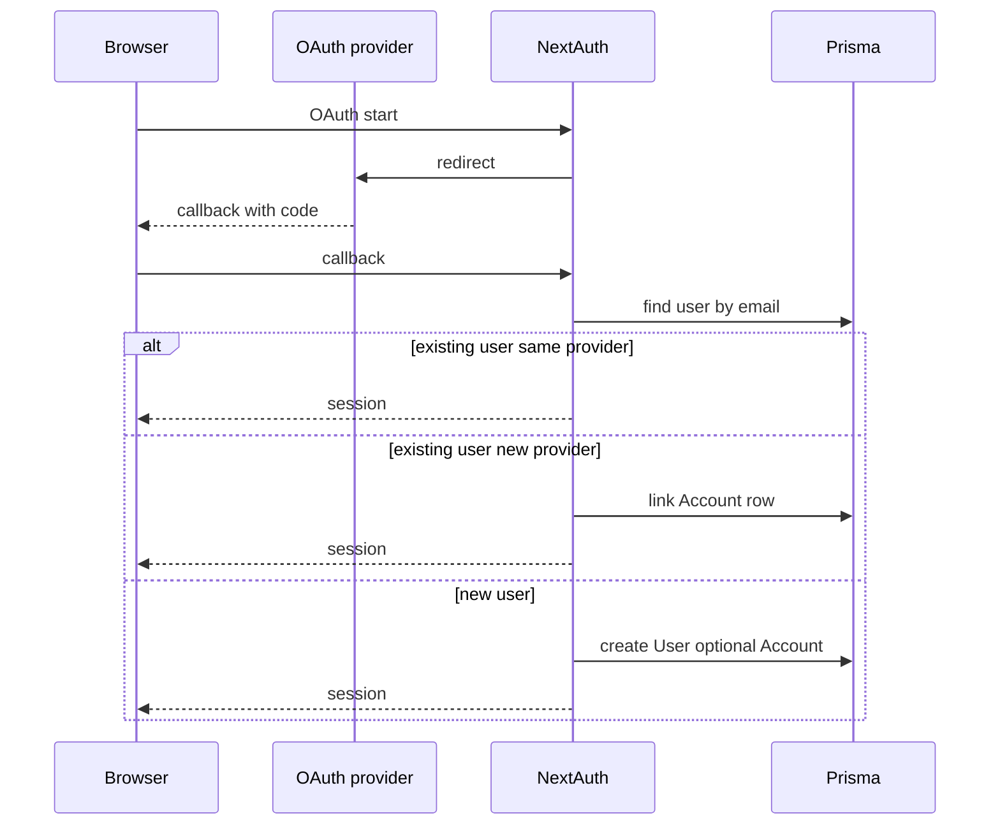
```mermaid
sequenceDiagram
  participant B as Browser
  participant OA as OAuth provider
  participant NA as NextAuth
  participant DB as Prisma

  B->>NA: OAuth start
  NA->>OA: redirect
  OA-->>B: callback with code
  B->>NA: callback
  NA->>DB: find user by email
  alt existing user same provider
    NA-->>B: session
  else existing user new provider
    NA->>DB: link Account row
    NA-->>B: session
  else new user
    NA->>DB: create User optional Account
    NA-->>B: session
  end
```

### 9.10 UML sequence — resume persisted update (autosave)

```mermaid
sequenceDiagram
  participant UI as Editor client
  participant API as api/resumes/id
  participant AUTH as getServerSession
  participant PR as Prisma

  UI->>API: PATCH JSON debounced
  API->>AUTH: validate session
  AUTH-->>API: user id
  API->>PR: update Resume content version
  PR-->>API: committed
  API-->>UI: 200 + body
```

### 9.11 UML sequence — AI “improve bullet” (representative)

```mermaid
sequenceDiagram
  participant UI as Builder
  participant API as api/resumes/id/ai/improve-bullet
  participant RL as rate limit cache
  participant OAI as OpenAI

  UI->>API: POST bullet text context
  API->>RL: check daily quota
  alt over limit
    API-->>UI: 429
  else allowed
    API->>OAI: completion
    OAI-->>API: text
    API->>RL: log usage cache response
    API-->>UI: improved bullet
  end
```

### 9.12 Activity diagram — billing webhook processing

```mermaid
flowchart TD
  Start([Stripe sends webhook]) --> Sig{Valid signature?}
  Sig -->|no| Reject[401 reject]
  Sig -->|yes| Idem{Event id seen?}
  Idem -->|yes| OKDup[200 idempotent noop]
  Idem -->|no| Route{Event type}
  Route -->|checkout completed| Sub[Upsert subscription invoice]
  Route -->|subscription deleted| Down[Downgrade user tier]
  Route -->|other| Log[Log or no-op]
  Sub --> Save[Persist DB]
  Down --> Save
  Log --> Save
  Save --> End([200 OK])
  Reject --> EndFail([Reject])
```

### 9.13 Mindmap — product domains

```mermaid
mindmap
  root((ResumeDoctor))
    Acquire
      Marketing SEO
      Blog examples
      Trial OTP
    Activate
      Signup OAuth
      Email verify
      Onboarding checklist
    Core value
      Resume editor
      Templates import
      ATS AI
    Monetize
      Stripe checkout
      Promos Pro trial
      Resume pack
    Trust safety
      2FA sessions
      Rate limits audit log
    Operate
      Admin cockpit
      Cron jobs
      Analytics events
```

### 9.14 Data-flow — export pipeline (conceptual)

```mermaid
flowchart LR
  subgraph sources [Sources]
    RES[Resume JSON in DB]
    TPL[Template metadata]
  end

  subgraph transforms [Transforms]
    HTML[HTML preview path]
    TXT[TXT serializer]
    DOCX[docx lib server]
    PDF[client PDF path]
  end

  subgraph sinks [Sinks]
    DL[Download]
    LOG[export log row]
  end

  RES --> HTML
  RES --> TXT
  RES --> DOCX
  RES --> PDF
  TPL --> HTML
  TPL --> DOCX
  TXT --> DL
  HTML --> DL
  DOCX --> DL
  PDF --> DL
  DL --> LOG
```

---

## 10. Scheduled jobs (Vercel Cron)

Configured in `vercel.json`:

| Schedule | Path | Purpose |
|----------|------|---------|
| Daily 09:00 UTC | `/api/health` | Keep-alive / health ping |
| Daily 02:30 UTC | `/api/cron/trial-expiry-reminders` | Pro trial reminder emails |
| Daily 02:15 UTC | `/api/cron/trial-expired-downgrade` | Expired trial handling |

---

## 11. Content assets

| Asset type | Location |
|------------|----------|
| Blog posts | `content/blog/*.md` (frontmatter + body; consumed via `lib/blog.ts`) |
| Example resumes metadata | `content/examples/index.json` + `src/app/examples/` |
| Job seed data | `content/jobs/seed.json` |

---

## 12. Environment & integrations (checklist)

Typical keys (see `.env.example` / `LOCAL-DEVELOPMENT-SETUP.md` for authoritative list):

- **Database:** `DATABASE_URL`, `DIRECT_URL`
- **Auth:** `NEXTAUTH_SECRET`, OAuth client IDs/secrets, email verification settings
- **Stripe:** API keys, webhook secret, price IDs
- **AI:** `OPENAI_API_KEY`
- **Email:** Resend API key
- **Security / admin:** `ADMIN_IP_ALLOWLIST`, master admin allowlist env, `REQUIRE_ADMIN_2FA`
- **Trial:** trial JWT secret (see `lib/trial-secret.ts`)
- **Vercel Cron:** secured cron routes (verify implementation in each cron handler)

---

## 13. How to maintain this blueprint

1. After adding a **page**, append it to **§4 Route catalog** and **§3 Feature map** if new surface area.
2. After adding an **API route**, append under **§5** (keep alphabetical order within groups).
3. After a **schema migration**, update **§6** (ER + UML class) and any affected **§9** state or sequence diagrams.
4. When **user journeys** or **integrations** change materially, update **§8** and **§9** (flows, sequences, deployment/context if vendors change).
5. When **middleware rules** change, update **§7** text and the diagram **§7a**.

---

*This file is descriptive, not normative: when it disagrees with code, trust the repository.*
