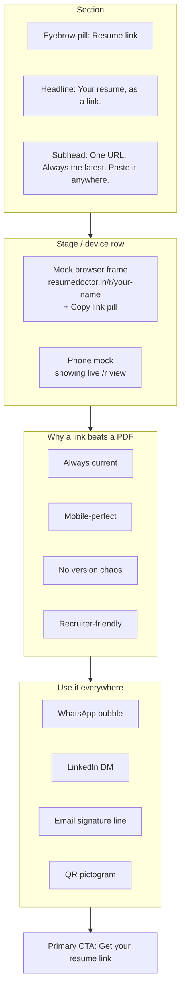

## New positioning

**One-liner:** _ResumeDoctor is the easiest way to create your resume, keep it up to date, manage versions for different roles, and share it as a link anywhere — built for India, fresher to senior._

**Four pillars (replace ATS-led messaging in primary surfaces):**

- **Create** — templates, AI bullets, ~5 min draft
- **Maintain** — cloud-saved, auto-save, edit anytime, versioned
- **Manage** — multiple resumes, variants per role / company, dashboard
- **Share (web link)** — `resumedoctor.in/r/<slug>` for WhatsApp, LinkedIn DMs, recruiter email, email signature, QR — **the central differentiator**

ATS treatment: keep the feature, FAQ, and blog references intact (user chose "demote, keep deep"). Remove ATS from hero, headline, USP line, page metadata, and trust stats bar.

## What we now know about the share-link feature (verified in code)

Honest, defensible claims we can use in marketing — and where they come from:

| Claim                                                      | Verified by                                                                                                                                                                         |
| ---------------------------------------------------------- | ----------------------------------------------------------------------------------------------------------------------------------------------------------------------------------- |
| **"Always shows the latest version — no re-sending PDFs"** | [src/app/r/[slug]/page.tsx](src/app/r/[slug]/page.tsx) re-fetches resume content on every visit (lines 32–39); there is no snapshot, the link is live                               |
| **"Publish once, share anywhere"**                         | [src/components/resume-builder/share-resume-button.tsx](src/components/resume-builder/share-resume-button.tsx) — user explicitly opts in, server returns `publicSlug` URL           |
| **"Anyone can view"**                                      | Share popover copy line 76                                                                                                                                                          |
| **"Mobile-friendly preview"**                              | [src/components/resume-builder/resume-preview.tsx](src/components/resume-builder/resume-preview.tsx) renders responsively in [src/app/r/[slug]/page.tsx](src/app/r/[slug]/page.tsx) |

Claims to AVOID (not yet shipped, would be misleading):

- "Claim your name" / vanity URL — slug is server-generated; no UI to customise.
- "View tracking / who-saw-it" — not in repo.
- "Rich link preview on WhatsApp / LinkedIn" — public page is client-rendered (no SSR / no `generateMetadata`); preview cards will be weak. Flag as follow-up.

## Capitalising on the share-link USP (this pass)

This is the largest and most-elevated change. The hero co-leads with it, the dedicated section is full-width and design-grade, and we make it visually undeniable.

### A. Hero co-leads with the link (lines 76–129 of [src/app/page.tsx](src/app/page.tsx))

- **H1** (current: _"Build a Resume Recruiters Love"_) →
  e.g., **_"Create your resume. Share it as a link. Update it anytime."_**
  with the verbs in the gradient, not the subject.
- **Subhead** — drop ATS-first language. Lead with: _"Create, maintain, and manage your resume on ResumeDoctor — and share it as one link that's always up to date, ready for WhatsApp, LinkedIn, or recruiter email. Built for India."_
- **Quick-wins bullets (lines 88–101)** — replace the 4 bullets around the four pillars; remove the "See ATS fit" line.
- **Hero side visual** — keep the existing artwork; in a follow-up we may swap to a "phone showing /r/<slug>" graphic.

### B. NEW dedicated section: "Your resume, as a link"

Insert between the Template Showcase (~line 510) and Career Stages (~line 581). Full-width, design-grade band, on par with AI Spotlight / Final CTA. Anatomy:

Components:

- **Eyebrow pill** "Resume link" / brand name (TBD — see naming question).
- **Mock browser frame** — traffic-light dots, URL bar showing `resumedoctor.in/r/your-name`, "Copy link" pill (visual only — no JS clipboard on the marketing surface).
- **Phone mock** beside the browser frame — vertical device showing the live public render. Reinforces "WhatsApp-tap → instant clean preview".
- **"Link vs PDF" comparison strip** — 4 short rows, dual-column:
  - Always current ↔ Sends a stale snapshot
  - Opens in 1 tap on mobile ↔ Awkward PDF download
  - One URL forever ↔ "resume-final-final-v2.pdf" version chaos
  - Recruiter clicks → reads ↔ Recruiter forwards an attachment that may not even open
- **Channel mocks (small, illustrative — not full chat windows):**
  - WhatsApp green bubble with the link
  - LinkedIn DM line "Here's my resume:" + link
  - Email signature line: `Hari Krishnan · Frontend Dev · resumedoctor.in/r/hari-krishnan`
  - QR pictogram with caption "Print on a card"
- **Primary CTA** "Get your resume link" → `/try`.
- **Trust micro-line** under the CTA: _"Free to publish. Update anytime — your link stays the same."_

### C. Trust stats bar (lines 278–292)

- Replace `{ num: "ATS", label: "Friendly layouts" }` with `{ num: "1 link", label: "Always up to date" }` (or similar — finalise during execution).

### D. Final CTA (lines 149–155)

- Subhead append: _"… plus your shareable resume link — for WhatsApp, LinkedIn, and recruiter inboxes."_
- Keep the secondary "View templates" link.

### E. Page metadata (lines 10–15)

- `<title>` → `"ResumeDoctor — Create, Manage & Share Your Resume as a Link | India"`
- `description` → `"Create your resume, keep it current, and share it as one always-up-to-date link — perfect for WhatsApp, LinkedIn, and recruiter emails. India-first, fresher to senior."`

### F. [docs/MESSAGING-BRIEF.md](docs/MESSAGING-BRIEF.md)

- Update **Outcomes we promise** — add **"Share as a link"** as outcome #1 or #2.
- Update **Differentiation** — make **"Your resume as a link — always up to date, India-first"** the lead bullet.
- Update **Primary CTAs** — add "Get your resume link" alongside "Start with Try".
- Demote ATS to a deeper trust mention, not a primary differentiator.

## Out of scope (deliberately) — Phase 2 follow-ups

Captured here so we don't lose them after the deploy:

1. **SSR + `generateMetadata` for [src/app/r/[slug]/page.tsx](src/app/r/[slug]/page.tsx)** so WhatsApp / LinkedIn / iMessage produce rich link previews (name, role, headline, OG image). This will compound the share-link USP in viral channels.
2. **Auto-generated OG image** for `/r/<slug>` (e.g., dynamic `og.png` route with name + role + photo).
3. **Vanity slugs** ("claim your name") — backend + UI work, not in the repo today.
4. **Lightweight view counter** — simple "Viewed N times" on the owner's dashboard. India recruiters and candidates both love this.
5. **A standalone landing page at `/share` or `/resume-link`** for SEO targeting "online resume link", "share my resume online", "resume url India".
6. **Templates / Pricing / Try copy alignment** with new positioning — keep ATS language there, but soften lead.

## Risks / things to watch

- "Always up to date" — TRUE per code, but only **after the user clicks Share / Publish at least once**. Copy must reflect that ("Publish once, then update anytime").
- The mock URL example must be obviously generic — `your-name` not a real person.
- Don't over-claim view tracking, vanity slugs, or rich previews until shipped.

## Single open decision (one user-owned question)

Brand naming for the feature in marketing — see chat AskQuestion immediately after this plan.

## Deploy

Per workspace rule, commit and push to trigger Vercel auto-deploy. No local dev server.
