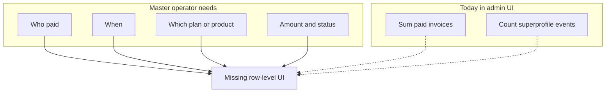

# Super admin dashboard: improvements and parameters

## Honest current state

The codebase **does expose** headline revenue proxies on the overview: paid invoice **count** and **total INR** via [`src/app/api/admin/analytics/route.ts`](src/app/api/admin/analytics/route.ts) → [`src/app/admin/page.tsx`](src/app/admin/page.tsx), plus `SuperprofilePurchaseEvent` as a single **aggregate** count (`superprofilePurchases`). That is **not** the same as knowing **which customers** paid **when** and **for which plan**—there is **no admin API or UI** that lists `Invoice` rows or purchase events per user today (confirmed: admin API folder only aggregates invoices in analytics).

For a **master** operator, the gap is **row-level commercial truth**, not more charts.

**Authoritative money tables** (see [`prisma/schema.prisma`](prisma/schema.prisma)):

- **`Invoice`** — `userId`, `plan`, `amount` (paise), `currency`, `status` (`paid` | `pending` | `refunded`), `createdAt`, `externalRef` (Stripe), `pdfUrl`.
- **`SuperprofilePurchaseEvent`** — `userId`, `email`, `productKey` (e.g. `pro_monthly`, `resume_pack`), `createdAt`, `idempotencyKey`, optional `payloadSnapshot`.

Stripe webhook and other flows may write **`Invoice`** and/or emit **`ProductEvent`** (`payment_success`). The master view should **reconcile** both paths (unified timeline or separate tabs with clear labels) so nothing is double-counted in UI when both exist for one checkout.

---

## Priority 1 — Purchase and revenue ledger (your ask)

**Goal:** As master admin, see every purchase (or attempted/pending) with sortable columns and filters.

**Backend:** New route e.g. [`src/app/api/admin/purchases/route.ts`](src/app/api/admin/purchases/route.ts) (name can be `revenue` or `transactions`):

- Query `Invoice` with `include: { user: { select: { email, name } } }`, order `createdAt desc`, pagination (`cursor` or `skip/take`), filters: `status`, date range, `plan`, search by email/userId.
- Query `SuperprofilePurchaseEvent` similarly with user relation + filters on `productKey`, date range.
- Response shape: either **two arrays** (`invoices`, `superprofileEvents`) or a **merged** list with a `source` discriminator and normalized fields for the table. Merged is nicer for “everything in order by time” but requires careful typing.

**Frontend:** New page e.g. [`src/app/admin/purchases/page.tsx`](src/app/admin/purchases/page.tsx) + nav entry in [`src/components/admin/admin-app-shell.tsx`](src/components/admin/admin-app-shell.tsx).

**Export:** Extend [`src/app/api/admin/export/route.ts`](src/app/api/admin/export/route.ts) with `type=invoices` or dedicated `type=purchases` unified export; call `logAdminAction` like existing CSV exports.

**Docs:** Add route to the inventory table in [`docs/MASTER-ADMIN.md`](docs/MASTER-ADMIN.md).

---

## Priority 2 — Per-user billing on user detail

On [`src/app/admin/users/[id]/page.tsx`](src/app/admin/users/[id]/page.tsx) (and/or GET [`src/app/api/admin/users/[id]/route.ts`](src/app/api/admin/users/[id]/route.ts)):

- Include last N `Invoice` rows and last N `SuperprofilePurchaseEvent` rows for that user.
- Surface `billingProvider`, `stripeCustomerId`, `subscriptionExpiresAt` from `User` so support context matches Stripe/manual reality.

---

## 3. Quick wins — show what analytics API already returns

Add sections on the overview (or a “Growth” sub-page) for:

| Data | Source in API | Why it matters |
|------|---------------|----------------|
| Weekly signup → paid cohort | `productEvents.cohortSignupToPaid` | Conversion by week |
| Funnel steps (7d) | `productEvents.funnelLast7Days` | Funnel leaks |
| Basic/free vs Pro split | `subscriptionMetrics.basicCount`, `planBreakdown` | Plan mix |

**Files:** [`src/app/admin/page.tsx`](src/app/admin/page.tsx) only, if binding existing JSON.

---

## 4. Security and governance (“super” vs “any admin”)

Today every admin shares the same powers. Optional tiering: `support_admin` vs `super_admin`, or `SUPER_ADMIN_EMAILS` for destructive routes only. See original design in previous revision; implement after ledger ships.

---

## 5. Additional KPIs (aggregates — after ledger)

Signups windows, invoice status breakdown (pending/refunded counts), trial expiry cohorts, churn by reason, OTP ratios — extend [`src/app/api/admin/analytics/route.ts`](src/app/api/admin/analytics/route.ts) or keep purchases separate to avoid one mega route.

---

## 6. Operational extras

- Dashboard widget: latest admin actions from `SecurityAuditLog`.
- CSV: audit log, churn, trial activations (pattern from existing export route).

---

## 7. Product / platform controls (optional, later)

Feature flags, maintenance mode, alerting — net-new; not required for purchase visibility.

---

## Suggested implementation order

1. **Purchase ledger API + `/admin/purchases` page + nav + export** — addresses the master use case directly.
2. **User detail billing section** — ties ledger to individual accounts.
3. **Cohort + funnel on overview** — low risk, uses existing analytics payload.
4. **Governance + security hardening** — when you add non-owner admins.
5. **Extra aggregates and audit widgets** — polish.

This keeps scope aligned with existing Prisma models and admin auth patterns.
