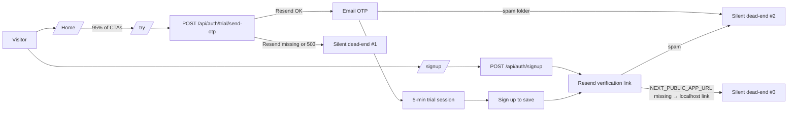

# 1. Root-cause analysis – what is actually happening

The drop coincides almost exactly with three changes shipped between **May 1 → May 7**. There is no homepage / template / pricing breakage I can see in the code; the fault lines are in **measurement, the verification pipe, and a build that was failing for ~2.5 hours** during peak Indian traffic on May 6. The trial UX itself is also brutally short, which compounds the issue.

### 1a. Most likely #1 – GA4 was reporting on the wrong property (measurement noise)

Until **today, May 7 16:14 IST** the code defaulted to `G-K4VS43PF7T`:

```11:11:src/components/analytics-provider.tsx
const GA_ID = process.env.NEXT_PUBLIC_GA_MEASUREMENT_ID ?? "G-WDPGFYERFD";
```

Commit `8bced13` flipped the default from `G-K4VS43PF7T` → `G-WDPGFYERFD`. If `NEXT_PUBLIC_GA_MEASUREMENT_ID` was never set on Vercel, all client-side `sign_up`, `trial_start`, `pricing_view` events were going to a property the user is not looking at. **The "0 new users in GA4" number can be partially or fully a measurement artifact** (real users may exist in `User`, `TrialSession`, and `ProductEvent` tables).

### 1b. Most likely #2 – Signup→verify→login funnel is silently failing

Signup was made hard-gated on email verification on **May 1** (`deffdfc feat(auth): enforce email verification`):

```54:56:src/lib/auth.ts
if (!user.emailVerified) {
  throw new Error("EMAIL_NOT_VERIFIED");
}
```

Combined with two production-only failure modes that nobody sees in dev:

- **Verify-link fallback is `localhost:3000`** if `NEXT_PUBLIC_APP_URL` is missing on Vercel:

```99:100:src/app/api/auth/signup/route.ts
const baseUrl = process.env.NEXT_PUBLIC_APP_URL || "http://localhost:3000";
const verifyLink = `${baseUrl}/verify-email#token=${verifyToken}`;
```

Every signup email sent in that state is unclickable — user signs up, never confirms, can never log in.

- **Resend `EMAIL_FROM` defaults to `onboarding@resend.dev`** if not configured:

```5:7:src/lib/email.ts
const fromEmail =
  process.env.EMAIL_FROM || "ResumeDoctor <onboarding@resend.dev>";
```

That sender + the very thin verification HTML in `sendVerificationEmail` is a near-guaranteed Promotions/Spam classification on Gmail/Outlook, especially in India.

The same email pipe is the only way to deliver the trial OTP. If it's degraded, both `/signup` and `/try` go quiet at once — exactly the symptom.

### 1c. Most likely #3 – Production build was failing for ~2.5 hours on May 6

`992d285 feat(marketing)` (May 6 12:09 IST) added `export const metadata` to two `"use client"` pages (`verify-email`, `reset-password`). That is invalid in Next.js 14 App Router and would break the production build. `2251a83` (May 6 14:41 IST) reverted it by moving metadata into server `layout.tsx`. So between **12:09 and 14:41 IST on May 6**, Vercel deploys for that window failed; any user who tried to verify their email or reset their password in that window may have hit a broken page (depending on which build Vercel was actually serving). May 6 is the deepest point of the 3-day dip.

### 1d. Funnel design that amplifies any of the above

- **Trial = 5 minutes** (8 if returning), set in `verify-otp/route.ts`. Users who go through OTP, build for 4 minutes, then get logged out and lose work. Most will not come back.
- **Home CTAs all push to `/try`** (OTP), not `/signup`. Acquisition is 100% routed through the email pipe. If email is degraded for any reason, signups go to zero, which is exactly the pattern reported.
- **Auth metadata change (same May 6 commit)** flipped `/login`, `/signup`, `/forgot-password` from `robots: index:false, follow:true` → `index:false, follow:false`. SEO-neutral for those pages (already noindex), so this is **not** the cause but is worth knowing.

### 1e. Content / reach side – is there a real top-of-funnel issue?

- **No new blog posts since the April 28 revamp** (`a38b987`); the last 7 days were all blog UI/SEO polish, no new URLs for Google to index.
- 14 blog posts exist, all evergreen guides. Sitemap and robots are healthy (`src/app/robots.ts`, `src/app/sitemap.ts`).
- No new landing page since the BOFU LP batch (`cb3e73a` on May 1).

So even if everything technical were fine, there is **no fresh content pulling in new search visitors** since April 28. Two compounding effects: (a) tracking blind, (b) email funnel risk, (c) no new content.

### 1f. Verdict

This is **not a homepage / template / pricing breakage**. It is most likely:

1. Tracking blind spot (wrong GA property) — _just fixed today_.
2. Verification email pipe degraded in production (envs and/or deliverability).
3. A short window of broken builds on May 6.
4. Top-of-funnel content has not been refreshed in ~10 days.



# 2. Plan – what to do, in order

## Phase A. Verify before changing anything (~30 min, mostly read-only)

These are checks the owner can run; they tell us which of the three hypotheses are real. Do these **before** writing any code.

- **A1. Confirm which Vercel env vars are actually set** (Vercel → Project → Settings → Environment Variables, Production scope):
  - `NEXT_PUBLIC_APP_URL` should be `https://www.resumedoctor.in` (or apex). If missing → that alone explains a lot.
  - `RESEND_API_KEY` set and active on the Resend dashboard.
  - `EMAIL_FROM` set to a verified domain sender (e.g. `ResumeDoctor <noreply@resumedoctor.in>`). Domain DKIM/SPF must be verified in Resend.
  - `NEXTAUTH_SECRET` set, same value as on a working historical deploy.
  - `NEXT_PUBLIC_GA_MEASUREMENT_ID` should be `G-WDPGFYERFD` (or whatever the active GA4 property is).
- **A2. Confirm real signup numbers from the database, not GA4.** In Vercel logs or the admin cockpit, check:
  - Count of `User` rows created in the last 7 days vs prior 7 days.
  - Count of `TrialSession` rows with `verifiedAt` not null in the last 7 days vs prior 7 days.
  - Count of `OtpAttempt` rows with `type=send, success=false` in the last 7 days. **A spike here is the smoking gun for Resend failure.**
- **A3. Check Resend dashboard:** delivery rate, bounce rate, complaint rate for the last 7 days. If "Delivered" is dropping or "Spam" rising, that's the cause.
- **A4. Check Vercel deploys for May 6 12:00–15:00 IST.** Confirm whether the deployment with `992d285` actually went live (failed builds usually keep the previous deploy, but Cancel/Skip may have happened).
- **A5. End-to-end smoke test** from a clean device using a Gmail and an Outlook address: `/signup` → does verification email arrive in inbox (not promotions)? Click link → does it go to `https://resumedoctor.in/verify-email...` or `localhost`? `/try` → does the OTP arrive?

## Phase B. Fix the silent failures in the funnel (small code changes)

Even if A1–A5 turn out clean, these are real defects worth closing.

- **B1. Stop sending `localhost` verification links.** In [`src/app/api/auth/signup/route.ts`](src/app/api/auth/signup/route.ts) and [`src/app/api/user/change-email/request`](src/app/api/user/change-email) and any other place using the `NEXT_PUBLIC_APP_URL || "http://localhost:3000"` pattern, replace with the centralized `siteUrl` from [`src/lib/seo.ts`](src/lib/seo.ts), which already falls back to `https://resumedoctor.in`. Also log a `console.warn` if `NEXT_PUBLIC_APP_URL` is unset in production so it shows up in Vercel logs.
- **B2. Harden the verification email** in [`src/lib/email.ts`](src/lib/email.ts):
  - Switch the sender to a verified domain sender; if `EMAIL_FROM` is missing in production, log a loud warning and refuse to send (cleaner failure than spamming everyone from `onboarding@resend.dev`).
  - Add a plain-text alternative (`text:` field on `resend.emails.send`) — single biggest deliverability lift.
  - Tone down link density and add a List-Unsubscribe header (best-practice for transactional, even though the email is opt-in).
  - Add `reply-to` header pointing at a real human address.
- **B3. Add an internal smoke route** `/api/health/email` (admin-only or token-protected) that calls Resend with a no-op recipient and returns the actual error, so future env regressions surface in seconds.
- **B4. Surface failures to the user instead of silent success.** In [`src/app/api/auth/signup/route.ts`](src/app/api/auth/signup/route.ts), if `sendVerificationEmail` returns `ok:false`, return `202 Accepted` with a clear "we couldn't send the email" message and a "Resend verification email" button on `/signup` success view ([`src/app/signup/page.tsx`](src/app/signup/page.tsx)) — currently the success screen always says "we sent a link" even when we didn't.
- **B5. Lengthen the trial window from 5 → 15 minutes.** In [`src/app/api/auth/trial/verify-otp/route.ts`](src/app/api/auth/trial/verify-otp/route.ts) change `TRIAL_DURATION_MINUTES = 5` to `15` (and `TRIAL_EXTEND_MINUTES = 5`). 5 minutes is below realistic resume-build time and is a major reason trial → signup conversion is low.
- **B6. Add a secondary `/signup` CTA on the homepage hero** alongside the "Try" CTA, in [`src/app/page.tsx`](src/app/page.tsx). Currently 100% of hero CTAs route through OTP. A direct signup path adds a second rail that doesn't depend on the OTP-only Resend path being healthy.

## Phase C. Re-establish trustworthy measurement

- **C1.** Set `NEXT_PUBLIC_GA_MEASUREMENT_ID=G-WDPGFYERFD` in Vercel Production env (don't rely on the code default; the code default does nothing for already-built artifacts until next deploy).
- **C2.** Verify GA4 Realtime is receiving events from `resumedoctor.in` after redeploy.
- **C3.** Add server-side instrumentation: emit `recordProductEvent({name: "signup_attempt"})` at the **start** of `/api/auth/signup` (currently emitted only on success). Same for `/api/auth/trial/send-otp`. This gives a database-backed funnel that is independent of GA4 and ad-blockers.

## Phase D. Refill top-of-funnel with a new blog post + reach push

Even with all the above fixed, the last new blog content shipped on April 28; Google has nothing fresh to rank. Add **one** high-intent post and promote it.

- **D1. Topic to add (highest-intent gap in current 14 posts):** "AI Resume Builder vs Template: Which One Actually Gets Indian Freshers Shortlisted in 2026". This sits at the intersection of three high-volume India queries (`ai resume builder`, `resume for freshers`, `ats-friendly resume`) and lets us link out to `/try`, `/templates`, `/examples`, and `/blog/ats-friendly-resume-complete-guide`. Place at `content/blog/ai-resume-builder-vs-template-india-2026.md` with the same frontmatter shape used by [`content/blog/how-to-tailor-resume-for-job-description.md`](content/blog/how-to-tailor-resume-for-job-description.md) (same MDX blocks: `KeyTakeaway`, `BeforeAfterCompare`, `ResumeDoctorCta`, `Checklist`).
- **D2. Internal-link refresh.** In the new post and the home page FAQ, link to the existing top-3 India guides (ATS, freshers, formats). Cross-link from the new post into `/examples` and `/try`.
- **D3. Reach push (no new code):**
  - Submit the new URL + `/sitemap.xml` to Google Search Console for re-crawl.
  - Add the new post to the introduction email campaign in [`email-templates/introduction-resumedoctor.html`](email-templates/introduction-resumedoctor.html) as the lead link.
  - LinkedIn + WhatsApp share blurbs (manual; not a code task).
- **D4. Optional second post (only if A2 confirms signups in DB are flat too, i.e. it really is a reach problem and not a tracking problem):** "How to Pass Naukri's ATS in 2026 — Field-by-Field Checklist for Indian Job Boards". Pairs naturally with [`content/blog/naukri-linkedin-profile-tips.md`](content/blog/naukri-linkedin-profile-tips.md).

## Phase E. Order of operations

1. Phase A (verification) **first** — it tells us which fixes matter.
2. Phase B + C (fixes) **second** — these are mostly safe small PRs and worth shipping regardless of A's findings.
3. Phase D (new blog) **last**, because there is no point pulling in new visitors while the activation pipe is leaking.

# 3. Risks and trade-offs

- **Trial extension to 15 min** increases server cost slightly and could mildly cannibalize signup conversions (users get more value before being asked to sign up). Net-positive expected because right now 5 min destroys the experience entirely.
- **Hardening the verification email** requires a verified domain sender on Resend. If domain is not yet verified, B2 must be split: ship the loud-warning + plain-text part now, ship the `noreply@resumedoctor.in` switch after DNS records propagate.
- **A second hero CTA to `/signup`** changes the funnel mix. We should keep "Try" as the primary, "Sign up" as secondary, so trial volume is preserved.
- **Content production is the slowest lever** — 1 post does not move SEO in days. The fast wins are in Phase A/B/C; Phase D is the durable lever.
