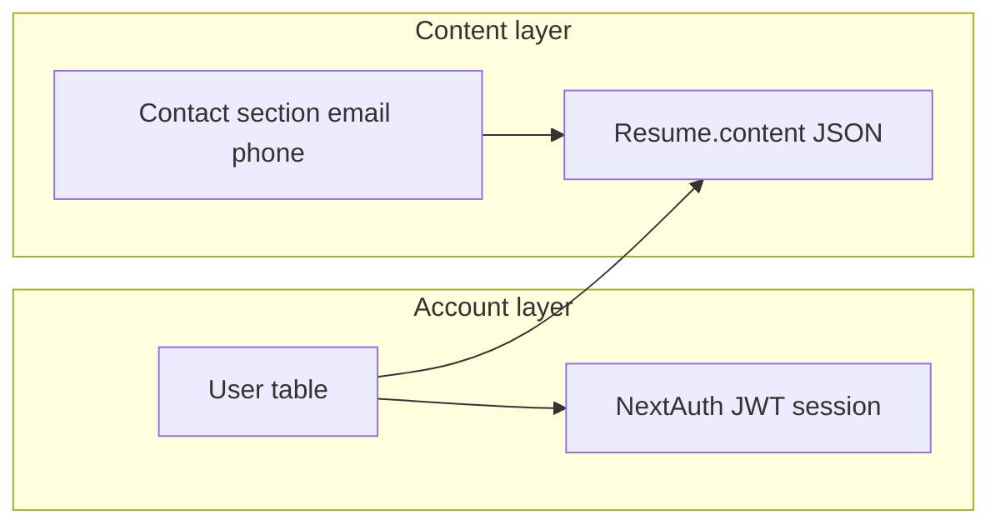

# Deep analysis: user data collection, validation, verification, and flaws

## 1. Data model vs. “user data” in the product

The [`User`](prisma/schema.prisma) model stores **account identity**: `email`, `emailVerified`, `name`, `image`, `passwordHash`, `role`, `subscription`, billing fields, 2FA, notification prefs, onboarding JSON, and email-change pending fields. There is **no phone number column** on `User`.

**Resume-scoped PII** (including contact **email** and **phone**) lives inside `Resume.content` JSON, edited via [`contact-editor.tsx`](src/components/resume-builder/sections/contact-editor.tsx). That is a **second copy** of email/phone that can **differ** from the login email and is **not** tied to verification state.

---

## 2. Where data is collected (deeper map)

| Surface | Fields | Persistence | Server validation |
|--------|--------|-------------|-------------------|
| Signup [`/api/auth/signup`](src/app/api/auth/signup/route.ts) | email, password, optional name | `User`; `VerificationToken` | Zod email; password min 8; email **normalized** to lowercase |
| Trial OTP [`send-otp` / `verify-otp`](src/app/api/auth/trial/send-otp/route.ts) | email, OTP | `TrialSession`, `OtpAttempt`, `User` (trial) | Zod email; OTP length + digits |
| Login [`auth.ts` CredentialsProvider](src/lib/auth.ts) | email, password | session | Password compare; **email not normalized** |
| OAuth Google/LinkedIn | email, name, image (from IdP) | `User` / `Account` via adapter | Provider-dependent |
| Profile PATCH [`/api/user/profile`](src/app/api/user/profile/route.ts) | name, image, notification prefs, onboarding | `User` | Zod (no email/phone) |
| Change email [`change-email/request`](src/app/api/user/change-email/request/route.ts) + [`verify`](src/app/api/user/change-email/verify/route.ts) | new email + password; token | `User` pending fields → email swap | Zod email; new email lowercased for storage/checks |
| Forgot / reset password [`forgot-password`](src/app/api/auth/forgot-password/route.ts), [`reset-password`](src/app/api/auth/reset-password/route.ts) | email; token + new password | `PasswordResetToken`; `User.passwordHash` | Zod email; **lookup email not normalized** |
| Verify signup email [`/api/auth/verify-email`](src/app/api/auth/verify-email/route.ts) | token | sets `emailVerified` | Token + expiry |
| Resume PATCH [`/api/resumes/[id]`](src/app/api/resumes/[id]/route.ts) | `content` blob | `Resume` / versions | `content` is **`z.record(z.unknown())`** — **no** per-field email/phone rules |
| SuperProfile webhook [`/api/webhooks/superprofile`](src/app/api/webhooks/superprofile/route.ts) | email, product, idempotency | fulfillment + `SuperprofilePurchaseEvent` | Zod email; fulfillment [lowercases email](src/lib/superprofile-fulfillment.ts) |
| Churn feedback [`/api/user/churn-feedback`](src/app/api/user/churn-feedback/route.ts) | reason, detail | `ChurnFeedback` + `userEmail` snapshot | Text limits |
| Client analytics mirror [`/api/analytics/event`](src/app/api/analytics/event/route.ts) | `name`, **`props` arbitrary object** | `ProductEvent` | `props: z.record(z.unknown())` |
| Blog lead [`/api/blog/lead`](src/app/api/blog/lead/route.ts) | optional email | not stored | regex if present |

---

## 3. Email: validation vs verification (strict)

**Validation (format)**  
- Strong on signup, trial, forgot-password, change-email, webhook (Zod `.email()` or equivalent).  
- **Weak / absent** for resume contact email: browser `type="email"` only; API accepts any string in JSON.

**Verification (control of inbox)**  
- **Signup:** sends link; [`verify-email`](src/app/api/auth/verify-email/route.ts) sets `emailVerified`.  
- **Trial:** OTP success sets `emailVerified` on the trial user ([`verify-otp`](src/app/api/auth/trial/verify-otp/route.ts)).  
- **OAuth:** [`auth.ts` `events.signIn`](src/lib/auth.ts) sets `emailVerified` if still null (treats IdP as proof).  
- **Change email:** completes only after link to **new** address; sets `emailVerified`.

**Critical gap:** **Credentials login does not require `emailVerified`.** [`authorize`](src/lib/auth.ts) never checks it. Users can sign in with password even when the signup message says to verify first ([`signup` response text](src/app/api/auth/signup/route.ts) vs actual behavior). Middleware ([`middleware.ts`](src/middleware.ts)) only checks JWT/trial cookie — **not** verification.

---

## 4. Phone: validation vs verification

- **Not** collected as account-level data.  
- **Only** in resume contact; **no** server-side format validation (E.164, length, country), **no** OTP/SMS, **no** `phoneVerified` field.  
- Import path uses regex heuristics in [`resume-import.ts`](src/lib/resume-import.ts) for parsing only, not as a global validation gate for saved content.

---

## 5. Flaws (prioritized by theme)

### A. Identity consistency (email normalization)

- **Signup** stores lowercase ([`signup/route.ts`](src/app/api/auth/signup/route.ts)).  
- **Credentials `authorize`** uses `credentials.email` **as typed** ([`auth.ts`](src/lib/auth.ts)). **Login** and **admin login** pass the raw field ([`login/page.tsx`](src/app/login/page.tsx)). If a user types mixed case, **`findUnique` may miss** the row (Postgres exact string match on `User.email`).  
- **Forgot password** uses raw parsed `email` for `findUnique` and for `PasswordResetToken.email` ([`forgot-password/route.ts`](src/app/api/auth/forgot-password/route.ts)). Same casing bug: user gets generic success but **no email**, reset **fails** for wrong casing.  
- **Inconsistency:** some routes use `session.user.email.toLowerCase()` (e.g. [`churn-feedback`](src/app/api/user/churn-feedback/route.ts), [`analytics/event`](src/app/api/analytics/event/route.ts)) while others use `session.user.email` bare — behavior depends on what the JWT holds after OAuth or login.

**Impact:** UX failures, possible duplicate-account confusion if casing ever diverged at creation (e.g. OAuth vs local).

### B. Email verification policy

- **Policy mismatch:** Signup copy implies verification before use; **password login allows unverified accounts.**  
- **OAuth** marks verified without a separate email link — fine if documented, but **inconsistent** with password signup bar.  
- **Risk profile:** Lower for “verify to prove email” anti-abuse (spam, wrong address) than for pure account takeover; still a **product/compliance** gap if you promise verified addresses.

### C. Secret-bearing URLs and leakage

- **Verify email:** token in query string ([`verify-email/page.tsx`](src/app/verify-email/page.tsx) → `?token=`). Same pattern as password reset links. Tokens can leak via **Referer** to third parties, **browser history**, and **access logs**.  
- **2FA flow:** redirects with `token` in query ([`login/page.tsx`](src/app/login/page.tsx) → `/login/2fa?token=...`). Same class of issue.

### D. Trial / middleware secrets

- Trial cookie verification falls back to `TRIAL_SESSION_SECRET || NEXTAUTH_SECRET || "trial-secret-change-me"` ([`middleware.ts`](src/middleware.ts)). If both env vars were missing in a misconfigured deploy, trial JWTs would be predictable.

### E. Resume `content` and analytics `props` (data quality / governance)

- **Resume PATCH** accepts arbitrary `content` structure — **no** Zod schema for contact fields; arbitrary strings (phone/email) and size are not bounded at this layer.  
- **`/api/analytics/event`** allows **`props: z.record(z.unknown())`** — authenticated clients could persist **PII inside `ProductEvent.props`** unless you govern client payloads.

### F. Phone and resume contact

- No verification path; no server validation — expected given product scope, but **not** “validated once” or “verified” at the account level.  
- Contact email in resume is **not** validated to match account email — can confuse recipients or ATS parsers.

### G. Minor / positive notes

- Forgot-password response is **constant** whether user exists ([`forgot-password`](src/app/api/auth/forgot-password/route.ts)) — good for **enumeration** resistance (but interacts badly with casing bug above).  
- SuperProfile fulfillment **normalizes email** before lookup ([`superprofile-fulfillment.ts`](src/lib/superprofile-fulfillment.ts)).  
- Trial OTP has rate limits and lockout ([`send-otp`](src/app/api/auth/trial/send-otp/route.ts), [`verify-otp`](src/app/api/auth/trial/verify-otp/route.ts)).

---

## 6. Suggested remediation directions (if you choose to fix later)

Not executing now — only logical follow-ups:

1. **Normalize email** everywhere: credentials authorize, forgot-password lookup + token row, and standardize session DB lookups (always `toLowerCase().trim()`), optionally DB `citext` or migration to enforce uniqueness case-insensitively.  
2. **Decide policy:** block or warn unverified credentials users on sensitive actions, or soften signup copy to match behavior.  
3. **Move long-lived secrets** from query to **POST body** or fragment + POST where feasible; short-lived exchange tokens for 2FA redirect.  
4. **Require `TRIAL_SESSION_SECRET`** in production (fail closed).  
5. **Optional:** Zod partial schema for resume contact on PATCH; cap string lengths; optional `props` allowlist for analytics.  
6. **Phone:** only if product requires it — E.164 validation + optional SMS verify + `User` fields.

This document is the deliverable for “deep analysis + flaws”; implementation can be scoped in a follow-up task per item above.
