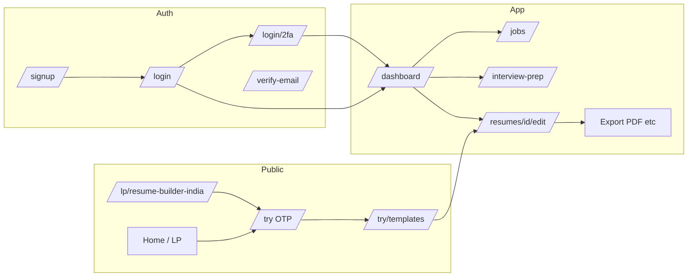

# UX improvement plan (expanded)

This audit traces **marketing → try/trial → signup/login → dashboard → resume editor → export/settings** and ties friction to concrete code locations in the ResumeDoctor Next.js app.

## Codebase snapshot (May 2026)

Spot-check against the current repo shows **most original findings still apply**; nothing in Phase 0–2 was fully “resolved” by later edits alone.

| Area | Current behavior (brief) |
|------|---------------------------|
| Onboarding checklist | [`OnboardingChecklist`](src/components/dashboard/onboarding-checklist.tsx) still uses `fetch` → `r.ok ? r.json() : null` without setting `steps` on failure; render condition is effectively “still loading” while `steps` is null, so failed API → perpetual “Loading checklist…”. “Mark done” still present. Copy now mentions TXT vs Pro PDF/Word on the export step. |
| Dashboard list | [`fetchResumes`](src/app/dashboard/page.tsx) still maps `!res.ok` and `catch` to `[]` → false empty state. Duplicate/delete still silent on `!res.ok`. Dashboard includes [`PricingTrustStatsBar`](src/components/pricing/payment-value-sections.tsx), trial timer, upgrade strip, impersonation banner, Cover Letters CTA. |
| Autosave | [`useResume`](src/hooks/use-resume.ts) still **`DEBOUNCE_MS = 2500`**; no visibility/router flush in the hook. |
| Toasts | [`ToastProvider`](src/contexts/toast-context.tsx): wrapper `aria-live="polite"` but each toast is still **`role="alert"`** for all variants. |
| Try / OTP | [`try/page.tsx`](src/app/try/page.tsx): OTP step has “Use a different email” only — **no resend-with-cooldown**. Supports `?expired=1`, trust bar, analytics on success. |
| Middleware | [`middleware.ts`](src/middleware.ts): **`/resumes/*` without session → `/try`** (no `callbackUrl`); other protected routes get `callbackUrl`. Trial JWT still allows `/dashboard` and `/resumes/*`. Protected matcher: `/dashboard`, `/settings`, `/resumes`, `/cover-letters`, `/admin`, `/try/templates`, `/login`, `/signup`. |
| Auth | Credentials [`authorize`](src/lib/auth.ts) still does **not** gate on `emailVerified`. **2FA** path throws `2FA_REQUIRED` and uses a separate credentials provider + [`/login/2fa`](src/app/login/2fa/page.tsx). |
| Export | [`ExportButtons`](src/components/resume-builder/export-buttons.tsx): export allowed when `(isPro or resumePackCredits > 0) and not trial`; trial users blocked even for TXT client-side. |

**New or expanded logged-in surfaces** (same reliability/trust lens applies; not all are middleware-gated):

- [`/jobs`](src/app/jobs/page.tsx) — redirects via `useSession` when unauthenticated (client-side; possible flash before redirect).
- [`/interview-prep`](src/app/interview-prep/page.tsx) — checklist state in-browser; uses dashboard layout and trust bar.
- [`/pricing/verify-trial`](src/app/pricing/verify-trial/page.tsx) — post-pricing trial verification.
- [`/lp/resume-builder-india`](src/app/lp/resume-builder-india/page.tsx) — BOFU landing; align CTAs with `/try` and signup.

---

## Goals

- **Reliability first:** Users must never be misled (fake empty states, infinite loaders) or lose work silently.
- **Trust second:** Auth, verification, 2FA, and tier limits should match what the UI promises.
- **Clarity third:** Reduce cognitive load in the editor and repeat upgrade/limit messaging at the moment of need (including **Pro vs resume-pack** semantics).

## Non-goals (for this plan)

- Visual rebrand or new illustration system.
- Replacing the entire PDF pipeline unless item 15 warrants a dedicated spike.

## End-to-end flow (simplified)

**Middleware note:** [`src/middleware.ts`](src/middleware.ts) allows trial JWT access to `/dashboard` and `/resumes/*`. Unauthenticated users on `/resumes/*` are sent to `/try` (not `/login` with `callbackUrl`), which strongly shapes first-time mental models. `/jobs` and `/interview-prep` rely on client redirects to `/login` instead of the same middleware pattern — worth aligning for consistency and bookmark behavior.

---

## Prioritization

| Priority | Theme | Items | Rationale |
|----------|--------|-------|-----------|
| **P0** | Reliability / honesty | 1–5 | Bugs and silent failures directly damage trust and data; fix before growth work. |
| **P1** | Auth & trial trust | 7–12 | Wrong expectations → support load and abandoned signups; **2FA** errors add a parallel support theme. |
| **P1** | Export & a11y | 13–15 | Revenue-adjacent (export, packs) and compliance (a11y). |
| **P2** | Editor IA & messaging | 6, 16–20 | Improves completion and conversion but builds on stable saves and clear tiers. |

**Quick wins (small scope, high impact):** 1, 2, 3, 13 (partial), 14 (copy + inline help).

**Product / policy decision required before build:** 9 (enforce `emailVerified` vs simplify email step), 16 (remove “Mark done” vs keep for power users).

---

## Phased delivery

### Phase 0 — Reliability (ship first)

- Implement **1–3** (onboarding error state, dashboard error vs empty, action failure feedback).
- Implement **4–5** (save flush on visibility/navigation, retry UX for failed PATCH).

**Exit criteria:** No infinite spinner on onboarding fetch failure; dashboard shows retry on list failure; duplicate/delete failures are visible; last edit window ≤ debounce risk documented and mitigated (e.g. flush + user-tested).

### Phase 1 — Auth, trial, redirects

- **7–12:** Redirect messaging, login error granularity (safe), verification story, verify-email detail, signup success copy, OTP resend with cooldown (respect existing OTP API limits).
- **Add:** 2FA completion UX — clear errors and recovery on [`/login/2fa`](src/app/login/2fa/page.tsx) (session expiry, wrong code, back navigation).

**Exit criteria:** User can recover from “no email” on try flow without hacking the back button; verification messaging matches actual [`authorize`](src/lib/auth.ts) behavior; 2FA dead-ends documented and fixed.

### Phase 2 — Export, performance cues, a11y

- **13–15:** Toast roles, popup-blocker guidance, PDF/export loading states.
- Ensure **resume pack credits** messaging matches [`export-buttons`](src/components/resume-builder/export-buttons.tsx) behavior (not only Pro vs trial).

**Exit criteria:** Screen reader spot-check on toast variants; export CTA shows in-progress for long PDF; trial/basic/pro/**pack** gating copy adjacent to disabled actions.

### Phase 3 — Editor experience & consistency

- **6, 16–20:** Softer trial expiry, onboarding checklist honesty, progressive disclosure in editor, tier messaging at decision points, OAuth vs password parity in settings/help.

**Exit criteria:** New-user test (5 participants) completes first section with fewer “where do I start?” comments; upgrade prompts reference the same limits as export and AI routes.

---

## Success metrics (suggested)

Leverage existing first-party events in [`src/lib/analytics-event-names.ts`](src/lib/analytics-event-names.ts) and add **funnel diagnostics** where gaps exist:

- **Onboarding:** `onboarding_completed` rate; new client event optional: `onboarding_checklist_error` (exposure + retry) if checklist load fails often.
- **Dashboard:** Resume list load failure rate (new technical event or RUM); duplicate/delete failure counts.
- **Editor:** Save error rate (PATCH non-2xx); optional `save_retry_success` after implementing retry.
- **Trial → paid:** `trial_start` → `checkout_started` → `payment_success`; watch drop after Phase 1 OTP improvements; **`superprofile_checkout_click` / `superprofile_checkout_cancelled`** for SuperProfile path.
- **Export:** `first_export` and `upgrade_click` correlation; time-to-first-export after account creation.

Qualitative: brief monthly review of support themes (“couldn’t verify,” “lost work,” “PDF didn’t download,” **2FA lockouts**).

---

## Acceptance criteria templates (representative)

**Item 1 (onboarding):** If `GET /api/user/onboarding-status` returns non-OK, UI shows a message and **Retry** (or hides checklist with “Couldn’t load progress”) — never perpetual “Loading checklist…”.

**Item 2 (dashboard list):** Distinguish `res.ok === false` and `catch` from empty JSON `[]`; show “Couldn’t load resumes” + Retry; only show marketing empty state when `res.ok` and length 0.

**Item 4 (autosave):** Document chosen strategy (e.g. flush on `visibilitychange` hidden→visible and before route change); manual test: type, immediately click Dashboard, reload resume — no loss beyond agreed window.

**Item 12 (OTP resend):** Resend button with **visible cooldown** (e.g. 60s); server returns 429 with clear message if abused.

---

## Dependencies and risks

- **Item 9** depends on product/legal stance on verified email; engineering-only fix is insufficient.
- **Item 15** (server PDF) may touch billing/export watermark rules — coordinate with backend constraints.
- **Item 7** (middleware redirects) affects SEO/bookmarks to `/resumes/:id`; test shared links for logged-out users. **Jobs/interview-prep** client-only redirects may need the same treatment for consistent “return to intent.”
- Changing **item 16** affects analytics for `onboarding_step_completed` — align definitions if “Mark done” goes away.

---

## 20 improvements (codebase-backed)

1. **Fix onboarding checklist “infinite loading” on API failure** – [`OnboardingChecklist`](src/components/dashboard/onboarding-checklist.tsx) keeps `steps` as `null` when `fetch("/api/user/onboarding-status")` is non-OK (`.then((r) => (r.ok ? r.json() : null))` never sets state). Users see “Loading checklist…” forever. Add error state, retry, or degrade gracefully.

2. **Surface dashboard list errors instead of fake empty state** – [`fetchResumes`](src/app/dashboard/page.tsx) maps failures to `[]`, so a network or 500 error looks like “no resumes.” Show an error banner and retry.

3. **Feedback on duplicate/delete failure** – `handleDuplicate` / `handleDelete` only refresh or update local state on `res.ok`; silent no-ops otherwise ([`dashboard/page.tsx`](src/app/dashboard/page.tsx)). Add toast or inline error.

4. **Reduce data loss risk from autosave debounce** – [`useResume`](src/hooks/use-resume.ts) debounces PATCH by **2500ms**. Navigating away or closing the tab can drop the last edits. Consider shorter debounce, `visibilitychange` flush, router transition flush, or `beforeunload` when `saveStatus !== 'saved'`.

5. **Stronger recovery when save fails** – Editor shows “Error saving” in the sticky bar ([`resumes/[id]/edit/page.tsx`](src/app/resumes/[id]/edit/page.tsx)) but no primary “Retry” or toast; [`useResume`](src/hooks/use-resume.ts) only sets `saveStatus` to `error`. Add explicit retry and keep local draft authoritative until server confirms.

6. **Softer trial-expiry experience** – Full-screen blocking overlay on expiry ([`edit/page.tsx`](src/app/resumes/[id]/edit/page.tsx)) is clear but harsh. Consider read-only preview, copy summary, or “email me a link” before hard block.

7. **Align redirects with user intent** – For `/resumes/*` without session, middleware sends users to [`/try`](src/middleware.ts) without preserving a return URL to a specific resume. Trial users may not understand why they landed on try vs login. Consider `callbackUrl` or a one-line explanation. **Extend:** align `/jobs` and `/interview-prep` with middleware or documented pattern so behavior matches user expectations.

8. **Richer login errors (where safe)** – [`login/page.tsx`](src/app/login/page.tsx) maps all credential failures to “Invalid email or password.” If the product ever distinguishes locked/unverified/passwordless accounts, expose safe, specific messages. **Related:** surface **2FA required** vs invalid password distinctly if not already clear.

9. **Clarify email verification story** – Signup creates a verification token and email ([`api/auth/signup`](src/app/api/auth/signup/route.ts)), but credentials [`authorize`](src/lib/auth.ts) does not check `emailVerified`. Users may ignore the email or feel the flow is pointless. Either enforce verification before app use or de-emphasize the email in UI.

10. **More helpful verify-email failures** – [`verify-email/page.tsx`](src/app/verify-email/page.tsx) collapses failures to generic error. Distinguish missing token, expired token, and server error with next steps (resend, contact support).

11. **Signup success screen vs verification** – Success state says “Redirecting to sign in…” ([`signup/page.tsx`](src/app/signup/page.tsx)) with a 2s timer. If verification matters, lead with “Check your inbox” and optional resend; if not, simplify messaging to match auth behavior.

12. **Try flow: resend OTP** – [`try/page.tsx`](src/app/try/page.tsx) sends OTP once; there is no dedicated “Resend code” with cooldown. Users who don’t receive mail are stuck unless they use “Use a different email” and re-enter (awkward). Add resend with cooldown (respect OTP API limits).

13. **Toast semantics for a11y** – [`ToastProvider`](src/contexts/toast-context.tsx) uses `role="alert"` for all variants. Success/info should use `role="status"` (or appropriate `aria-live`) so screen readers don’t treat every toast as critical.

14. **Export: popup-blocker and trial gating UX** – Print flow uses `window.open` ([`export-buttons.tsx`](src/components/resume-builder/export-buttons.tsx)); blocked popups surface a short error. Add persistent inline help (“Allow popups” / open in same tab). Trial users see exports disabled (`isTrial`) — ensure UI always explains *why* next to the control. **Packs:** when `resumePackCredits > 0`, explain consumption vs Pro subscription if users are confused.

15. **PDF export perceived performance** – Client-side `html2canvas` + `jsPDF` can block the main thread on large previews. Add a progress state, disable double-clicks, or move heavy PDF work server-side for smoother UX.

16. **Onboarding “Mark done” honesty** – Manual complete without doing the step ([`onboarding-checklist.tsx`](src/components/dashboard/onboarding-checklist.tsx)) inflates completion metrics and confuses users who skip value. Replace with “Dismiss” or only auto-complete from detected state.

17. **Resume editor cognitive load** – Edit page stacks many panels (wizard, ATS, job paste, live feedback, India tips, etc.) ([`edit/page.tsx`](src/app/resumes/[id]/edit/page.tsx)). Progressive disclosure (tabs, “Recommended next step”, collapsible sections) would help new users.

18. **Skip link and focus order** – No “Skip to main content” in layout shells ([`user-dashboard-layout.tsx`](src/components/user-dashboard-layout.tsx), [`site-header.tsx`](src/components/site-header.tsx)). Add skip links and verify focus when opening mobile nav / dialogs.

19. **Consistent trust and tier messaging** – Dashboard mixes trial timer, Pro CTAs, and [`PricingTrustStatsBar`](src/components/pricing/payment-value-sections.tsx). Audit copy so trial vs basic vs Pro limits (exports, AI) and **resume pack credits** are repeated at decision points (export button, AI improve) not only on pricing.

20. **OAuth vs password parity** – OAuth sign-in auto-sets `emailVerified` in an event ([`auth.ts`](src/lib/auth.ts)); password users may have a different path. Document in UI (settings) and avoid surprises when linking accounts later.

---

## Additional opportunities (lightweight follow-on)

Not fully audited in the first pass; worth a **short second pass** with the same reliability lens:

- **Pricing / checkout:** [`pricing/page.tsx`](src/app/pricing/page.tsx), [`pricing/verify-trial`](src/app/pricing/verify-trial/page.tsx) — clarity of trial vs paid, error states on checkout (`checkout_started` vs abandon), post-payment confirmation continuity.
- **Cover letters:** [`cover-letters/[id]/edit/page.tsx`](src/app/cover-letters/[id]/edit/page.tsx) — parity with resume editor for save feedback, empty states, and tier gating if any.
- **Settings / account:** [`settings-content.tsx`](src/components/settings/settings-content.tsx) — long forms; progressive disclosure and destructive action confirmations (patterns exist in `delete-account-dialog`; extend consistently). **2FA setup** copy should match login recovery paths.
- **Marketing vs app IA:** Multiple entry paths (home, [`lp/resume-builder-india`](src/app/lp/resume-builder-india/page.tsx), try) — ensure navbar and CTAs use consistent verbs (“Try” vs “Sign up” vs “Build resume”).
- **Jobs feed:** [`jobs/page.tsx`](src/app/jobs/page.tsx) — loading/error vs empty jobs, saved applications, and consistency with middleware vs client `router.push("/login")`.
- **Interview prep:** [`interview-prep/page.tsx`](src/app/interview-prep/page.tsx) — local-only checklist persistence; clarify “saved on this browser” vs account-backed state if users expect sync.

---

## Summary

**Highest product risk:** **1–5** (misleading UI and save reliability). **Highest trust risk:** **9–12** (verification and trial recovery) **plus 2FA edge cases**. **Highest revenue-adjacent polish:** **14–15** (export and packs). Use **phases** to ship P0 before expanding editor IA; gate **item 9** on an explicit product decision; align analytics before changing onboarding completion rules (**16**).

When you are ready to **execute** this plan in the repo, say so explicitly (e.g. “implement Phase 0”); until then this document remains the single source of truth for scope and ordering.
