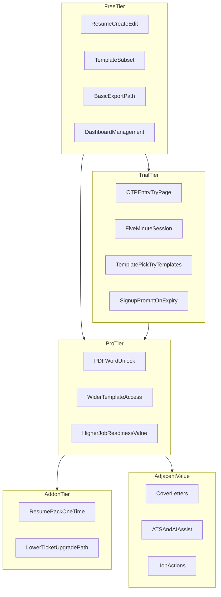
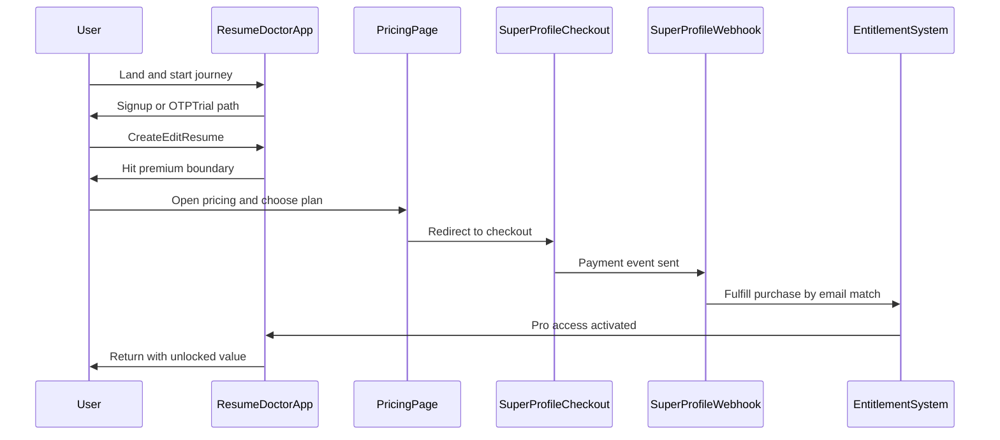
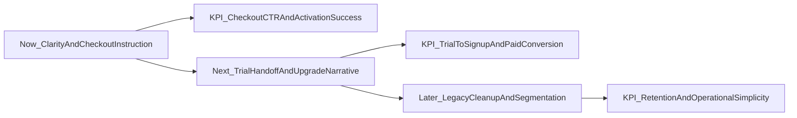
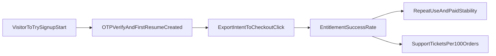

# ResumeDoctor Business-Only Audit Sheet

Date: 2026-04-27  
Scope: Business motive, offer stack, customer funnel, friction points, and ROI-prioritized actions.

## 1) Business Motive and Positioning

ResumeDoctor is positioned as a fast, practical job-application helper for India-first users who need an ATS-friendly resume quickly.  
The core commercial intent is:

- Acquire users with a low-friction entry (free usage and OTP trial entry).
- Deliver immediate value in the builder (template, editing, ATS/AI assistance).
- Convert at high-intent moments (export, premium templates, advanced outcomes).
- Fulfill entitlement reliably after payment with email-linked activation.

Current monetization behavior in product:

- Free baseline exists and is usable for core creation/editing.
- Paid tiers are promoted from value moments and dashboard.
- Payment intent has moved to SuperProfile as the primary purchase path.
- Fulfillment depends on matching buyer email to account email.

## 2) Service Catalog and Packaging

### Free

- Resume creation and editing.
- Template access subset.
- Basic export path support (with paid gating around premium exports/features).
- Access to dashboard and ongoing resume management.

### Trial (product trial behavior)

- OTP-based entry from `/try`.
- Short, time-bound editing session with visible countdown.
- Trial-to-signup conversion prompts when session ends.
- Template selection via `/try/templates`.

### Pro (paid)

- Premium export capabilities (PDF/Word unlock messaging).
- Fuller template access and stronger “job-ready” value promise.
- Greater overall utility for active job seekers and repeat use.

### Add-on / One-time Pack

- Resume pack purchase flow exists in pricing surfaces.
- Intended as a lower-ticket path for users not ready for full Pro commitment.

### Adjacent Services (value expansion)

- Cover letters.
- ATS scoring and AI-assisted improvements.
- Job-oriented actions (job board/apply support touchpoints).

## 3) End-to-End Business Funnel

```mermaid
flowchart LR
  awareness[Awareness_LandingTemplatesContent] --> activation[Activation_SignupOrTry]
  activation --> firstValue[FirstValue_CreateResumeAndEdit]
  firstValue --> valueExpansion[ValueExpansion_AIAtsCoverLetter]
  valueExpansion --> conversionTrigger[ConversionTrigger_ExportTemplateLimits]
  conversionTrigger --> pricing[Pricing_ChoosePlanOnPricing]
  pricing --> checkout[Checkout_Superprofile]
  checkout --> fulfillment[Fulfillment_WebhookEntitlement]
  fulfillment --> retainedUse[Retention_RepeatEditsAndExports]
  conversionTrigger --> dropOff[DropOff_FrictionOrConfusion]
  pricing --> dropOff
  checkout --> dropOff
```

## 4) Operational Flow (Intent to Entitlement)

1. User enters through homepage/templates/pricing.
2. User either signs up/logs in or starts OTP trial.
3. User reaches value quickly by creating and editing a resume.
4. User encounters premium boundary (export format, template, or advanced utility).
5. User is directed to pricing and external checkout.
6. Webhook fulfillment activates account benefits using the same email identity.
7. User returns to dashboard/editor and continues with paid capabilities.

Business interpretation: the strongest conversion signal is tied to an immediate job-output need (export/apply readiness), not broad feature browsing.

## 5) Friction and Risk Register

| Area | Friction | Severity | Business Impact |
|---|---|---:|---|
| Pricing narrative | Legacy references still coexist with newer SuperProfile-first model | High | Conversion leakage, trust loss, “which path is correct?” confusion |
| Checkout identity | Same-email dependency can fail if buyer uses different email | High | Paid users may not receive entitlement immediately; support burden and refund risk |
| Trial messaging consistency | Different places describe trial behavior with different tones/expectations | Medium | Lower trial-to-signup conversion due to mismatch in user expectation |
| Offer clarity | Boundaries between Free, Trial, Pro, and pack may not be instantly obvious | Medium | Slower purchase decisions; more hesitation at pricing stage |
| Legacy admin/manual paths | Legacy trial activation/admin flows still present for historical support | Medium | Internal complexity and potential accidental reliance on outdated operations |
| Region/currency communication | Regional pricing language can become inconsistent in edge cases | Low | Perceived pricing mismatch, lower checkout confidence |

## 6) Prioritized Actions (Now / Next / Later)

### Now (highest ROI, lowest ambiguity)

1. Unify public pricing message to one explicit commercial promise: SuperProfile is the live payment path.
2. Add explicit checkout instruction at every CTA: “Use the same email as your ResumeDoctor account.”
3. Standardize the Free vs Trial vs Pro comparison language into one reusable block used across pricing and key conversion points.

Expected KPI impact:

- Increase pricing page click-through to checkout.
- Reduce “payment done but not activated” support tickets.
- Improve checkout completion rate.

### Next (funnel performance lift)

1. Tighten trial-to-signup handoff copy at timer expiry and dashboard prompts.
2. Strengthen “why upgrade now” framing at export-intent moments (value-led, not feature-list-led).
3. Add one clear post-payment confirmation state in-app so activation confidence is immediate.

Expected KPI impact:

- Increase trial-to-signup conversion.
- Increase trial/free to paid conversion at export trigger.
- Reduce bounce after external checkout return.

### Later (scalability and retention)

1. Rationalize or retire unused legacy payment/trial paths after validation window.
2. Segment plans/offers by user intent (first-time fresher, experienced switcher, bulk resume updater).
3. Add lifecycle nudges for retained use (resume refresh reminders before common hiring seasons).

Expected KPI impact:

- Improve operational simplicity and reduce maintenance overhead.
- Raise repeat paid usage and renewal-equivalent behavior.

## 7) KPI Scorecard (Business Tracking)

Track these weekly with baseline and target:

- Visitor -> Try/Signup start rate
- OTP sent -> OTP verified rate
- First resume created rate
- First export intent rate (click/open)
- Pricing view -> checkout click rate
- Checkout click -> successful entitlement rate
- Trial user -> signup conversion rate
- Free/trial -> paid conversion rate
- Payment-support ticket rate per 100 paid orders

### KPI Ownership and Alert Thresholds

| KPI Stage | Primary KPI | Owner | Weekly Alert Threshold |
|---|---|---|---|
| Acquisition | Visitor -> Try/Signup start | Growth | Drops by >15% vs 4-week average |
| Activation | OTP sent -> OTP verified | Product | Drops below 55% |
| First Value | First resume created | Product | Drops below 60% of verified users |
| Conversion Intent | Export intent (locked export clicks) | Product | Drops by >20% |
| Checkout | Pricing view -> checkout click | Growth | Drops below 12% |
| Fulfillment | Checkout click -> entitlement success | Backend | Below 95% same-day activation |
| Support Risk | Payment help tickets per 100 orders | Support | Above 5 per 100 orders |
| Retention | Paid users active in 14 days | Product | Drops by >10% |

### Event Coverage Map (Source of Truth)

| Funnel Step | Event Name | Source Surface |
|---|---|---|
| Trial start | `trial_start` | `/try` OTP verification success |
| Resume creation | `resume_created` | Template selection / resume create flows |
| Upgrade intent | `upgrade_click` | Export locks, pricing entry CTAs |
| Checkout start | `superprofile_checkout_click` | SuperProfile CTA links |
| Checkout cancellation | `superprofile_checkout_cancelled` | SuperProfile pre-check confirmation |
| Payment success | `payment_success` | Webhook-backed product event logging |

Weekly review cadence:

- Monday: KPI review with stage owners (Growth, Product, Backend, Support).
- Wednesday: Status checkpoint on any metric in alert.
- Friday: Close-loop summary with action owner, decision, and expected KPI impact.

## 8) Assumptions and Evidence Gaps

- This audit is grounded in product surfaces and route behavior, not a full analytics warehouse pull.
- KPI movements above are directional until validated with event-level funnel data.
- Legacy path usage should be confirmed before hard deprecation decisions.

## 9) Executive Summary

ResumeDoctor has a strong core value loop and clear monetization potential at output-intent moments.  
The main business risk is not missing features; it is message and flow coherence across old and new payment/trial paths.  
Prioritizing commercial clarity, entitlement confidence, and conversion-focused copy will likely deliver the highest near-term revenue lift.
