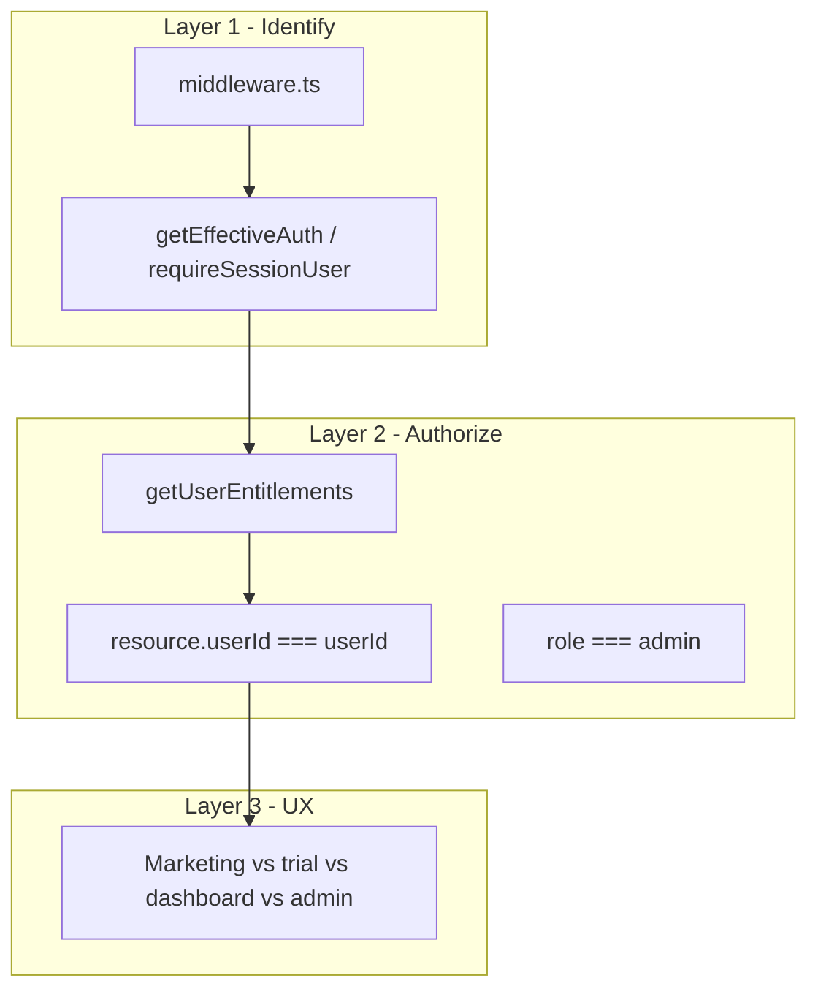

# User model and access control (ResumeDoctor)

How we **define**, **accommodate**, and **manage** users across the site. Normative for new API routes and features; when this doc disagrees with code, fix the code or update this doc together.

**Related:** [`MASTER-ADMIN.md`](./MASTER-ADMIN.md), [`.cursor/plans/project_blueprint.plan.md`](../.cursor/plans/project_blueprint.plan.md), [`prisma/schema.prisma`](../prisma/schema.prisma).

---

## 1. Source of truth

| Concern | Location |
|--------|----------|
| User record | `User` in Prisma (`email`, `role`, `subscription`, 2FA, onboarding, credits, Pro Link fields) |
| Session auth | NextAuth JWT (`src/lib/auth.ts`) — `id`, `email`, `role` on session |
| Trial identity | OTP → `TrialSession` → **trial JWT cookie** (`src/lib/trial-jwt.ts`) |
| Effective API identity | `getEffectiveAuth()` — impersonation → session → trial (`src/lib/effective-auth.ts`) |
| Feature gates | `getUserEntitlements()` (`src/lib/entitlements.ts`) + `hasFullProAccess()` (`src/lib/subscription-entitlements.ts`) + Pro Link (`src/lib/pro-link-entitlement.ts`) |
| Route gating (coarse) | `src/middleware.ts` |
| Admin gate | `requireAdmin()` / `requireSuperAdmin()` (`src/lib/admin-auth.ts`) |

---

## 2. User types (actors)

| Type | How recognized | Typical surfaces |
|------|----------------|------------------|
| **AnonymousVisitor** | No NextAuth JWT, no trial cookie | `/`, `/pricing`, `/blog`, `/try` (start) |
| **TrialUser** | Valid `trial_session` cookie | `/try/templates`, `/dashboard`, `/resumes/*` (limited) |
| **AccountUser** | NextAuth session | `/dashboard`, `/settings`, full app after signup |
| **Subscriber** | `User.subscription` pro_* (+ expiry for `pro_trial_14`) | Export PDF/DOCX, all templates, higher AI limits |
| **AdminOperator** | `role === "admin"` + optional allowlists | `/admin/*`, `/api/admin/*` |
| **TeamMember** *(future)* | Org membership | See [`TEAMS-FORWARD-DESIGN.md`](./TEAMS-FORWARD-DESIGN.md) |

---

## 3. State dimensions

- **Auth state:** `anonymous` \| `trial_cookie` \| `session` \| `session+impersonating`
- **Verification:** `emailVerified` required for credentials login
- **Security:** optional 2FA; `REQUIRE_ADMIN_2FA` for admin password login
- **Plan:** `subscription` + `subscriptionExpiresAt` (14-day pass)
- **Entitlements:** computed — not stored as a single JSON blob

---

## 4. Three-layer enforcement



### Layer 1 — Identify (always)

| Context | Use |
|---------|-----|
| Resume builder, export, ATS, templates, trial-aware limits | `getEffectiveAuth()` or `requireEffectiveAuth()` |
| Settings, 2FA, billing profile, cover letters, jobs, delete account | `requireSessionUser()` — **no trial cookie, no impersonation** |
| AI rewrite / tailor (paid conversion) | `requireFullAccountAuth()` — blocks OTP trial |

Helpers live in **`src/lib/api-auth.ts`**.

### Layer 2 — Authorize (simple)

1. **Role:** `admin` for admin APIs/pages.
2. **Entitlement:** `loadUserEntitlements(userId, isTrial)` → `hasFullPro`, `canExportPaidFormats`, `proLink`, etc.
3. **Ownership:** `where: { id, userId: auth.userId }` on user-owned rows.

### Layer 3 — UX segmentation

- Anonymous → try / signup CTAs
- Trial → editor + templates; block export and full-account AI
- Logged-in basic → 10 templates, TXT export, low AI quota
- Pro → all templates, PDF/DOCX, higher AI quota
- Admin → separate cockpit, audited mutations

---

## 5. Middleware (`src/middleware.ts`)

**Protected (session or limited trial):** `/dashboard`, `/settings`, `/resumes`, `/cover-letters`, `/jobs`, `/interview-prep`

**Trial cookie allowed only on:** `/dashboard`, `/resumes/*`, `/try/templates` (not settings, cover letters, jobs)

**Auth pages:** `/login`, `/signup` — redirect to dashboard if already logged in

**Admin:** `/admin/*` — `role === admin`, optional `MASTER_ADMIN_EMAILS`, `ADMIN_IP_ALLOWLIST`

---

## 6. Identity-dependent flows (inventory)

| Flow | Identity | Entitlement / notes |
|------|----------|-------------------|
| Signup / OAuth / verify email | Session (after) | Creates `User`, default `basic` |
| OTP trial (`/api/auth/trial/*`) | Trial cookie | Creates/links `User`, sets trial access |
| Resume CRUD | `getEffectiveAuth` | Ownership by `userId` |
| Template pick | `getTemplateAccessContext` | Trial subset vs Basic 10 vs Pro 30 |
| Export TXT | Effective auth, non-trial | |
| Export PDF/DOCX | Effective auth + `canExportPaidFormats` | Pack credits for basic |
| AI improve/suggest/tailor | `requireFullAccountAuth` | Rate limits via `AiUsageLog` |
| ATS score | Effective auth | |
| Cover letters / jobs | Session only | Middleware blocks trial |
| Settings / 2FA / delete | Session only | |
| Stripe / SuperProfile webhooks | N/A | Updates `subscription`, invoices |
| Admin impersonate | Super admin | 30m cookie; effective auth as target user |
| Public resume `/r/[slug]` | Public read | Owner edit via session |

### Trial OTP → signup → login

1. **`/try`** — send OTP → verify → `trial_session` cookie (not NextAuth).
2. User edits resume with `isTrial: true` until signup or session expiry.
3. **`/signup`** with same email — trial-only users upgrade to `basic`, **`trial_session` cookie cleared**, `trialUpgrade: true` in API response.
4. **`/login`** — credentials sign-in (email already verified from OTP). `getEffectiveAuth()` uses DB `subscription` when resolving trial cookie, so upgraded users are not stuck on trial entitlements if cookie lingered.

---

## 7. Subscription → entitlements (summary)

| `subscription` | Full Pro templates | PDF/DOCX export | AI tier |
|----------------|-------------------|-----------------|--------|
| `basic` / `free` | 10 base templates | Pack credits only | Low daily limit |
| `trial` (OTP funnel) | Trial template set | Blocked | Trial / blocked for AI actions |
| `pro_monthly` / `pro_annual` | All | Yes | High |
| `pro_trial_14` | All while `subscriptionExpiresAt` > now | Yes while active | High while active |

**Pro Link** (vanity slug, analytics): annual implicit; standalone SKU via `proLinkActive` / `proLinkExpiresAt` — see `src/lib/pro-link-entitlement.ts`.

---

## 8. Operational management

- **Promote admin:** `npm run promote-admin` — see [`MASTER-ADMIN.md`](./MASTER-ADMIN.md)
- **Audit:** `SecurityAuditLog` for sensitive admin and account actions
- **Rate limits:** `IpRateLimit`, `AiUsageLog`, `OtpAttempt`
- **Lifecycle crons:** trial reminders, downgrade, win-back — `vercel.json`
- **Churn:** `ChurnFeedback` on delete / cancel

---

## 9. Adding a new feature (checklist)

1. Which **actor types** need access?
2. **Identify** with `getEffectiveAuth` vs `requireSessionUser`.
3. **Entitlement** flag in `getUserEntitlements` if it’s plan-gated.
4. **Ownership** check on DB queries.
5. Update **middleware** only if new protected route prefix.
6. Emit **ProductEvent** if funnel-relevant (`src/lib/analytics-event-names.ts`).

---

## 10. Key files

```
src/lib/auth.ts              # NextAuth
src/lib/effective-auth.ts    # getEffectiveAuth, getEffectiveUserId
src/lib/trial-auth.ts        # getTrialFromRequest; getResumeAuth → delegates
src/lib/api-auth.ts          # requireSessionUser, requireFullAccountAuth
src/lib/entitlements.ts      # getUserEntitlements, loadUserEntitlements
src/lib/subscription-entitlements.ts
src/lib/pro-link-entitlement.ts
src/lib/export-api-helpers.ts
src/lib/template-access.ts
src/middleware.ts
src/lib/admin-auth.ts
```
