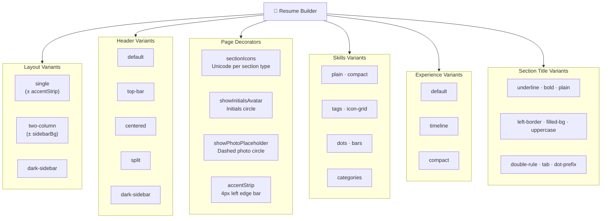
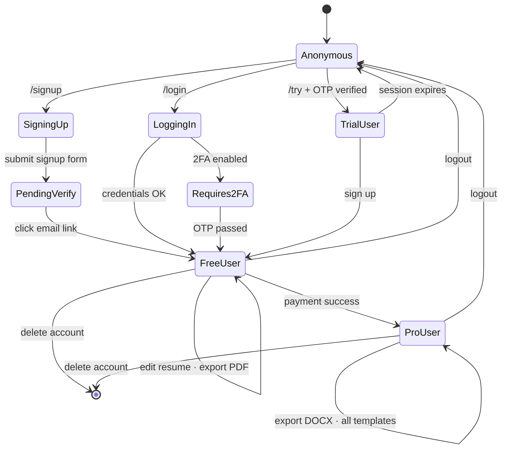
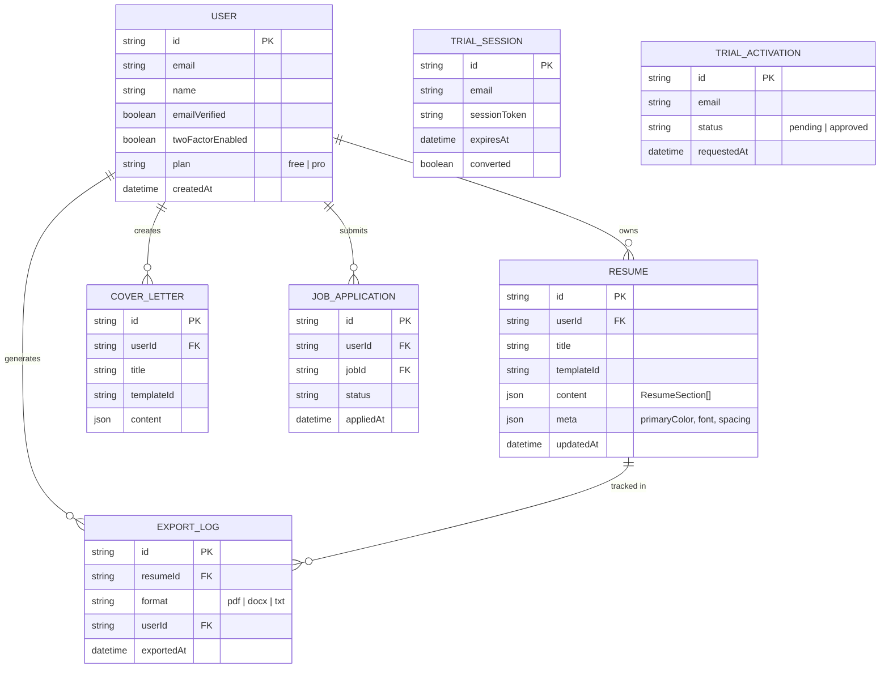

# ResumeDoctor — Complete User Workflow

## Full System Flowchart

```mermaid
flowchart TD
    %% ─────────────────────────────────────────────
    %% ENTRY POINTS
    %% ─────────────────────────────────────────────
    subgraph ENTRY["🌐 Entry"]
        A([User visits resumedoctor.in])
        A --> B{Has account?}
    end

    %% ─────────────────────────────────────────────
    %% AUTH FLOW
    %% ─────────────────────────────────────────────
    subgraph AUTH["🔐 Authentication"]
        SIGN_UP["📝 /signup\nEnter email + password"]
        LOGIN["🔑 /login\nEmail / Google / GitHub"]
        VERIFY["📧 /verify-email\nConfirm email token"]
        TFA["🔒 /login/2fa\nOTP verification"]
        FORGOT["❓ /forgot-password"]
        RESET["🔄 /reset-password?token="]
        OTP_SEND["API: /auth/trial/send-otp"]
        OTP_VERIFY["API: /auth/trial/verify-otp"]

        SIGN_UP --> VERIFY
        VERIFY --> DASH
        LOGIN --> TFA_CHECK{2FA enabled?}
        TFA_CHECK -->|Yes| TFA
        TFA_CHECK -->|No| DASH
        TFA --> DASH
        FORGOT --> RESET
        RESET --> LOGIN
    end

    %% ─────────────────────────────────────────────
    %% TRY FREE (no signup)
    %% ─────────────────────────────────────────────
    subgraph TRY["⚡ Try Free — No Signup"]
        TRY_HOME["/try\nEnter email for trial"]
        TRY_TEMPL["/try/templates\nPick template"]
        TRY_OTP["📲 Verify OTP via email"]
        TRIAL_BUILDER["🛠 Trial Resume Builder\n(limited saves)"]

        TRY_HOME --> OTP_SEND
        OTP_SEND --> TRY_OTP
        TRY_OTP --> OTP_VERIFY
        OTP_VERIFY --> TRY_TEMPL
        TRY_TEMPL --> TRIAL_BUILDER
        TRIAL_BUILDER --> UPGRADE_CTA{Export or save?}
        UPGRADE_CTA -->|"Trial limit hit"| PRICING
        UPGRADE_CTA -->|"Export PDF"| EXPORT_PDF
    end

    %% ─────────────────────────────────────────────
    %% DASHBOARD
    %% ─────────────────────────────────────────────
    subgraph DASH_AREA["🏠 Dashboard — /dashboard"]
        DASH["Dashboard\nMy Resumes list"]
        DASH --> DA{Choose action}
        DA -->|"+ New resume"| NEW_RES
        DA -->|"Edit existing"| BUILDER
        DA -->|"Duplicate"| DUP["API: /resumes/[id]/duplicate"]
        DA -->|"Cover letters"| CL_HUB
        DA -->|"Jobs"| JOBS
        DA -->|"Settings"| SETTINGS
        DA -->|"Upgrade"| PRICING
        DUP --> BUILDER
    end

    %% ─────────────────────────────────────────────
    %% TEMPLATE SELECTION
    %% ─────────────────────────────────────────────
    subgraph TEMPL_AREA["🎨 Templates"]
        TEMPL_PAGE["/templates\n30 template thumbnails"]
        NEW_RES["/resumes/new\nPick template + name"]
        TEMPL_PAGE --> NEW_RES
        NEW_RES --> BUILDER
    end

    %% ─────────────────────────────────────────────
    %% RESUME BUILDER — core
    %% ─────────────────────────────────────────────
    subgraph BUILDER_AREA["📄 Resume Builder — /resumes/[id]/edit"]
        BUILDER["Builder layout\n← Editor | Preview →"]

        subgraph SECTIONS["📋 Section Editor (14 types)"]
            direction LR
            S1["◈ Contact\n+title +github +portfolio"]
            S2["◆ Summary\nor Objective"]
            S3["◉ Experience\n+employmentType"]
            S4["◈ Education\n+gpa +honours"]
            S5["◇ Skills\n+levels +categories"]
            S6["◉ Projects\nmulti-entry +tech[]"]
            S7["◈ Certifications"]
            S8["◎ Languages\n5-dot proficiency"]
            S9["★  Awards"]
            S10["◇ Volunteer Work"]
            S11["◆ Publications\n+DOI +authors"]
            S12["♦  Interests"]
            S13["◆ Custom Section\nuser-defined heading"]
        end

        subgraph PREVIEW["👁 Live Preview (ResumePreview)"]
            direction TB
            LAY{"Layout variant"}
            LAY -->|single| SING["Single column\n± accentStrip\n± sectionIcons\n± photoPlaceholder"]
            LAY -->|two-column| TWOC["Two-column\n± sidebarBg\n± sectionIcons"]
            LAY -->|dark-sidebar| DARK["Dark sidebar\n+ initials avatar\n± photoPlaceholder"]
            HDRS["Header variants\ndefault · top-bar · centered\nsplit · dark-sidebar"]
            SKILL_V["Skills variants\nplain · tags · dots · bars\ncategories · icon-grid · compact"]
            EXP_V["Experience variants\ndefault · timeline · compact"]
            SEC_T["Section title variants\nunderline · left-border · uppercase\nfilled-bg · bold · plain\ndouble-rule · tab · dot-prefix"]
        end

        BUILDER --> SECTIONS
        BUILDER --> PREVIEW
        SECTIONS --> PREVIEW
    end

    %% ─────────────────────────────────────────────
    %% AI FEATURES
    %% ─────────────────────────────────────────────
    subgraph AI_AREA["🤖 AI Features"]
        AI_BULLETS["✨ Suggest bullets\nAPI: /resumes/[id]/ai/suggest-bullets\nRole + keywords → 5 options"]
        AI_IMPROVE["📝 Improve bullet\nAPI: /resumes/[id]/ai/improve-bullet\nWeaken → Strengthen"]
        AI_SUMMARY["📋 Improve summary\nAPI: /resumes/[id]/ai/improve-summary\nDraft → Polished"]
        OPENAI[(OpenAI GPT-4)]

        AI_BULLETS --> OPENAI
        AI_IMPROVE --> OPENAI
        AI_SUMMARY --> OPENAI
        OPENAI --> SECTIONS
    end

    %% ─────────────────────────────────────────────
    %% ATS SCORE
    %% ─────────────────────────────────────────────
    subgraph ATS_AREA["📊 ATS Score Checker"]
        ATS_CHECK["API: /resumes/[id]/ats\nKeyword density · length\nsection completeness · format"]
        ATS_RESULT{"Score?"}
        ATS_CHECK --> ATS_RESULT
        ATS_RESULT -->|"< 70 — needs work"| SECTIONS
        ATS_RESULT -->|"70–89 — good"| EXPORT
        ATS_RESULT -->|"90+ — excellent"| EXPORT
    end

    %% ─────────────────────────────────────────────
    %% EXPORT
    %% ─────────────────────────────────────────────
    subgraph EXPORT["📥 Export"]
        EXP_CHOICE{Format?}
        EXPORT_PDF["PDF Download\nAPI: /resumes/[id]/export/html\n→ browser print-to-PDF"]
        EXPORT_DOCX["DOCX Download\nAPI: /resumes/[id]/export/docx\n(Pro only)"]
        EXPORT_TXT["Plain text\nAPI: /resumes/[id]/export/txt\nATS paste format"]
        EXP_LOG["API: /resumes/[id]/export/log\nTrack every download"]

        EXP_CHOICE -->|"PDF (Free + Pro)"| EXPORT_PDF
        EXP_CHOICE -->|"DOCX (Pro)"| DOCX_CHECK{Is Pro?}
        EXP_CHOICE -->|"TXT"| EXPORT_TXT
        DOCX_CHECK -->|Yes| EXPORT_DOCX
        DOCX_CHECK -->|No| PRICING
        EXPORT_PDF --> EXP_LOG
        EXPORT_DOCX --> EXP_LOG
    end

    %% ─────────────────────────────────────────────
    %% APPLY TO JOBS
    %% ─────────────────────────────────────────────
    subgraph APPLY["📨 Apply"]
        APPLY_OUT["Copy link or download\nUpload to job portals"]
        PORTALS["Naukri · LinkedIn · Indeed India\nInternshala · TimesJobs · Shine · Foundit"]
        APPLY_OUT --> PORTALS
    end

    %% ─────────────────────────────────────────────
    %% COVER LETTERS
    %% ─────────────────────────────────────────────
    subgraph CL_AREA["✉ Cover Letters"]
        CL_HUB["/cover-letters\nMy cover letters"]
        CL_NEW["/cover-letters/new\nPick cover letter template"]
        CL_EDIT["/cover-letters/[id]/edit\nCustomize + AI rewrite"]
        CL_DOCX["API: /cover-letters/[id]/export/docx"]

        CL_HUB --> CL_NEW
        CL_NEW --> CL_EDIT
        CL_EDIT --> CL_DOCX
        CL_EDIT --> AI_CUSTOMIZE["API: /cover-letters/[id]/customize\nAI tailors to job description"]
    end

    %% ─────────────────────────────────────────────
    %% JOBS BOARD
    %% ─────────────────────────────────────────────
    subgraph JOB_AREA["💼 Jobs — /jobs"]
        JOBS["/jobs\nCurated listings"]
        JOB_APPLY["API: /jobs/[id]/apply\nTrack application"]
        JOB_HIST["API: /jobs/applications\nApplication history"]

        JOBS --> JOB_APPLY
        JOB_APPLY --> JOB_HIST
    end

    %% ─────────────────────────────────────────────
    %% PRICING / UPGRADE
    %% ─────────────────────────────────────────────
    subgraph PRICING_AREA["💳 Pricing"]
        PRICING["/pricing\nFree vs Pro plan cards"]
        PRIC_REGION["API: /pricing/region\nAuto-detect INR / USD"]
        PROMO["API: /pricing/validate-promo\nApply coupon"]
        TRIAL_ACT["API: /pricing/trial-activation\nRequest trial access"]
        PRIC_VERIFY["/pricing/verify-trial\nAdmin approval pending"]
        PAY["Razorpay / payment gateway"]
        PRO_ACT["Pro plan activated\nUnlimited templates + DOCX"]

        PRICING --> PRIC_REGION
        PRICING --> PROMO
        PRICING --> TRIAL_ACT
        TRIAL_ACT --> PRIC_VERIFY
        PRICING --> PAY
        PAY --> PRO_ACT
        PRO_ACT --> DASH
    end

    %% ─────────────────────────────────────────────
    %% SETTINGS
    %% ─────────────────────────────────────────────
    subgraph SETTINGS_AREA["⚙ Settings — /settings"]
        SETTINGS["/settings"]
        SET_PASS["API: /auth/change-password"]
        SET_EMAIL["API: /user/change-email/request\n→ /settings/change-email/verify"]
        SET_2FA["API: /user/2fa/setup → /user/2fa/verify\n→ /user/2fa/disable"]
        SET_AVATAR["API: /user/avatar/upload"]
        SET_EXPORT["API: /user/export-data\nDownload all data (GDPR)"]
        SET_DEL["API: /user/delete-account"]
        SET_INV["API: /user/invoices"]

        SETTINGS --> SET_PASS
        SETTINGS --> SET_EMAIL
        SETTINGS --> SET_2FA
        SETTINGS --> SET_AVATAR
        SETTINGS --> SET_EXPORT
        SETTINGS --> SET_DEL
        SETTINGS --> SET_INV
    end

    %% ─────────────────────────────────────────────
    %% ADMIN PANEL
    %% ─────────────────────────────────────────────
    subgraph ADMIN_AREA["🛡 Admin — /admin"]
        ADMIN["/admin\nDashboard + analytics"]
        ADMIN_LOGIN["/admin/login\nAdmin credentials"]
        ADMIN_USERS["/admin/users\nUser management"]
        ADMIN_EXPORT["/admin/export-logs\nDownload audit trail"]
        ADMIN_TRIAL["/admin/trial-activations\nApprove trial requests"]
        ADMIN_IMP["API: /admin/impersonate\nLogin as any user"]
        DB_ADMIN[(PostgreSQL\nPrisma ORM)]

        ADMIN_LOGIN --> ADMIN
        ADMIN --> ADMIN_USERS
        ADMIN --> ADMIN_EXPORT
        ADMIN --> ADMIN_TRIAL
        ADMIN --> ADMIN_IMP
        ADMIN --> DB_ADMIN
    end

    %% ─────────────────────────────────────────────
    %% DATA PERSISTENCE
    %% ─────────────────────────────────────────────
    subgraph DATA["🗄 Data Layer"]
        DB[(PostgreSQL\nPrisma)]
        RESUMES_API["API: /resumes\nCRUD for resumes\n(ResumeContent JSON)"]
        DB --> RESUMES_API
    end

    %% ─────────────────────────────────────────────
    %% CONNECTIONS (top-level flow)
    %% ─────────────────────────────────────────────
    A --> B
    B -->|"New user"| SIGN_UP
    B -->|"Returning"| LOGIN
    B -->|"Try free"| TRY_HOME
    B -->|"Browse templates"| TEMPL_PAGE

    SIGN_UP --> AUTH
    LOGIN --> AUTH

    BUILDER --> AI_AREA
    BUILDER --> ATS_CHECK
    BUILDER --> EXP_CHOICE
    BUILDER --> RESUMES_API

    EXP_CHOICE --> APPLY_OUT

    EXPORT_PDF --> APPLY_OUT
    EXPORT_DOCX --> APPLY_OUT

    ADMIN_TRIAL -->|"Approve"| PRO_ACT

    %% ─────────────────────────────────────────────
    %% STYLE
    %% ─────────────────────────────────────────────
    classDef page        fill:#dbeafe,stroke:#3b82f6,color:#1e3a8a
    classDef api         fill:#d1fae5,stroke:#10b981,color:#064e3b
    classDef decision    fill:#fef3c7,stroke:#f59e0b,color:#78350f
    classDef external    fill:#f3e8ff,stroke:#8b5cf6,color:#4c1d95
    classDef db          fill:#fee2e2,stroke:#ef4444,color:#7f1d1d
    classDef ai          fill:#ede9fe,stroke:#7c3aed,color:#2e1065

    class A,SIGN_UP,LOGIN,VERIFY,TFA,FORGOT,RESET,TRY_HOME,TRY_TEMPL,DASH,TEMPL_PAGE,NEW_RES,BUILDER,SETTINGS,PRICING,JOBS,CL_HUB,CL_NEW,CL_EDIT,ADMIN,ADMIN_LOGIN,ADMIN_USERS,ADMIN_EXPORT,ADMIN_TRIAL page
    class RESUMES_API,ATS_CHECK,OTP_SEND,OTP_VERIFY,AI_BULLETS,AI_IMPROVE,AI_SUMMARY,EXPORT_PDF,EXPORT_DOCX,EXPORT_TXT,EXP_LOG,CL_DOCX,AI_CUSTOMIZE,JOB_APPLY,JOB_HIST,SET_PASS,SET_EMAIL,SET_2FA,SET_AVATAR,SET_EXPORT,SET_DEL,SET_INV,PRIC_REGION,PROMO,TRIAL_ACT,ADMIN_IMP api
    class B,TFA_CHECK,DA,UPGRADE_CTA,ATS_RESULT,EXP_CHOICE,DOCX_CHECK decision
    class PORTALS,PAY,OPENAI external
    class DB,DB_ADMIN db
    class AI_BULLETS,AI_IMPROVE,AI_SUMMARY ai
```

---

## Simplified User Journey (Happy Path)

```mermaid
flowchart LR
    A([🌐 Land]) --> B([📝 Sign up\nor Try Free])
    B --> C([🎨 Pick Template\n30 options])
    C --> D([🛠 Build Resume\n14 section types])
    D --> E([🤖 AI Assist\nbullets · summary])
    E --> F([📊 ATS Check\nscore & keywords])
    F --> G([📥 Export\nPDF · DOCX · TXT])
    G --> H([📨 Apply\nNaukri · LinkedIn\nIndeed · Internshala])

    style A fill:#3b82f6,color:white,stroke:none
    style B fill:#8b5cf6,color:white,stroke:none
    style C fill:#06b6d4,color:white,stroke:none
    style D fill:#10b981,color:white,stroke:none
    style E fill:#7c3aed,color:white,stroke:none
    style F fill:#f59e0b,color:white,stroke:none
    style G fill:#ef4444,color:white,stroke:none
    style H fill:#0ea5e9,color:white,stroke:none
```

---

## Resume Builder — Section & Variant Map

---

## Auth State Machine

---

## Data Model Relationships

