# ResumeDoctor — UX Flow Reference

**Product:** India-first resume and CV builder (freemium SaaS with Pro subscriptions, OTP try, and optional trials)  
**Production domain:** [resumedoctor.in](https://resumedoctor.in)  
**Last updated:** 2026-05-12  
**Audience:** Product, design, frontend, content, and QA — single map of screens, decisions, and outcomes across the whole product.

This document describes **what users see and do**, with a **visual diagram library** (Mermaid: flowcharts, state machines, sequences, ER/class diagrams, mindmaps, timelines, swimlanes). For routes, APIs, and implementation detail, use [`.cursor/plans/project_blueprint.plan.md`](../.cursor/plans/project_blueprint.plan.md). For role acceptance criteria, see [`PRD-ROLE-BASED.md`](./PRD-ROLE-BASED.md).

**How to read diagrams:** GitHub and many Markdown previews render Mermaid inline. If a diagram fails to render, open this file in a Mermaid-capable editor or paste the block into [mermaid.live](https://mermaid.live).

---

## Table of contents

1. [Product scope](#1-product-scope)
2. [Personas and account states](#2-personas-and-account-states)
3. [Information architecture](#3-information-architecture)
4. [Global shell and navigation](#4-global-shell-and-navigation)
5. [Access, redirects, and gating](#5-access-redirects-and-gating)
6. [Discovery and marketing](#6-discovery-and-marketing)
7. [Try without signup (OTP trial)](#7-try-without-signup-otp-trial)
8. [Authentication and identity](#8-authentication-and-identity)
9. [Dashboard and onboarding](#9-dashboard-and-onboarding)
10. [Resume creation and builder](#10-resume-creation-and-builder)
11. [Import existing resume](#11-import-existing-resume)
12. [AI assistance](#12-ai-assistance)
13. [ATS score and live feedback](#13-ats-score-and-live-feedback)
14. [Export, download, and share](#14-export-download-and-share)
15. [Cover letters](#15-cover-letters)
16. [Jobs and applications](#16-jobs-and-applications)
17. [Interview prep](#17-interview-prep)
18. [Content: blog and examples](#18-content-blog-and-examples)
19. [Pricing, checkout, and upgrades](#19-pricing-checkout-and-upgrades)
20. [Settings and account lifecycle](#20-settings-and-account-lifecycle)
21. [Admin operations](#21-admin-operations)
22. [Lifecycle email touchpoints](#22-lifecycle-email-touchpoints)
23. [Capability matrix by plan](#23-capability-matrix-by-plan)
24. [Visual diagram library](#24-visual-diagram-library)
25. [Route index](#25-route-index)
26. [Related documents](#26-related-documents)

---

## 1. Product scope

ResumeDoctor is a Zety-style resume builder aimed at Indian job seekers. The core loop is **land → create or try → edit with live preview → check quality (ATS / feedback) → export or share → apply**. Surrounding that loop are marketing and SEO surfaces, account and billing, cover letters, a lightweight job board, interview prep, and an admin cockpit.

**Primary outcomes for users**

- A resume they can send as PDF, Word, plain text, or a **stable public link** that always shows the latest version.
- Confidence that the resume matches how Indian portals and ATS systems read applications.
- Optional AI help for bullets, summary, tailoring, and cover letters.

**Primary outcomes for the business**

- Convert anonymous visitors through **OTP try**, **signup**, and **Pro / resume pack** purchase.
- Retain users via dashboard onboarding, exports, and lifecycle email (configured outside the app).

**Visual index:** end-to-end happy path [§24.9](#249-happy-path-eight-step-journey), master workflow [§24.8](#248-full-product-workflow-master-flowchart), system context [§24.2](#242-system-context-c4-landscape).

## 2. Personas and account states

| Persona | Goal | Typical entry | Primary surfaces |
|--------|------|---------------|------------------|
| **Anonymous visitor** | Evaluate product, read content, compare pricing | Home, SEO landing pages, blog, `/features` | Marketing pages, `/try`, `/templates` |
| **OTP trial user** | Build once without full account | “Try free” CTAs → `/try` | `/try`, `/try/templates`, builder (time-limited) |
| **Free (Basic) user** | Save resumes, basic export, explore upgrade | Signup, post-trial conversion | `/dashboard`, builder, `/pricing` |
| **Pro subscriber** | Full templates, PDF/Word, higher AI limits | `/pricing`, SuperProfile or Stripe checkout | Same as free + unlocked exports |
| **Returning user** | Edit, duplicate, export, track jobs | Login, email links | Dashboard, builder, `/jobs` |
| **Admin operator** | Support users, trials, promos, audit | `/admin/login` | `/admin/*` |

**Account states (simplified)** — see also [§24.5](#245-auth-and-identity-state-machines) and [§24.6](#246-subscription-and-trial-activation-states).

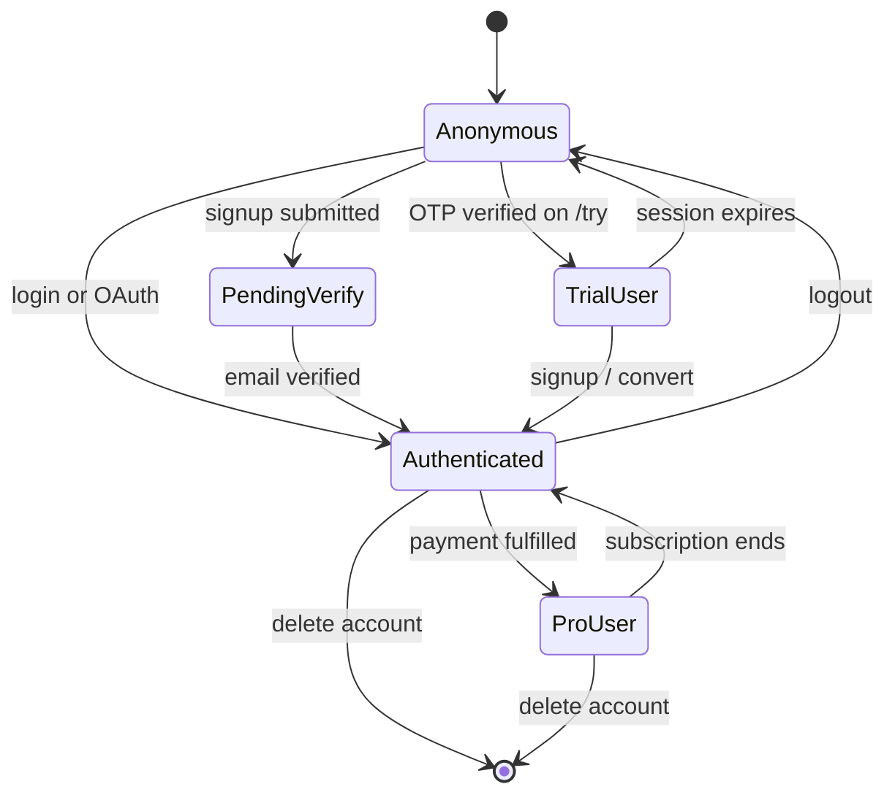
```mermaid
stateDiagram-v2
  [*] --> Anonymous
  Anonymous --> TrialUser: OTP verified on /try
  Anonymous --> PendingVerify: signup submitted
  Anonymous --> Authenticated: login or OAuth
  PendingVerify --> Authenticated: email verified
  TrialUser --> Authenticated: signup / convert
  TrialUser --> Anonymous: session expires
  Authenticated --> ProUser: payment fulfilled
  ProUser --> Authenticated: subscription ends
  Authenticated --> Anonymous: logout
  Authenticated --> [*]: delete account
  ProUser --> [*]: delete account
```

---

## 3. Information architecture

Top-level areas and how users move between them.

| Area | Purpose | Key routes |
|------|---------|------------|
| **Marketing** | Trust, SEO, conversion | `/`, `/about`, `/features`, `/pricing`, `/templates`, `/resume-link`, `/lp/*` |
| **Try funnel** | Low-friction first edit | `/try`, `/try/templates` |
| **Auth** | Identity | `/signup`, `/login`, `/verify-email`, `/forgot-password`, `/reset-password`, `/login/2fa` |
| **App hub** | Resume list and shortcuts | `/dashboard` |
| **Builder** | Core product | `/resumes/new`, `/resumes/[id]/edit` |
| **Cover letters** | Companion documents | `/cover-letters`, `/cover-letters/new`, `/cover-letters/[id]/edit` |
| **Jobs** | Listings and application tracking | `/jobs` |
| **Interview prep** | Q&A practice | `/interview-prep` |
| **Content** | SEO and education | `/blog`, `/blog/[slug]`, `/examples`, `/examples/[slug]` |
| **Public resume** | Shareable view | `/r/[slug]` |
| **Account** | Profile and security | `/settings`, `/settings/change-email/verify` |
| **Billing** | Plans and trial verification | `/pricing`, `/pricing/verify-trial` |
| **Legal** | Policies | `/terms`, `/privacy` |
| **Admin** | Operations | `/admin`, `/admin/*` |

**Visual:** site map [§24.4](#244-site-information-architecture-sitemap), product mindmap [§24.3](#243-product-domain-mindmap), mega menu IA [§24.30](#2430-public-navigation--mega-menu-ia-mindmap).

## 4. Global shell and navigation

**Site header** (marketing and signed-in): primary nav to product pillars (templates, features, pricing), auth CTAs or user menu, and mega-menu panels for deeper links on desktop; condensed mobile mega-menu for small viewports.

**Signed-in layout** (`UserDashboardLayout`): persistent sidebar or equivalent navigation among Dashboard, Resumes (via dashboard), Cover letters, Jobs, Interview prep, Settings, and Upgrade/Pricing.

**Footer**: legal links, secondary marketing links, and trust signals on public pages.

**Cross-cutting UI patterns**

- Toast notifications for save, AI, and export errors.
- Upgrade modals when a Pro-only action is attempted on Basic.
- Trial timer banner on dashboard and builder when an OTP session is active.
- “Saving…” / “Saved” on resume auto-save in the builder.

---

## 5. Access, redirects, and gating

Middleware enforces access before page render.

| Path pattern | Anonymous | OTP trial JWT | Signed-in (Basic) | Pro |
|--------------|-----------|---------------|-------------------|-----|
| `/`, `/pricing`, `/blog`, … | Yes | Yes | Yes | Yes |
| `/try` | Yes | Yes (may skip email step) | Redirect to dashboard | Same |
| `/try/templates` | No — redirect `/try` | Yes | Yes | Yes |
| `/dashboard`, `/settings` | No — `/login` | Limited trial access to dashboard | Yes | Yes |
| `/resumes/*` | No — `/try` or `/login` | Yes (trial limits) | Yes | Yes |
| `/cover-letters/*` | No — `/login` | No | Yes | Yes |
| `/login`, `/signup` | Yes | Redirect dashboard if session | Redirect dashboard | Same |
| `/admin/*` | `/admin/login` | N/A | Denied unless `admin` role | Same |

**Trial-specific UX**

- Five-minute (configurable) session timer surfaced in header/banner.
- Export actions locked or replaced with upgrade/signup CTAs.
- Template picker limited to basic templates on `/try/templates`.
- Expiry overlay: prompt to sign up to save and export.

**Pro gating (user-visible)**

- PDF and DOCX export, some templates, and higher AI usage typically require Pro or resume pack credits (exact rules enforced in UI + API).

**Visual:** middleware activity [§24.10](#2410-middleware-and-route-access-activity), capability gating [§24.40](#2440-capability-gating-decision).

## 6. Discovery and marketing

### 6.1 Homepage (`/`)

**User goal:** Understand value and start building.

**Flow**

1. Land on hero with primary CTA (create resume / try free) and secondary CTA (templates, pricing).
2. Scroll through feature pillars, social proof, and “resume as a link” story.
3. Exit via `/try`, `/signup`, `/templates`, or `/pricing`.

### 6.2 Features (`/features`)

**User goal:** Compare capabilities before committing.

**Flow**

1. Section nav across capability pillars (templates, AI, ATS, share link, exports).
2. Sticky CTA toward `/try` or signup.
3. FAQ and trust stats; analytics events on tracked links.

### 6.3 Templates gallery (`/templates`)

**User goal:** Browse layouts before creating an account.

**Flow**

1. Grid of template thumbnails (free vs Pro indicated in UI).
2. CTA to `/resumes/new` when signed in, or `/try` / signup when not.

### 6.4 SEO landing pages (`/lp/*`, `/resume-link`)

Dedicated narratives for search intent, for example:

- `/lp/resume-builder-india`
- `/lp/resume-export-pdf-docx-india`
- `/lp/fresher-campus-resume-india`
- `/lp/tailor-resume-job-description`
- `/resume-link` — shareable URL positioning

**Flow:** Problem → how ResumeDoctor solves it → proof → CTA to `/try` or signup. Copy aligns with homepage “resume as a link” language on `/resume-link`.

### 6.5 About, pricing, legal

- **`/about`:** Brand story and trust.
- **`/pricing`:** Plan comparison, regional pricing hints, promo code, checkout entry.
- **`/terms`, `/privacy`:** Legal acceptance reference for signup.

### 6.6 Introduction email page (`/introduction-resumedoctor-email`)

Campaign or lifecycle email destination; reinforces product story and deep-links into try or dashboard.

---

## 7. Try without signup (OTP trial)

**Entry:** Homepage, features, landing pages, header “Try free” → `/try`.

| Step | Screen / action | User sees | Success | Failure / edge |
|------|-----------------|-----------|---------|----------------|
| 1 | `/try` — email capture | Email field, “Send OTP” | Message that OTP was sent | Rate limit; invalid email |
| 2 | OTP entry | Six-digit input, verify CTA | Redirect toward template pick | Wrong/expired OTP; resend cooldown |
| 3 | `/try/templates` | Subset of basic templates | Resume created, open editor | No cookie → back to `/try` |
| 4 | `/resumes/[id]/edit` | Full editor + countdown | Auto-save during window | Timer hits zero → overlay |
| 5 | Post-trial | Signup, pricing, or leave | Account links trial work | Exports remain locked until upgrade |

**Conversion paths**

- Sign up with same email story to save work.
- Hit export or Pro template → `/pricing` or signup modal.
- Cron-driven reminders for expired try (email segment `otp_try_expired` — see [§22](#22-lifecycle-email-touchpoints)).

**Visual:** OTP sequence [§24.11](#2411-otp-try-funnel-sequence), master try branch in [§24.8](#248-full-product-workflow-master-flowchart).

## 8. Authentication and identity

### 8.1 Sign up (`/signup`)

1. User submits email, password, and required fields.
2. System creates account and sends verification email.
3. User lands on `/verify-email` or follows link with token.
4. After verification, user signs in and reaches `/dashboard`.

### 8.2 Log in (`/login`)

1. User chooses credentials or OAuth (Google, LinkedIn where enabled).
2. If 2FA enabled → `/login/2fa` for TOTP step.
3. Success → `/dashboard` (or prior `callbackUrl` if present).
4. Already signed in → redirect away from auth pages.

### 8.3 Email verification (`/verify-email`)

- Token from email URL; confirm success or show resend path.

### 8.4 Password reset

1. `/forgot-password` — request reset email.
2. Email link → `/reset-password?token=…` — new password.
3. Return to `/login`.

### 8.5 Two-factor authentication (settings-driven)

1. Enable in `/settings` — setup and verify via API.
2. Subsequent logins challenge at `/login/2fa` until satisfied.

### 8.6 Connected accounts

- Link or unlink OAuth providers from settings; password change for credential users.

**Visual:** signup sequence [§24.12](#2412-sign-up-and-email-verification-sequence), login 2FA [§24.13](#2413-credentials-login-with-2fa-branch-sequence), OAuth [§24.14](#2414-oauth-sign-in-and-account-linking-sequence), auth states [§24.5](#245-auth-and-identity-state-machines).

## 9. Dashboard and onboarding

**Route:** `/dashboard`  
**Layout:** Signed-in shell; resume cards; shortcuts to cover letters, jobs, settings, upgrade.

**First-time and returning flows**

1. **Empty state:** CTA to create first resume (`/resumes/new`) or import.
2. **Resume list:** Open editor, duplicate, delete; sort by recent activity.
3. **Trial banner:** Countdown and signup CTA when OTP session active.
4. **Pro confirmation:** Banner after successful upgrade (`?upgraded=` or equivalent).
5. **Onboarding checklist** (authenticated, not impersonating):

| Step key | User-facing label | Intent | Deep link |
|----------|-------------------|--------|-----------|
| `template_chosen` | Create a resume | Pick a layout | `/resumes/new` |
| `section_filled` | Fill key sections | Minimum viable content | First resume edit |
| `ats_run` | Run the ATS checker | JD match awareness | Edit URL with `?panel=ats` |
| `export_done` | Export your resume | Complete the loop | `/pricing` or export in builder |

Checklist loads from `/api/user/onboarding-status`; user can dismiss when done.

**Impersonation:** When admin views as user, checklist and some banners are suppressed.

**Visual:** checklist flow [§24.25](#2425-onboarding-checklist-flow), dashboard hierarchy [§24.26](#2426-dashboard-workspace-hierarchy-current-vs-target).

## 10. Resume creation and builder

### 10.1 Create resume (`/resumes/new`)

1. Choose template (full catalog for signed-in users; trial subset for OTP).
2. Name resume (optional/default).
3. POST create → redirect to `/resumes/[id]/edit`.

### 10.2 Editor layout (`/resumes/[id]/edit`)

**Layout:** Editor panel + live preview (stacked on small screens, editor first).

**Section types available in the product**

Contact, Summary, Objective, Experience, Education, Skills, Projects, Certifications, Languages, Awards, Volunteer, Publications, Interests, Custom section.

**Core interactions**

- Add, edit, remove section instances; drag-and-drop section order.
- Debounced auto-save with visible save state.
- Template switcher (preserve content where possible).
- Style controls: primary color, font, spacing; layout/header/skills/experience variants per template.
- Optional panels: ATS, live feedback, India tips, step wizard (where enabled).
- Voice input on supported fields (e.g. experience bullets).

**Empty states:** Prompt to add first section with clear CTA.

### 10.3 Duplicate resume

From dashboard or API-driven duplicate → new id → same editor experience.

**Visual:** builder variants [§24.27](#2427-resume-builder--sections-and-template-variants), editor engagement [§24.28](#2428-editor-early-session-engagement-current-vs-ideal), autosave [§24.15](#2415-resume-autosave-loop-sequence), mobile posture [§24.29](#2429-mobile-posture-responsive-vs-mobile-priority).

## 11. Import existing resume

**User goal:** Start from PDF or Word instead of blank.

**Flow (authenticated)**

1. User initiates import from dashboard or builder entry point.
2. Upload file → parse API extracts structured sections.
3. User reviews parsed content → confirm create.
4. Land in editor with `importSource` metadata; user fixes parsing gaps.

**Trial:** Import may be restricted to signed-in users depending on product rules; exports still follow plan gating.

**Visual:** import flow [§24.36](#2436-import-resume-flow).

## 12. AI assistance

Available in builder and cover-letter flows; rate limits apply per plan.

| Action | Where triggered | User experience | Outcome |
|--------|-----------------|-----------------|---------|
| Suggest bullets | Experience / project bullets | Role + keywords → list of options | User inserts chosen bullet |
| Improve bullet | Per bullet control | Loading state on button | Replace or refine text |
| Improve summary | Summary section | Draft in → polished out | Replace summary |
| Tailor for job | Resume-level action | Paste JD → targeted suggestions | User applies edits manually |
| Customize cover letter | Cover letter editor | Job context → rewritten letter | User edits result |

**Error UX:** Toast or inline error, retry; silent degradation if API unavailable.

**Visual:** AI sequence [§24.16](#2416-ai-improve-bullet-sequence).

## 13. ATS score and live feedback

### 13.1 ATS checker

1. User opens ATS panel in builder (or via onboarding deep link).
2. Optional: paste job description.
3. System scores keyword coverage, length, section completeness, format signals.
4. User sees score band and actionable suggestions.
5. User edits resume; may re-run check.

**Onboarding:** Completing a run can mark `ats_run` on the checklist.

### 13.2 Live feedback panel

Continuous, lighter-weight hints while editing (readability, weak phrases, missing sections) without full ATS run.

**Visual:** ATS sequence [§24.17](#2417-ats-check-sequence).

## 14. Export, download, and share

### 14.1 Export formats

| Format | Typical access | User action | Notes |
|--------|----------------|-------------|-------|
| TXT | Basic+ | Download | ATS paste-friendly |
| HTML / print | Basic+ | Print or save as PDF via browser | Watermark possible on free |
| PDF | Pro or pack | Download | Logged for analytics |
| DOCX | Pro | Download | Upgrade CTA if locked |

Export attempts on trial: blocked with upgrade/signup messaging.

### 14.2 Share public link

1. User enables share in builder (generates `publicSlug`).
2. Copy link to clipboard; optional QR on marketing pages.
3. Recipients open `/r/[slug]` — read-only rendered resume, always latest save.
4. User can revoke or rotate slug via settings/builder.

### 14.3 Apply out

User copies link or downloads file → uploads to Naukri, LinkedIn, Indeed India, Internshala, and similar portals (out of product).

**Visual:** export decision and share [§24.18](#2418-export-and-share-flow--sequence), export pipeline [§24.19](#2419-export-pipeline-data-flow).

## 15. Cover letters

**Routes:** `/cover-letters`, `/cover-letters/new`, `/cover-letters/[id]/edit`

| Step | User action | System response |
|------|-------------|-----------------|
| List | Open hub from nav | Cards of saved letters |
| Create | Pick template | New letter with scaffold |
| Edit | Body + metadata; optional link to resume | Auto-save |
| AI customize | Provide job description | Tailored draft |
| Export | TXT or DOCX | Download; Pro rules for Word |

**Visual:** cover letter journey [§24.37](#2437-cover-letter-journey-flow).

## 16. Jobs and applications

**Route:** `/jobs` (signed-in layout)

**Browse flow**

1. Search and filter listings (location, industry, keywords).
2. See match score when resume keywords align with job skills.
3. Save job or open external application URL.

**Application tracking**

1. Mark applied from listing → status pipeline: saved → applied → interviewing → rejected → offer.
2. Review history via jobs UI and `/api/jobs/applications`.

**Admin:** Curate listings at `/admin/jobs`.

**Visual:** job application states [§24.7](#247-job-application-pipeline-user-visible).

## 17. Interview prep

**Route:** `/interview-prep`

**UX structure**

1. **Prep track** checklist: research, elevator pitch, STAR story bank, practice, final review.
2. **Question categories:** behavioral, role fit, problem solving, culture, and more.
3. **AI answer helper:** User selects or types a question → generated answer with copy control; rate limited.
4. **Sample questions** for quick practice without AI.

Signed-in users get full layout; anonymous users may see marketing wrapper with login CTA depending on page rules.

**Visual:** interview prep flow [§24.38](#2438-interview-prep-journey-flow).

## 18. Content: blog and examples

### 18.1 Blog (`/blog`, `/blog/[slug]`)

1. Index lists posts from `content/blog`.
2. Article page: MDX/Markdown body, SEO metadata, optional lead magnet or feedback widget.
3. CTAs back to `/try` or product pillars.

### 18.2 Resume examples (`/examples`, `/examples/[slug]`)

1. Gallery of example resumes by role or industry.
2. Detail page shows structure and tips.
3. CTA to start own resume from template.

**Visual:** content funnel [§24.39](#2439-content-funnel-blog-and-examples).

## 19. Pricing, checkout, and upgrades

### 19.1 Pricing page (`/pricing`)

1. Show Free vs Pro (and packs if applicable); region-aware pricing via API.
2. User enters promo code → validate → adjusted checkout.
3. User selects plan → external checkout (SuperProfile links and/or Stripe Checkout).

### 19.2 Payment fulfillment

1. Payment provider webhook → subscription or credits updated.
2. User returns to app; dashboard may show Pro unlocked banner.
3. Export and template locks clear without re-login when session refreshed.

### 19.3 Manual / India trial activation (`/pricing/verify-trial`)

1. User submits UPI or manual trial request where configured.
2. Admin approves in `/admin/trial-activations`.
3. User receives access per product rules.

### 19.4 Upgrade triggers in product

- Locked PDF/DOCX export buttons.
- Pro template badges in gallery.
- AI limit reached messaging.
- Trial timer expiry and post-export CTAs.

**Visual:** Stripe checkout [§24.20](#2420-stripe-checkout-and-webhook-sequence--activity), SuperProfile [§24.21](#2421-superprofile-purchase-fulfillment-sequence), subscription states [§24.6](#246-subscription-and-trial-activation-states).

## 20. Settings and account lifecycle

**Route:** `/settings`

| Concern | User flow |
|---------|-----------|
| Profile | Name, locale, professional headline |
| Avatar | Upload image |
| Password | Change password (credential accounts) |
| Email | Request change → `/settings/change-email/verify` |
| 2FA | Setup, verify, disable |
| Connected accounts | OAuth link/unlink |
| Notifications | Preferences where implemented |
| Billing | Link to pricing; invoice list |
| Export data | GDPR-style download |
| Delete account | Confirm → churn feedback capture → account removed |

**Churn:** Optional feedback form on cancel or delete path.

**Visual:** account lifecycle overlaps auth states [§24.5](#245-auth-and-identity-state-machines).

## 21. Admin operations

**Entry:** `/admin/login` → `/admin` for users with `admin` role (optional master-email and IP allowlists).

| Workflow | Admin action | User impact |
|----------|--------------|-------------|
| User support | Search users, view detail, revoke sessions | User forced re-login |
| Impersonation | View as user | Debug UX; banner in app when impersonating |
| Trial activations | Approve/reject manual trial | Unlocks trial/Pro per request |
| Trial sessions | Inspect OTP trials | Support abuse or conversion |
| Promos | CRUD promo codes | Pricing page validation |
| Jobs | CRUD listings | `/jobs` content |
| Purchases | Reconcile SuperProfile events | Subscription state |
| Export logs | Audit downloads | Support billing disputes |
| Analytics / health | Dashboards and metrics | None direct |
| Audit log | Security and admin actions | Compliance |

**Exit impersonation:** Return to admin session via dedicated end action.

**Visual:** admin flow [§24.22](#2422-admin-support-and-impersonation-flow).

## 22. Lifecycle email touchpoints

Email automation is configured outside the repo (e.g. Resend, Customer.io). Product events should drive segments documented in [`LIFECYCLE-EMAIL.md`](./LIFECYCLE-EMAIL.md).

| Segment | Trigger (conceptual) | Email goal | In-app CTA target |
|---------|----------------------|------------|-------------------|
| `signed_up_no_resume` | Account, zero resumes | First resume | `/resumes/new` |
| `resume_no_export` | Resume exists, no export | First export / ATS | Builder, `/pricing` |
| `otp_try_expired` | Try ended, no signup | Convert | `/signup` |
| `trial_active` | Short try or India pass | Activate in window | Builder |
| `trial_ending` | Pass nearing end | Upgrade | `/pricing` |
| `paid_pro` | Active Pro | Retention tips | Dashboard |
| `dormant_14d` | No login 14 days | Re-engage | Blog, dashboard |

**Sequences:** welcome, try abandon, stuck after first resume, India pass midpoint, dormant nudge — see lifecycle doc for timing.

**Visual:** swimlane [§24.24](#2424-lifecycle-email-swimlane), cron timeline [§24.23](#2423-scheduled-jobs-and-trial-lifecycle-timeline).

## 23. Capability matrix by plan

Exact enforcement lives in API and UI; this table is the intended **user-visible** contract.

| Capability | Anonymous | OTP try | Basic (free) | Pro |
|------------|-----------|---------|--------------|-----|
| Browse marketing / blog | Yes | Yes | Yes | Yes |
| Build resume in editor | No | Yes, time-boxed | Yes | Yes |
| Save to account | No | Limited / convert | Yes | Yes |
| Template catalog | Preview | Subset | Free + locked Pro | Full |
| TXT export | No | No | Yes | Yes |
| PDF / DOCX | No | No | Locked / pack | Yes |
| Public share link | No | Policy-dependent | Yes | Yes |
| AI features | No | Limited | Limited quotas | Higher quotas |
| ATS checker | No | Yes in trial window | Yes | Yes |
| Cover letters | No | No | Yes | Yes |
| Jobs board | No | No | Yes | Yes |
| Interview prep AI | Varies | Varies | Rate limited | Rate limited |

---

## 24. Visual diagram library

Consolidated **Mermaid** atlas for ResumeDoctor. Diagram types used: **flowchart** (journeys, IA, pipelines), **stateDiagram** (auth, billing, jobs), **sequenceDiagram** (multi-actor interactions), **erDiagram** / **classDiagram** (data), **mindmap** (domain map), **timeline** (cron and email cadence). Narrative for each workflow lives in §1–§23; this section is the visual index.

### 24.1 Diagram type legend

| Type | Best for | Examples in this doc |
|------|----------|----------------------|
| `flowchart` | Decisions, funnels, pipelines | §24.3, §24.8, §24.20 |
| `stateDiagram-v2` | Account, subscription, job status | §2, §24.5–§24.7 |
| `sequenceDiagram` | Browser ↔ API ↔ third parties | §24.9–§24.18 |
| `erDiagram` | Entities users indirectly own | §24.21 |
| `classDiagram` | Aggregates and relations | §24.22 |
| `mindmap` | Product domains, nav IA | §24.2, §24.4 |
| `timeline` | Scheduled jobs, email cadence | §24.19, §24.23 |

### 24.2 System context (C4 landscape)

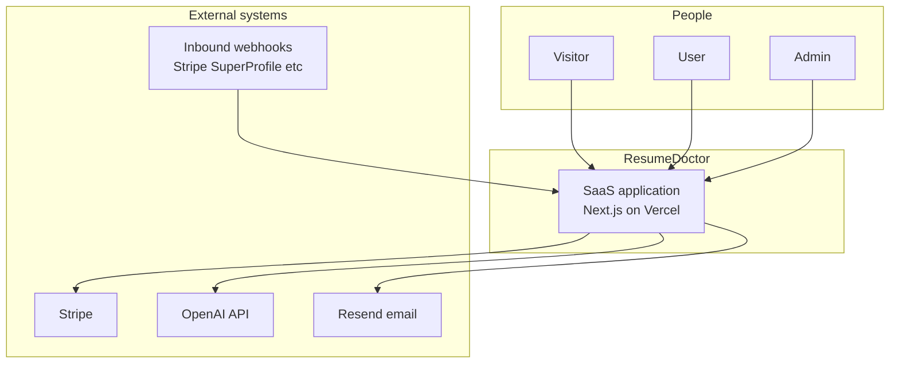
```mermaid
flowchart TB
  subgraph people [People]
    VIS[Visitor]
    USR[User]
    ADM[Admin]
  end

  subgraph system [ResumeDoctor]
    APP[SaaS application\nNext.js on Vercel]
  end

  subgraph org [External systems]
    STRIPE[Stripe]
    OAI[OpenAI API]
    EMAIL[Resend email]
    EXT_WH[Inbound webhooks\nStripe SuperProfile etc]
  end

  VIS --> APP
  USR --> APP
  ADM --> APP
  APP --> STRIPE
  APP --> OAI
  APP --> EMAIL
  EXT_WH --> APP
```

### 24.3 Product domain mindmap

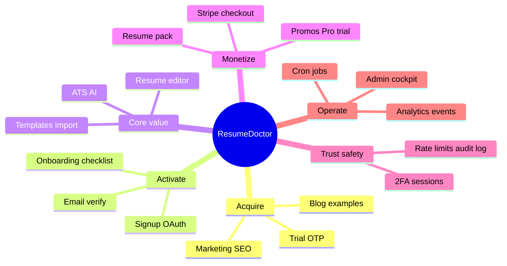
```mermaid
mindmap
  root((ResumeDoctor))
    Acquire
      Marketing SEO
      Blog examples
      Trial OTP
    Activate
      Signup OAuth
      Email verify
      Onboarding checklist
    Core value
      Resume editor
      Templates import
      ATS AI
    Monetize
      Stripe checkout
      Promos Pro trial
      Resume pack
    Trust safety
      2FA sessions
      Rate limits audit log
    Operate
      Admin cockpit
      Cron jobs
      Analytics events
```

### 24.4 Site information architecture (sitemap)

```mermaid
flowchart TB
  ROOT[resumedoctor.in]

  ROOT --> MKT[Marketing]
  ROOT --> TRY[Try funnel]
  ROOT --> AUTH[Auth]
  ROOT --> APP[Signed-in app]
  ROOT --> PUB[Public resume]
  ROOT --> ADM[Admin]

  MKT --> HOME[/]
  MKT --> FEAT[/features]
  MKT --> PRICE[/pricing]
  MKT --> TEMPL[/templates]
  MKT --> LP[/lp/*]
  MKT --> RLINK[/resume-link]
  MKT --> BLOG[/blog]
  MKT --> EX[/examples]
  MKT --> LEGAL[/terms /privacy]

  TRY --> TRY1[/try]
  TRY --> TRY2[/try/templates]

  AUTH --> SU[/signup]
  AUTH --> LI[/login]
  AUTH --> VE[/verify-email]
  AUTH --> FP[/forgot-password]
  AUTH --> RP[/reset-password]
  AUTH --> TFA[/login/2fa]

  APP --> DASH[/dashboard]
  APP --> RES[/resumes/new + edit]
  APP --> CL[/cover-letters]
  APP --> JOB[/jobs]
  APP --> INT[/interview-prep]
  APP --> SET[/settings]

  PUB --> RSLUG[/r/slug]

  ADM --> ALOGIN[/admin/login]
  ADM --> AHOME[/admin]
```

### 24.5 Auth and identity state machines

**Session / identity (user-facing)**

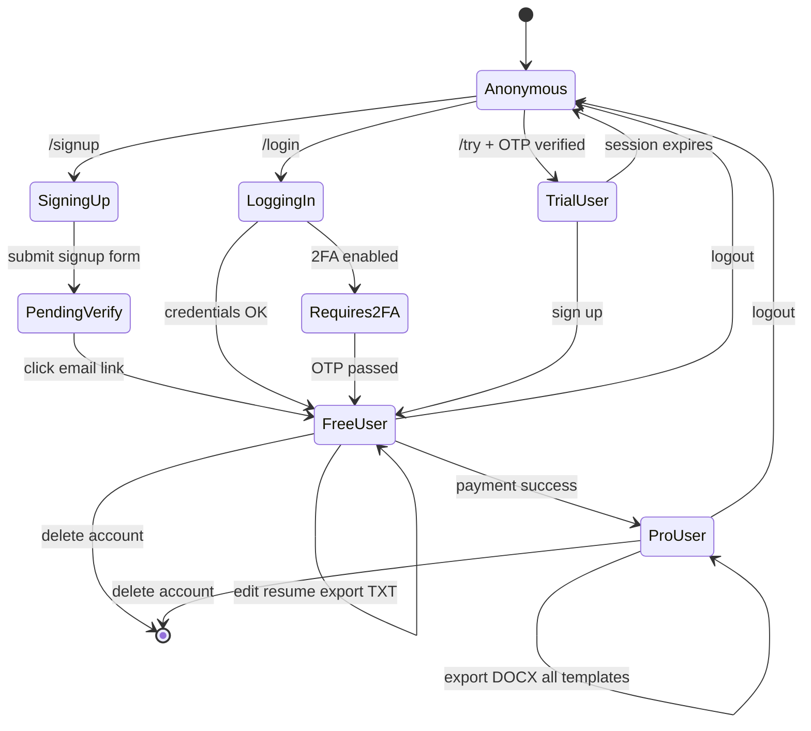
```mermaid
stateDiagram-v2
  [*] --> Anonymous

  Anonymous --> TrialUser: /try + OTP verified
  Anonymous --> SigningUp: /signup
  Anonymous --> LoggingIn: /login

  SigningUp --> PendingVerify: submit signup form
  PendingVerify --> FreeUser: click email link

  LoggingIn --> Requires2FA: 2FA enabled
  LoggingIn --> FreeUser: credentials OK
  Requires2FA --> FreeUser: OTP passed

  FreeUser --> ProUser: payment success
  FreeUser --> FreeUser: edit resume export TXT
  ProUser --> ProUser: export DOCX all templates

  TrialUser --> FreeUser: sign up
  TrialUser --> Anonymous: session expires

  FreeUser --> Anonymous: logout
  ProUser --> Anonymous: logout
  FreeUser --> [*]: delete account
  ProUser --> [*]: delete account
```

### 24.6 Subscription and trial-activation states

**Plan / subscription (simplified; cron and webhooks drive some edges)**

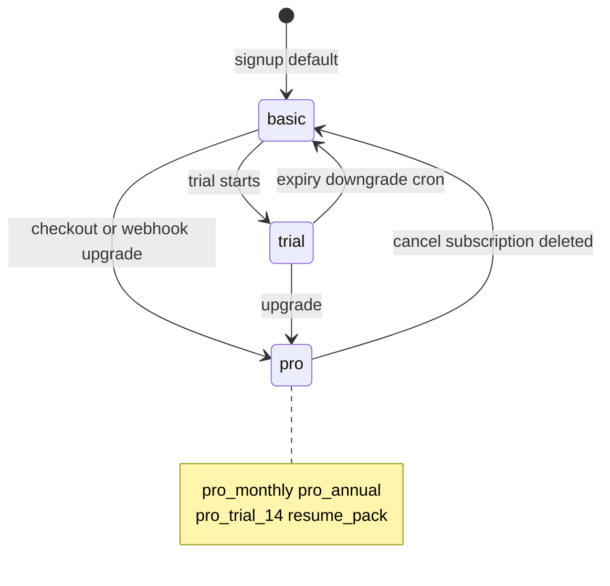
```mermaid
stateDiagram-v2
  [*] --> basic: signup default
  basic --> trial: trial starts
  basic --> pro: checkout or webhook upgrade
  trial --> pro: upgrade
  trial --> basic: expiry downgrade cron
  pro --> basic: cancel subscription deleted
  note right of pro
    pro_monthly pro_annual
    pro_trial_14 resume_pack
  end note
```

**Manual India trial request (`/pricing/verify-trial`)**

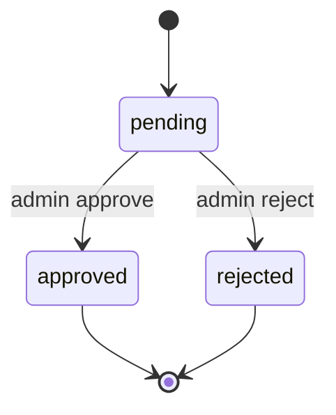
```mermaid
stateDiagram-v2
  [*] --> pending
  pending --> approved: admin approve
  pending --> rejected: admin reject
  approved --> [*]
  rejected --> [*]
```

### 24.7 Job application pipeline (user-visible)

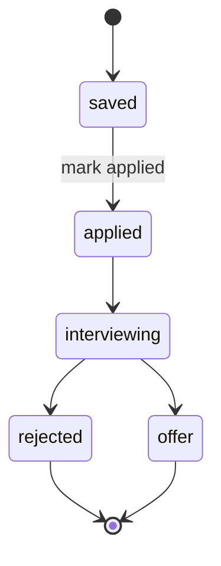
```mermaid
stateDiagram-v2
  [*] --> saved
  saved --> applied: mark applied
  applied --> interviewing
  interviewing --> rejected
  interviewing --> offer
  rejected --> [*]
  offer --> [*]
```

### 24.8 Full product workflow (master flowchart)

Single map from entry through auth, trial, dashboard, builder, AI, ATS, export, monetization, settings, and admin.

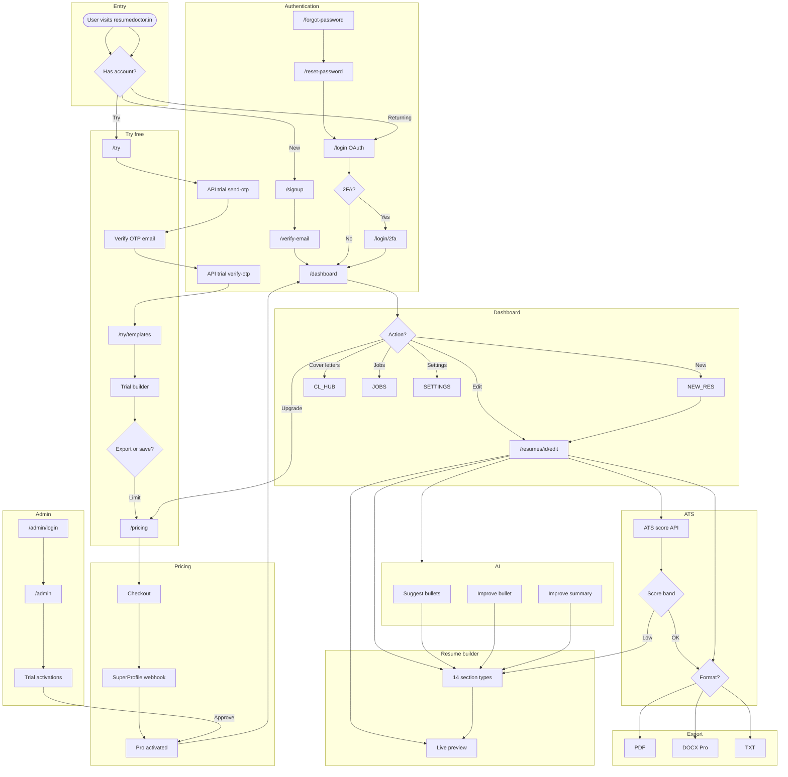
```mermaid
flowchart TD
  subgraph ENTRY["Entry"]
    A([User visits resumedoctor.in])
    A --> B{Has account?}
  end

  subgraph AUTH["Authentication"]
    SIGN_UP["/signup"]
    LOGIN["/login OAuth"]
    VERIFY["/verify-email"]
    TFA["/login/2fa"]
    FORGOT["/forgot-password"]
    RESET["/reset-password"]
    OTP_SEND["API trial send-otp"]
    OTP_VERIFY["API trial verify-otp"]
    SIGN_UP --> VERIFY
    VERIFY --> DASH
    LOGIN --> TFA_CHECK{2FA?}
    TFA_CHECK -->|Yes| TFA
    TFA_CHECK -->|No| DASH
    TFA --> DASH
    FORGOT --> RESET
    RESET --> LOGIN
  end

  subgraph TRY["Try free"]
    TRY_HOME["/try"]
    TRY_TEMPL["/try/templates"]
    TRY_OTP["Verify OTP email"]
    TRIAL_BUILDER["Trial builder"]
    TRY_HOME --> OTP_SEND
    OTP_SEND --> TRY_OTP
    TRY_OTP --> OTP_VERIFY
    OTP_VERIFY --> TRY_TEMPL
    TRY_TEMPL --> TRIAL_BUILDER
    TRIAL_BUILDER --> UPGRADE_CTA{Export or save?}
    UPGRADE_CTA -->|Limit| PRICING
  end

  subgraph DASH_AREA["Dashboard"]
    DASH["/dashboard"]
    DASH --> DA{Action?}
    DA -->|New| NEW_RES
    DA -->|Edit| BUILDER
    DA -->|Cover letters| CL_HUB
    DA -->|Jobs| JOBS
    DA -->|Settings| SETTINGS
    DA -->|Upgrade| PRICING
  end

  subgraph BUILDER_AREA["Resume builder"]
    BUILDER["/resumes/id/edit"]
    BUILDER --> SECTIONS["14 section types"]
    BUILDER --> PREVIEW["Live preview"]
    SECTIONS --> PREVIEW
  end

  subgraph AI_AREA["AI"]
    AI_BULLETS["Suggest bullets"]
    AI_IMPROVE["Improve bullet"]
    AI_SUMMARY["Improve summary"]
    AI_BULLETS --> SECTIONS
    AI_IMPROVE --> SECTIONS
    AI_SUMMARY --> SECTIONS
  end

  subgraph ATS_AREA["ATS"]
    ATS_CHECK["ATS score API"]
    ATS_CHECK --> ATS_RESULT{Score band}
    ATS_RESULT -->|Low| SECTIONS
    ATS_RESULT -->|OK| EXP_CHOICE
  end

  subgraph EXPORT["Export"]
    EXP_CHOICE{Format?}
    EXPORT_PDF["PDF"]
    EXPORT_DOCX["DOCX Pro"]
    EXPORT_TXT["TXT"]
    EXP_CHOICE --> EXPORT_PDF
    EXP_CHOICE --> EXPORT_DOCX
    EXP_CHOICE --> EXPORT_TXT
  end

  subgraph PRICING_AREA["Pricing"]
    PRICING["/pricing"]
    PAY["Checkout"]
    SUPER_WB["SuperProfile webhook"]
    PRO_ACT["Pro activated"]
    PRICING --> PAY
    PAY --> SUPER_WB
    SUPER_WB --> PRO_ACT
    PRO_ACT --> DASH
  end

  subgraph ADMIN_AREA["Admin"]
    ADMIN_LOGIN["/admin/login"]
    ADMIN["/admin"]
    ADMIN_TRIAL["Trial activations"]
    ADMIN_LOGIN --> ADMIN
    ADMIN --> ADMIN_TRIAL
    ADMIN_TRIAL -->|Approve| PRO_ACT
  end

  A --> B
  B -->|New| SIGN_UP
  B -->|Returning| LOGIN
  B -->|Try| TRY_HOME
  NEW_RES --> BUILDER
  BUILDER --> AI_AREA
  BUILDER --> ATS_CHECK
  BUILDER --> EXP_CHOICE
```

### 24.9 Happy path (eight-step journey)

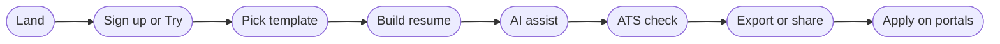
```mermaid
flowchart LR
  A([Land]) --> B([Sign up or Try])
  B --> C([Pick template])
  C --> D([Build resume])
  D --> E([AI assist])
  E --> F([ATS check])
  F --> G([Export or share])
  G --> H([Apply on portals])
```

### 24.10 Middleware and route access (activity)

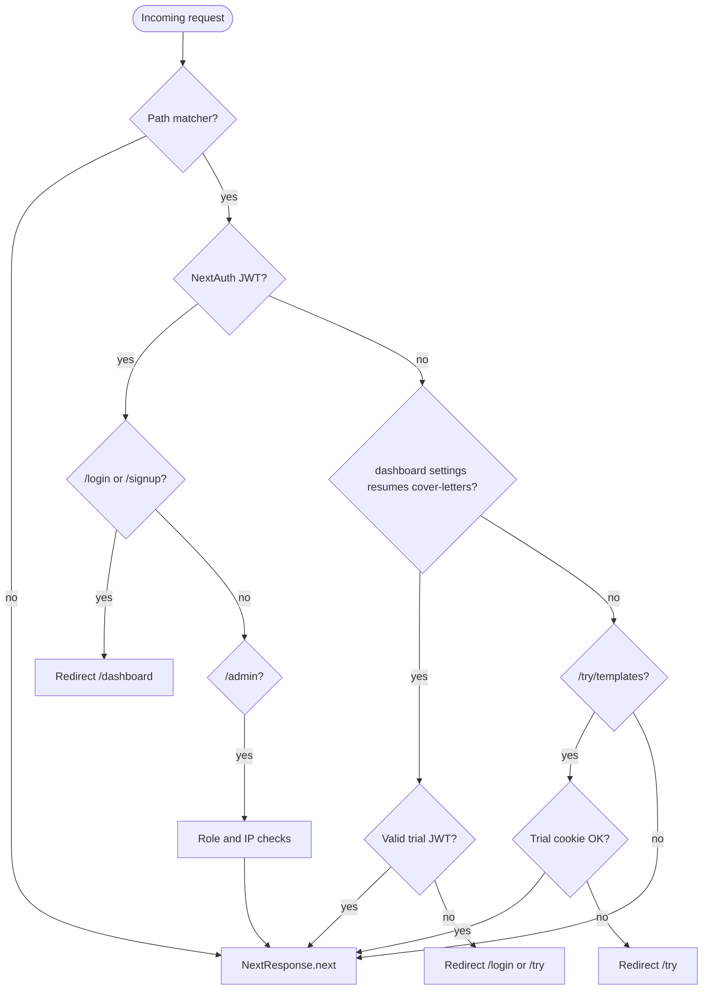
```mermaid
flowchart TD
  Start([Incoming request]) --> Match{Path matcher?}
  Match -->|no| Next[NextResponse.next]
  Match -->|yes| Token{NextAuth JWT?}

  Token -->|yes| AuthPages{/login or /signup?}
  AuthPages -->|yes| DashRedirect[Redirect /dashboard]
  AuthPages -->|no| AdminBlock{/admin?}
  AdminBlock -->|yes| AdminGate[Role and IP checks]
  AdminGate --> Next

  Token -->|no| Protected{dashboard settings resumes cover-letters?}
  Protected -->|yes| TrialCookie{Valid trial JWT?}
  TrialCookie -->|yes| Next
  TrialCookie -->|no| LoginRedirect[Redirect /login or /try]

  Protected -->|no| TryTpl{/try/templates?}
  TryTpl -->|yes| TryGate{Trial cookie OK?}
  TryGate -->|yes| Next
  TryGate -->|no| TryStart[Redirect /try]

  TryTpl -->|no| Next
```

### 24.11 OTP try funnel (sequence)

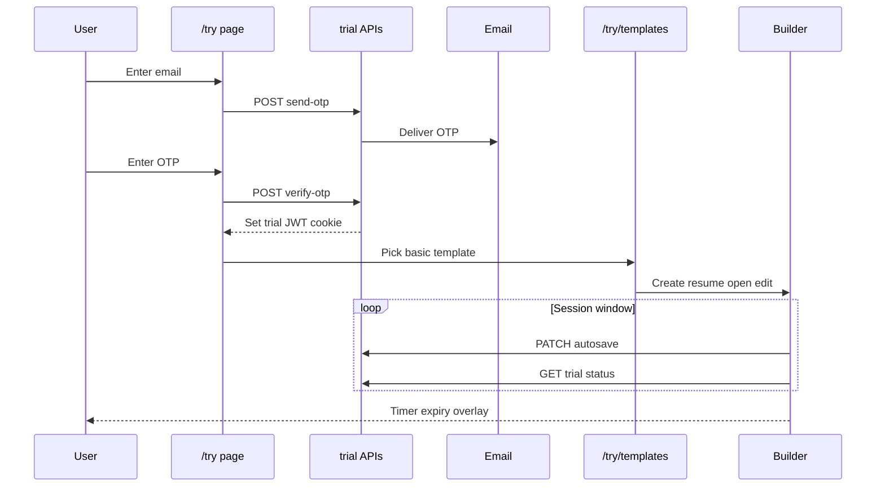
```mermaid
sequenceDiagram
  participant U as User
  participant T as /try page
  participant API as trial APIs
  participant M as Email
  participant P as /try/templates
  participant E as Builder

  U->>T: Enter email
  T->>API: POST send-otp
  API->>M: Deliver OTP
  U->>T: Enter OTP
  T->>API: POST verify-otp
  API-->>T: Set trial JWT cookie
  T->>P: Pick basic template
  P->>E: Create resume open edit
  loop Session window
    E->>API: PATCH autosave
    E->>API: GET trial status
  end
  E-->>U: Timer expiry overlay
```

### 24.12 Sign up and email verification (sequence)

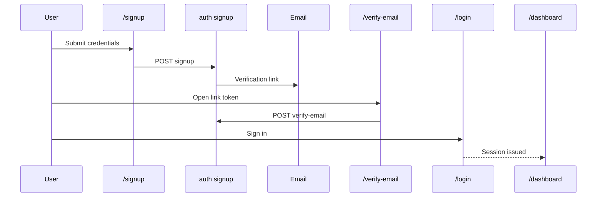
```mermaid
sequenceDiagram
  participant U as User
  participant S as /signup
  participant API as auth signup
  participant M as Email
  participant V as /verify-email
  participant L as /login
  participant D as /dashboard

  U->>S: Submit credentials
  S->>API: POST signup
  API->>M: Verification link
  U->>V: Open link token
  V->>API: POST verify-email
  U->>L: Sign in
  L-->>D: Session issued
```

### 24.13 Credentials login with 2FA branch (sequence)

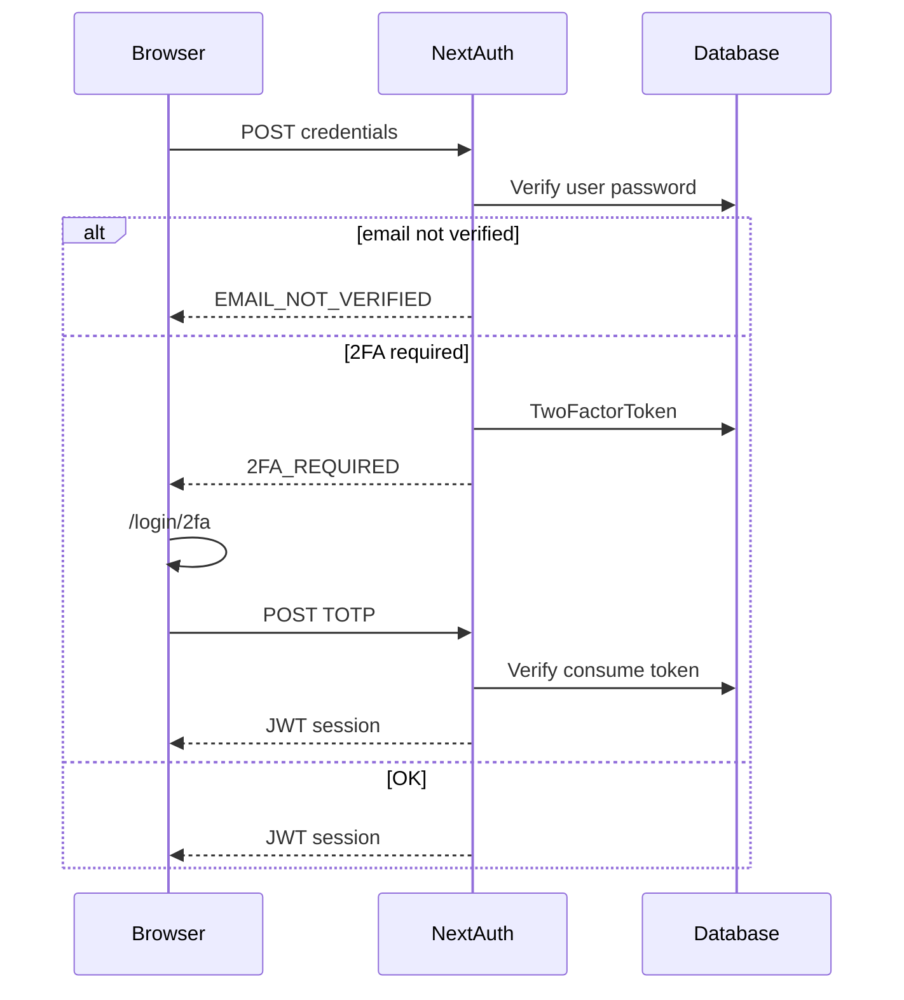
```mermaid
sequenceDiagram
  participant B as Browser
  participant NA as NextAuth
  participant DB as Database

  B->>NA: POST credentials
  NA->>DB: Verify user password
  alt email not verified
    NA-->>B: EMAIL_NOT_VERIFIED
  else 2FA required
    NA->>DB: TwoFactorToken
    NA-->>B: 2FA_REQUIRED
    B->>B: /login/2fa
    B->>NA: POST TOTP
    NA->>DB: Verify consume token
    NA-->>B: JWT session
  else OK
    NA-->>B: JWT session
  end
```

### 24.14 OAuth sign-in and account linking (sequence)

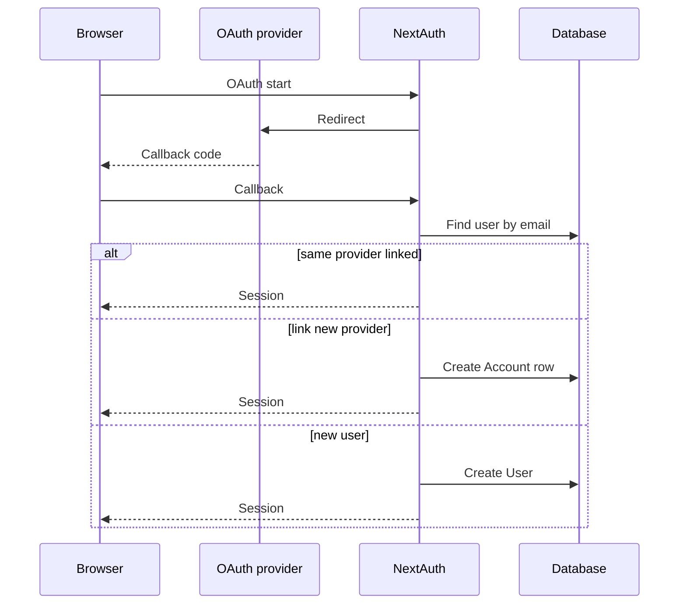
```mermaid
sequenceDiagram
  participant B as Browser
  participant OA as OAuth provider
  participant NA as NextAuth
  participant DB as Database

  B->>NA: OAuth start
  NA->>OA: Redirect
  OA-->>B: Callback code
  B->>NA: Callback
  NA->>DB: Find user by email
  alt same provider linked
    NA-->>B: Session
  else link new provider
    NA->>DB: Create Account row
    NA-->>B: Session
  else new user
    NA->>DB: Create User
    NA-->>B: Session
  end
```

### 24.15 Resume autosave loop (sequence)

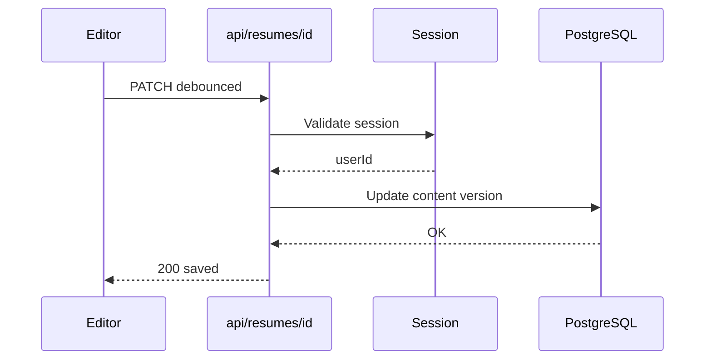
```mermaid
sequenceDiagram
  participant UI as Editor
  participant API as api/resumes/id
  participant AUTH as Session
  participant DB as PostgreSQL

  UI->>API: PATCH debounced
  API->>AUTH: Validate session
  AUTH-->>API: userId
  API->>DB: Update content version
  DB-->>API: OK
  API-->>UI: 200 saved
```

### 24.16 AI improve bullet (sequence)

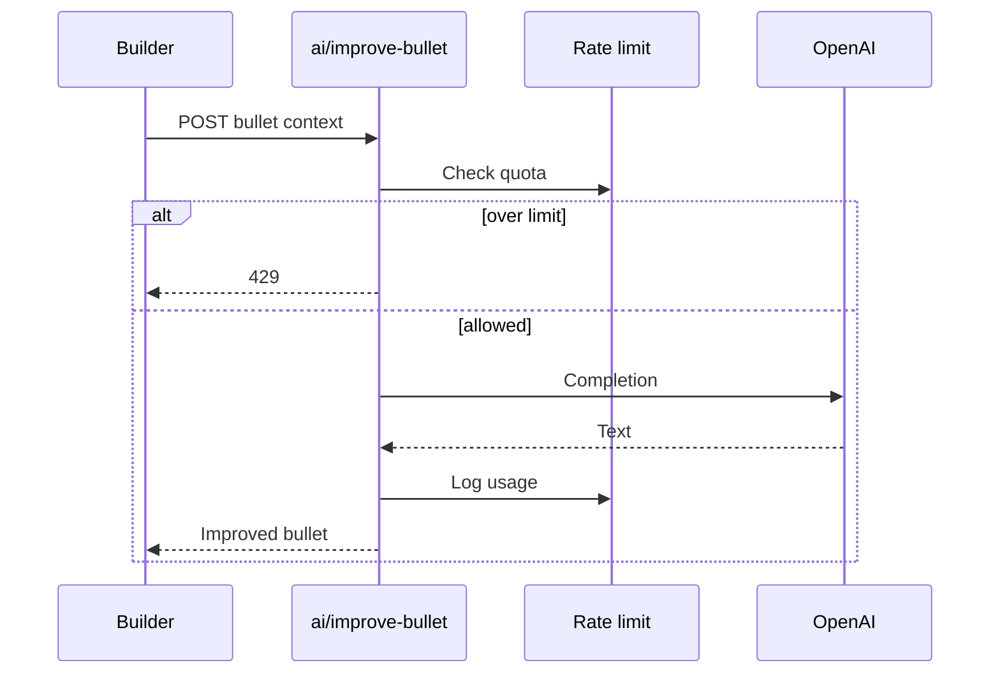
```mermaid
sequenceDiagram
  participant UI as Builder
  participant API as ai/improve-bullet
  participant RL as Rate limit
  participant OAI as OpenAI

  UI->>API: POST bullet context
  API->>RL: Check quota
  alt over limit
    API-->>UI: 429
  else allowed
    API->>OAI: Completion
    OAI-->>API: Text
    API->>RL: Log usage
    API-->>UI: Improved bullet
  end
```

### 24.17 ATS check (sequence)

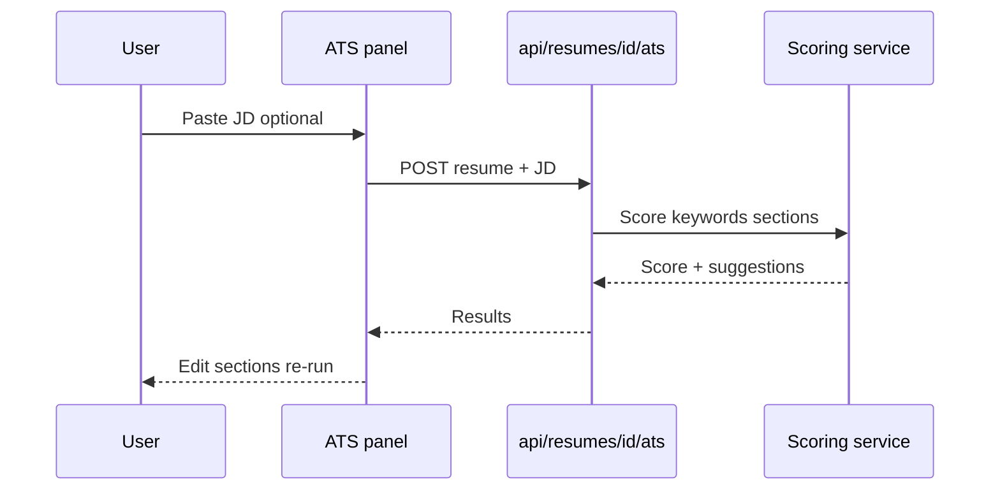
```mermaid
sequenceDiagram
  participant U as User
  participant P as ATS panel
  participant API as api/resumes/id/ats
  participant S as Scoring service

  U->>P: Paste JD optional
  P->>API: POST resume + JD
  API->>S: Score keywords sections
  S-->>API: Score + suggestions
  API-->>P: Results
  P-->>U: Edit sections re-run
```

### 24.18 Export and share (flow + sequence)

**Format decision**

```mermaid
flowchart TD
  Start([User taps Export]) --> Trial{Trial session?}
  Trial -->|Yes| Block[Signup or pricing CTA]
  Trial -->|No| Plan{Pro or pack?}
  Plan -->|TXT| TXT[Download TXT]
  Plan -->|HTML| HTML[Print HTML]
  Plan -->|PDF| PDF[PDF download log]
  Plan -->|DOCX| DOCXGate{Pro?}
  DOCXGate -->|Yes| DOCX[Download DOCX]
  DOCXGate -->|No| Price[/pricing]
```

**Public share link**

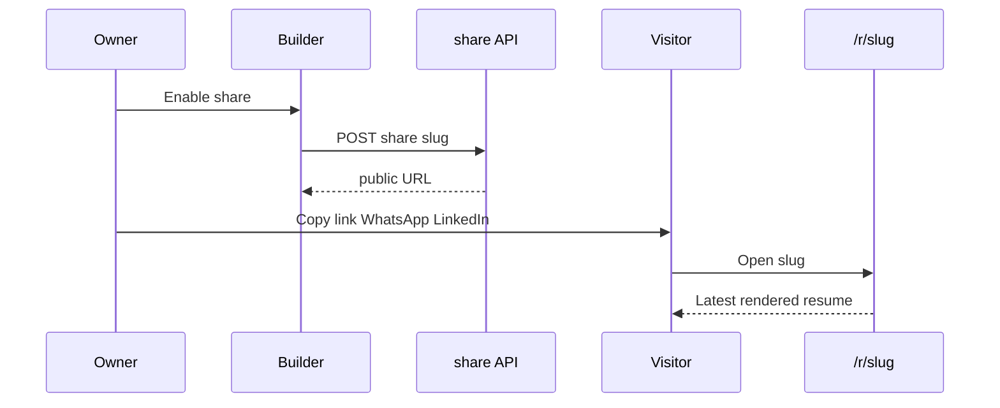
```mermaid
sequenceDiagram
  participant O as Owner
  participant B as Builder
  participant API as share API
  participant V as Visitor
  participant P as /r/slug

  O->>B: Enable share
  B->>API: POST share slug
  API-->>B: public URL
  O->>V: Copy link WhatsApp LinkedIn
  V->>P: Open slug
  P-->>V: Latest rendered resume
```

### 24.19 Export pipeline (data flow)

```mermaid
flowchart LR
  subgraph sources [Sources]
    RES[Resume JSON]
    TPL[Template metadata]
  end

  subgraph transforms [Transforms]
    HTML[HTML preview]
    TXT[TXT serializer]
    DOCX[DOCX server]
    PDF[Client PDF]
  end

  subgraph sinks [Sinks]
    DL[Download]
    LOG[ExportLog]
  end

  RES --> HTML
  RES --> TXT
  RES --> DOCX
  RES --> PDF
  TPL --> HTML
  TPL --> DOCX
  TXT --> DL
  HTML --> DL
  DOCX --> DL
  PDF --> DL
  DL --> LOG
```

### 24.20 Stripe checkout and webhook (sequence + activity)

```mermaid
sequenceDiagram
  participant U as User
  participant P as /pricing
  participant API as billing/checkout
  participant S as Stripe
  participant W as billing/webhook
  participant DB as Account

  U->>P: Choose plan
  P->>API: Create session
  API->>S: Redirect checkout
  S->>W: Subscription events
  W->>DB: Update subscription
  U->>P: Return success
  P-->>U: Pro unlocked UX
```

```mermaid
flowchart TD
  Start([Stripe webhook]) --> Sig{Valid signature?}
  Sig -->|no| Reject[401]
  Sig -->|yes| Idem{Seen event id?}
  Idem -->|yes| Dup[200 noop]
  Idem -->|no| Route{Event type}
  Route -->|checkout completed| Sub[Upsert subscription]
  Route -->|subscription deleted| Down[Downgrade tier]
  Route -->|other| Log[Log no-op]
  Sub --> Save[Persist DB]
  Down --> Save
  Save --> End([200 OK])
```

### 24.21 SuperProfile purchase fulfillment (sequence)

```mermaid
sequenceDiagram
  participant U as User
  participant SP as SuperProfile checkout
  participant WH as webhooks/superprofile
  participant DB as Database
  participant App as App session

  U->>SP: Pay productKey
  SP->>WH: Sale payload idempotencyKey
  WH->>DB: Match email user
  WH->>DB: Grant pro or pack
  U->>App: Refresh session
  App-->>U: Exports unlocked
```

### 24.22 Admin support and impersonation (flow)

```mermaid
flowchart TD
  A1[/admin/login] --> A2{Master allowlist OK?}
  A2 -->|no| U[Redirect user app]
  A2 -->|yes| A3[Admin home]
  A3 --> A4[Users trials promos jobs]
  A4 --> A5{Impersonate?}
  A5 -->|yes| A6[Session as user]
  A6 --> A7[Dashboard builder as user]
  A7 --> A8[End impersonation]
  A5 -->|no| A9[Revoke sessions audit export]
```

### 24.23 Scheduled jobs and trial lifecycle (timeline)

```mermaid
timeline
  title Vercel cron and trial UX
  section Daily UTC
    02:15 : trial-expired-downgrade
    02:30 : trial-expiry-reminders
    09:00 : health keep-alive
  section User session
    OTP verify : 5-min builder window
    Expiry : Overlay signup CTA
    Email segment : otp_try_expired
```

### 24.24 Lifecycle email swimlane

```mermaid
flowchart TB
  subgraph product [In-app events]
    E1[sign_up]
    E2[trial_start]
    E3[resume_created]
    E4[first_export]
    E5[ats_check_completed]
    E6[payment_success]
  end

  subgraph esp [ESP segments]
    S1[signed_up_no_resume]
    S2[resume_no_export]
    S3[otp_try_expired]
    S4[trial_active]
    S5[trial_ending]
    S6[paid_pro]
    S7[dormant_14d]
  end

  subgraph cta [Deep links]
    C1[/resumes/new]
    C2[Builder or /pricing]
    C3[/signup]
    C4[/dashboard]
  end

  E1 --> S1 --> C1
  E3 --> S2 --> C2
  E2 --> S3 --> C3
  E6 --> S6 --> C4
```

### 24.25 Onboarding checklist (flow)

```mermaid
flowchart LR
  D[Dashboard load] --> API[GET onboarding-status]
  API --> C{All steps done?}
  C -->|no| L[Show checklist card]
  L --> S1[Create resume]
  L --> S2[Fill sections]
  L --> S3[Run ATS]
  L --> S4[Export]
  S1 --> E[Mark step server-side]
  S2 --> E
  S3 --> E
  S4 --> E
  C -->|yes| H[Hide or dismiss]
```

### 24.26 Dashboard workspace hierarchy (current vs target)

```mermaid
flowchart TB
  subgraph today [Current stack]
    H[Header plus 4 CTAs]
    T[Trust stats bar]
    B[Banners]
    O[Full checklist card]
    E[Empty or list rows]
    H --> T --> B --> O --> E
  end

  subgraph target [Target hierarchy]
    H2[Greeting plus primary CTA]
    W[Compact alerts]
    M[Grid or empty hero]
    S[Sidebar checklist]
    H2 --> W --> M
    W --> S
  end
```

### 24.27 Resume builder — sections and template variants

```mermaid
flowchart TD
  BUILDER[Resume builder]

  subgraph LAYOUT [Layout variants]
    L1[single]
    L2[two-column]
    L3[dark-sidebar]
  end

  subgraph HEADER [Header variants]
    H1[default]
    H2[top-bar]
    H3[centered]
    H4[split]
    H5[dark-sidebar]
  end

  subgraph SECTIONS [Section types]
    S1[Contact Summary Objective]
    S2[Experience Education]
    S3[Skills Projects]
    S4[Certifications Languages]
    S5[Awards Volunteer Publications Interests Custom]
  end

  BUILDER --> LAYOUT
  BUILDER --> HEADER
  BUILDER --> SECTIONS
```

### 24.28 Editor early-session engagement (current vs ideal)

```mermaid
flowchart LR
  subgraph current [Current early session]
    land[Land on Summary]
    scan[Scan toolbar and rail]
    type[Type in Summary]
    tips[Read live tips]
    atsBlock[ATS signup wall]
    previewEmpty[Blank preview]
    land --> scan --> type
    scan --> tips
    scan --> atsBlock
    type --> previewEmpty
  end

  subgraph ideal [Ideal early session]
    focus[One primary focus]
    microWin[Micro-win per field]
    seeDoc[Preview updates]
    next[Clear next step]
    focus --> microWin --> seeDoc --> next
  end
```

### 24.29 Mobile posture (responsive vs mobile-priority)

```mermaid
flowchart LR
  subgraph today [Current posture]
    MF[Mobile-friendly CSS]
    MF --> Shell[Header footer forms]
    MF --> Mktg[Marketing pages]
    MF --> Gaps[Desktop-skewed UX]
  end

  subgraph target [Mobile-priority target]
    MP[Design for phone first]
    MP --> Proof[Mobile hero proof]
    MP --> Touch[44px targets]
    MP --> Product[Editor dashboard QA]
    MP --> Metrics[Device KPIs]
  end

  Gaps -.->|close gaps| MP
```

### 24.30 Public navigation — mega menu IA (mindmap)

```mermaid
mindmap
  root((Site header))
    Product
      Build
      Share
      App shortcuts
    Templates
      By style
      By stage
      By industry
    Solutions
      Fresher
      Experienced
      India use cases
    Resources
      Blog
      Examples
      Free tools
    Pricing
      Plans
      Pro Link
```

### 24.31 Runtime containers (deployment view)

```mermaid
flowchart TB
  subgraph browser [Browser]
    UI[React UI]
  end

  subgraph vercel [Vercel]
    EDGE[Edge middleware]
    SSR[Server components and APIs]
    CRON[Cron triggers]
  end

  subgraph data [Data]
    PG[(PostgreSQL)]
    BLOB[(Blob uploads)]
  end

  UI --> EDGE
  EDGE --> SSR
  SSR --> PG
  SSR --> BLOB
  CRON --> SSR
```

### 24.32 Layered architecture (conceptual)

```mermaid
flowchart TB
  subgraph presentation [Presentation]
    ROUTES[app pages]
    CMP[components]
  end

  subgraph api_layer [HTTP API]
    RH[api route handlers]
    MW[middleware]
  end

  subgraph domain [Domain services]
    AUTH[auth]
    BILL[billing]
    AI[ai ats]
    ADMIN[admin]
  end

  subgraph store [Data]
    PRISMA[Prisma]
    PG[(PostgreSQL)]
  end

  ROUTES --> RH
  CMP --> RH
  MW --> RH
  RH --> AUTH
  RH --> BILL
  RH --> AI
  RH --> ADMIN
  AUTH --> PRISMA
  BILL --> PRISMA
  AI --> PRISMA
  PRISMA --> PG
```

### 24.33 Actor collaboration boundary

```mermaid
flowchart LR
  subgraph external [External actors]
    VISITOR[Anonymous visitor]
    CUSTOMER[Subscriber]
    OPS[Admin operator]
  end

  subgraph app [Application packages]
    MKT[Marketing pages]
    USERAPP[Dashboard builder settings]
    ADMINAPP[admin cockpit]
    INT[billing AI email webhooks]
  end

  VISITOR --> MKT
  CUSTOMER --> USERAPP
  OPS --> ADMINAPP
  USERAPP --> INT
  ADMINAPP --> INT
```

### 24.34 Core UX entity relationships (ER)

```mermaid
erDiagram
  USER {
    string id PK
    string email
    string subscription
    boolean emailVerified
    boolean twoFactorEnabled
  }

  RESUME {
    string id PK
    string userId FK
    string title
    string templateId
    json content
    string publicSlug
  }

  COVER_LETTER {
    string id PK
    string userId FK
    string resumeId FK
    json content
  }

  EXPORT_LOG {
    string id PK
    string resumeId FK
    string userId FK
    string format
  }

  TRIAL_SESSION {
    string id PK
    string email
    datetime expiresAt
  }

  JOB_APPLICATION {
    string id PK
    string userId FK
    string jobId FK
    string status
  }

  USER ||--o{ RESUME : owns
  USER ||--o{ COVER_LETTER : creates
  USER ||--o{ EXPORT_LOG : generates
  USER ||--o{ JOB_APPLICATION : tracks
  RESUME ||--o{ EXPORT_LOG : tracked_in
  RESUME ||--o{ COVER_LETTER : optional_link
```

### 24.35 Domain aggregates (class diagram)

```mermaid
classDiagram
  class User {
    +String id
    +String email
    +String subscription
    +Json onboardingChecklist
    +Boolean twoFactorEnabled
  }

  class Resume {
    +String id
    +String userId
    +String templateId
    +Json content
    +String publicSlug
  }

  class ResumeVersion {
    +Int version
    +Json content
  }

  class CoverLetter {
    +String id
    +String userId
    +String resumeId
    +String templateId
  }

  class JobApplication {
    +String status
    +DateTime appliedAt
  }

  User "1" --> "*" Resume
  Resume "1" --> "*" ResumeVersion
  User "1" --> "*" CoverLetter
  Resume "1" --> "*" CoverLetter
  User "1" --> "*" JobApplication
```

### 24.36 Import resume (flow)

```mermaid
flowchart LR
  U[User upload PDF or DOCX] --> P[Parse API]
  P --> R[Review extracted sections]
  R --> C{Accept?}
  C -->|yes| N[Create resume importSource]
  C -->|no| U
  N --> E[Editor fix gaps]
```

### 24.37 Cover letter journey (flow)

```mermaid
flowchart LR
  H[/cover-letters] --> N[/cover-letters/new]
  N --> E[/cover-letters/id/edit]
  E --> AI[AI customize JD]
  E --> X[Export TXT or DOCX]
  AI --> E
```

### 24.38 Interview prep journey (flow)

```mermaid
flowchart TB
  I[/interview-prep] --> T[Prep track checklist]
  I --> Q[Question categories]
  Q --> A[AI answer helper]
  A --> C[Copy refine answer]
  T --> I
```

### 24.39 Content funnel (blog and examples)

```mermaid
flowchart LR
  SEO[Search social] --> B[/blog or /examples]
  B --> R[Read article or example]
  R --> CTA[Try signup templates]
  CTA --> CORE[Dashboard or builder]
```

### 24.40 Capability gating (decision)

```mermaid
flowchart TD
  A[User action] --> Auth{Signed in?}
  Auth -->|no| MKT[Marketing or /try]
  Auth -->|yes| Trial{Trial only?}
  Trial -->|yes| Tlim[Time and export limits]
  Trial -->|no| Tier{Pro or pack?}
  Tier -->|yes| Full[Full templates exports AI quota]
  Tier -->|no| Basic[TXT HTML share limited AI]
```

---

## 25. Route index

### Public and marketing

| Path | Role in UX |
|------|------------|
| `/` | Home |
| `/about` | About |
| `/features` | Capability explorer |
| `/pricing` | Plans and checkout entry |
| `/templates` | Template gallery |
| `/resume-link` | Share-link SEO landing |
| `/lp/resume-builder-india` | SEO landing |
| `/lp/resume-export-pdf-docx-india` | Export-focused landing |
| `/lp/fresher-campus-resume-india` | Fresher/campus landing |
| `/lp/tailor-resume-job-description` | JD tailoring landing |
| `/try`, `/try/templates` | OTP trial funnel |
| `/blog`, `/blog/[slug]` | Content |
| `/examples`, `/examples/[slug]` | Example resumes |
| `/jobs` | Job board (signed-in) |
| `/interview-prep` | Interview helper |
| `/login`, `/signup`, `/forgot-password`, `/reset-password`, `/verify-email` | Auth |
| `/terms`, `/privacy` | Legal |
| `/introduction-resumedoctor-email` | Email campaign landing |

### Authenticated app

| Path | Role in UX |
|------|------------|
| `/dashboard` | Hub |
| `/settings`, `/settings/change-email/verify` | Account |
| `/resumes/new`, `/resumes/[id]/edit` | Create and edit |
| `/cover-letters`, `/cover-letters/new`, `/cover-letters/[id]/edit` | Cover letters |
| `/login/2fa` | Second factor |
| `/pricing/verify-trial` | Manual trial verification |

### Other

| Path | Role in UX |
|------|------------|
| `/r/[slug]` | Public resume |
| `/admin`, `/admin/login`, `/admin/users`, … | Operations |
| `/dev/preview/[templateId]` | Template preview (dev) |

---

## 26. Related documents

| Document | Use when you need |
|----------|-------------------|
| [`.cursor/plans/project_blueprint.plan.md`](../.cursor/plans/project_blueprint.plan.md) | Routes, APIs, ER diagrams, cron, architecture |
| [`USER-WORKFLOW.md`](./USER-WORKFLOW.md) | Alternate copy of the master flowchart and ER diagram |
| [`PRD-ROLE-BASED.md`](./PRD-ROLE-BASED.md) | Acceptance criteria by agent role |
| [`FREE-TRIAL-WORKFLOW-PLAN.md`](./FREE-TRIAL-WORKFLOW-PLAN.md) | OTP trial implementation detail |
| [`LIFECYCLE-EMAIL.md`](./LIFECYCLE-EMAIL.md) | Email segments and sequences |
| [`MESSAGING-BRIEF.md`](./MESSAGING-BRIEF.md) | Voice and positioning |
| [`WBS-WORK-BREAKDOWN-STRUCTURE.md`](./WBS-WORK-BREAKDOWN-STRUCTURE.md) | Task IDs and delivery phases |

---

*Maintainers: when adding a user-facing route or changing gating, update this file and the route catalog in the project blueprint in the same change.*
