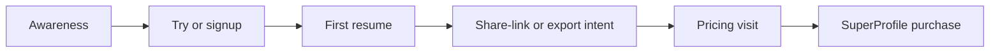

# `email-templates/` — broadcast & lifecycle email assets

Static, hand-tuned HTML/text email assets for ResumeDoctor marketing
sends. The repo's transactional pipeline lives elsewhere
(`src/lib/email.ts`, ZeptoMail); this folder holds **broadcast / cold
intro** templates that are uploaded into an ESP and sent to lists.

If you change positioning here, also update
[`docs/MESSAGING-BRIEF.md`](../docs/MESSAGING-BRIEF.md) so the site, in-app
copy, and email keep saying the same thing.

---

## Files

| File | Purpose |
| --- | --- |
| `introduction-resumedoctor.html` | Primary HTML body for the intro broadcast (TOFU). 600px max-width table layout, inline styles, Poppins → Arial fallback, light-mode-first. |
| `introduction-resumedoctor.txt` | Plain-text MIME companion for multipart sending. Mirrors the HTML's headlines, bullets, and UTM links. |
| `README.md` | This file: ESP setup, merge tags, deliverability, funnel mapping, experiments, and the ZeptoMail wiring recipe. |

> **Hero image:** the HTML defaults to `https://www.resumedoctor.in/og-image.png`
> (self-hosted, full HTTPS). To swap to a dedicated 600 px banner, export
> a JPEG/PNG (≤ 200 KB), upload it under `public/` so it serves from
> `https://www.resumedoctor.in/<filename>`, then change the ``
> on line 48 of the HTML and the `alt` text. Do **not** hotlink from
> SuperProfile or third-party CDNs.

---

## ESP merge tags used in this template

The HTML and text intentionally hard-code only the marketing copy and
internal links. Any value that varies per recipient or per send is a
double-curly merge tag — replace with your ESP's syntax.

| Merge tag | Purpose | Required? | Notes |
| --- | --- | --- | --- |
| `{{UNSUBSCRIBE_URL}}` | One-click unsubscribe link in footer. | **Yes** for any non-transactional send | Map to your ESP's per-recipient unsubscribe token. Many ESPs auto-inject this, but the `<a>` is already in place so you can keep the design control. |
| `{{PREFERENCE_CENTER_URL}}` | Email preferences page (frequency / topic opt-out). | Recommended | If you don't have a preference center yet, point this to a `/email-preferences` route or remove the link block in the footer. |

There are **no** per-recipient `{{first_name}}` / `{{email}}` merges in
the intro because the body is intentionally cohort-level (TOFU). If you
add personalisation later, also add a graceful fallback (e.g.
`{{first_name|default:"there"}}`).

---

## Test checklist before any broadcast

Run all of these before you press Send. Most failures show up on
mobile + Outlook.

1. **Inbox preview**
   - [ ] Subject line ≤ 50 characters, no ALL CAPS, no `!!!`, no fake `Re:`.
   - [ ] Preheader is the line **after** the `<title>` and reads as a real
         continuation of the subject (currently: *"Create your resume in
         under 5 minutes…"*).
2. **Visual rendering** (Litmus, Email on Acid, or HEY's `/preview`)
   - [ ] Gmail web + iOS + Android.
   - [ ] Outlook 2019 / Outlook 365 web (the worst offender — table layout
         and `bgcolor` should keep the buttons visible).
   - [ ] Apple Mail iOS + macOS.
   - [ ] Yahoo Mail web.
3. **Mobile**
   - [ ] At ≤ 620 px viewport, the three plan cards stack (`.stack` rule
         in the `<style>` block). Verify on a real phone if possible.
   - [ ] Tap targets ≥ 44×44 px (CTA button is 14 px padding around 16 px
         text — fine).
4. **Links**
   - [ ] Every internal link carries `utm_source=email`,
         `utm_medium=intro`, `utm_campaign=introduction-tofu`, and a
         `utm_content` slot. (15 hrefs total; verify with
         `rg "resumedoctor.in/" introduction-resumedoctor.html`.)
   - [ ] No `localhost`, `vercel.app`, or non-`www` hosts.
   - [ ] No SuperProfile `create-payment-page/…` URLs in the body — the
         only paid links go to `/pricing`.
5. **Plain text**
   - [ ] `introduction-resumedoctor.txt` is uploaded as the MIME `text/plain`
         alternative. Spam filters penalise HTML-only sends.
6. **Compliance copy**
   - [ ] Footer shows: real legal entity name, postal address (replace
         `[Legal Entity Name]` and `[Postal Address]`), one-click
         unsubscribe, working preference-center link.
   - [ ] If sending to addresses you obtained outside ResumeDoctor signup,
         confirm you have an opt-in trail.
7. **Send a real seed test** to a personal Gmail, an Outlook, and the
   `support@resumedoctor.in` mailbox. Read it on a phone.

---

## Deliverability — DNS, ESP, content, list hygiene

### Sending domain authentication

Whichever ESP you broadcast through, the sending domain (`resumedoctor.in`
or a subdomain like `mail.resumedoctor.in`) needs:

| Record | Why | How |
| --- | --- | --- |
| **SPF** | Tells receivers which servers may send for your domain. | Add the ESP's `include:` to a single `v=spf1 …` TXT record. Don't ship multiple SPF records. |
| **DKIM** | Cryptographically signs each message so receivers can verify it wasn't altered. | ESP gives you a `<selector>._domainkey` CNAME or TXT — publish it. |
| **DMARC** | Policy + reporting on top of SPF/DKIM. | Start with `p=none; rua=mailto:dmarc@resumedoctor.in;` for a few weeks, then move to `p=quarantine` once aligned. |

> The transactional path uses **ZeptoMail** (see `src/lib/email.ts`).
> The ZeptoMail-verified domain you used for OTP and password reset is
> already SPF/DKIM-aligned for transactional. **Marketing broadcasts
> from a different ESP need a separate alignment** — don't assume the
> transactional setup covers a different sender host.

### Sender + warmup

- **Display name:** `ResumeDoctor` (consistent with `EMAIL_FROM` env in
  prod). Avoid generic friendly-from names like "The Team".
- **Reply-to:** `support@resumedoctor.in` (matches the transactional
  default).
- **Warmup:** if the broadcast domain is new, ramp from ~50/day to your
  target volume over 2–3 weeks. Sudden spikes from a cold IP/domain
  trigger throttling at Gmail/Microsoft.

### Content discipline (per send)

- **Subject:** honest, specific, ≤ 50 chars. No fake `Re:`/`Fwd:`, no
  urgency theatre.
- **Preheader:** finishes the subject's thought, doesn't repeat it.
- **HTML / text balance:** every send must include the `.txt` companion.
- **One primary ask:** the bulletproof button to `/try`. Secondary
  `/pricing` and tertiary `/resume-link` are plain links — don't promote
  them to buttons in the intro.
- **Voice:** follow [`docs/MESSAGING-BRIEF.md`](../docs/MESSAGING-BRIEF.md).
  Lead with create / maintain / manage / share-as-link in user language.
  ATS is a deep feature, never the lead.
- **List-Unsubscribe headers:** for any non-transactional broadcast,
  the ESP must inject **both** `List-Unsubscribe: <mailto:…>, <https:…>`
  and `List-Unsubscribe-Post: List-Unsubscribe=One-Click` (RFC 8058).
  ZeptoMail accepts a `mime_headers` map per send (see
  `src/lib/email.ts` — the trial-reminder pattern is the closest
  reference).

### List hygiene & compliance

| Practice | Action |
| --- | --- |
| **Double opt-in** for cold lists | Confirmation email before any marketing send. Single opt-in is fine for users who explicitly registered on `/signup`. |
| **Bounce handling** | Hard-bounce: suppress permanently. Soft-bounce ≥ 3 in 30 days: suppress. |
| **Complaints** | Any `abuse` / `feedback-loop` complaint → suppress permanently and never email again. |
| **Engagement segmentation** | After 60 days of zero opens, drop to a "winback" cadence; after 120 days of zero opens, suppress. |
| **Indian audience** | Honour DND-style preferences and provide a clear sender identity in the footer. |
| **Global promotional rules** | Comply with CAN-SPAM (US) and GDPR (EU) when in scope: physical address, identifiable sender, working opt-out within 10 days. |

---

## Funnel — TOFU / MOFU / BOFU

The intro template is the **TOFU** asset. Map its follow-ups to the
segments and events already defined in
[`docs/LIFECYCLE-EMAIL.md`](../docs/LIFECYCLE-EMAIL.md).

| Stage | Goal | Email(s) | Lifecycle trigger | Primary CTA |
| --- | --- | --- | --- | --- |
| **TOFU** | Awareness → first session | **`introduction-resumedoctor.html`** (this file), "Templates for Indian portals" | List opt-in / cold list (no in-product event yet) | `/try` |
| **MOFU** | Activation → value proof | "Stuck without exporting", "Tighten with the JD match", "Publish your resume link" | `sign_up`, `trial_start`, `resume_created` (no `first_export` after 3 days) | Builder, `/resume-link`, `/pricing` |
| **BOFU** | Decide → purchase | India 14-day pass midpoint, "Unlock exports — same email on SuperProfile", optional renewal reminder | Pricing visit, `ats_check_completed`, India trial day 7 of 14 | `/pricing` → SuperProfile checkout |

### Events to wire (from `docs/LIFECYCLE-EMAIL.md`)

`sign_up`, `trial_start`, `resume_created`, `first_export`,
`payment_success`, `ats_check_completed`, `onboarding_completed`.

For the new positioning, also start tracking:

- `resume_link_published` — fired when the user toggles a resume to
  public (`Resume.publicSlug` is set in
  [`prisma/schema.prisma`](../prisma/schema.prisma)).
- `resume_link_shared` — optional client-side event when the user clicks
  a share-target on the publish modal.

These two underpin the MOFU "share-link" branch — without them, the
funnel can't tell whether someone tried the headline feature.

### ESP segments to create

Match the segment definitions in `docs/LIFECYCLE-EMAIL.md` 1:1, plus
two new ones:

| Segment ID | Definition | Use for |
| --- | --- | --- |
| `signed_up_no_resume` | Account created, zero resumes | Welcome day-2 nudge |
| `resume_no_export` | ≥ 1 resume, no export log | Stuck-after-first email |
| `resume_no_link` *(new)* | ≥ 1 resume, no `resume_link_published` event | "Publish your link" MOFU email |
| `link_published_no_paid` *(new)* | Has a published link, never paid | "Want a portal-ready PDF?" gentle BOFU |
| `otp_try_expired` | Try session ended, not signed up | Try-abandon email |
| `trial_active` / `trial_ending` | India 14-day pass active / day 10–14 | Activation + upgrade |
| `paid_pro` | Active Pro | Retention, referral asks |
| `dormant_14d` | No login 14 days | Re-engagement |

---

## A/B experiment plan for the intro

Run **one** test on the intro before scaling the broadcast. Two
variables maximum, otherwise the result is unreadable.

### Test 1 — subject line

| Variant | Subject |
| --- | --- |
| A (control) | `Your resume, but as a link you can share` |
| B (outcome) | `Stop sending PDF attachments — share one link instead` |
| C (curiosity) | `One link. Always up to date. (Even on WhatsApp.)` |

Hold preheader, body, and CTAs constant across A/B/C.

### Test 2 — primary CTA destination

| Variant | Button label | Destination |
| --- | --- | --- |
| A (control) | `Start with Try` | `/try` |
| B (link-led) | `Get your resume link` | `/try` (same destination, different framing in copy + button) |

Variant B requires also changing the secondary plain-link wording so the
two don't collide.

### Metrics to track

| Layer | Metric | Source |
| --- | --- | --- |
| Email | Delivery, open, click, complaint, unsubscribe | ESP dashboard |
| Site | `/try` start, `/signup` complete, `resume_created`, `resume_link_published`, `first_export` | GA4 + server analytics |
| Revenue | `payment_success` (SuperProfile webhook → `fulfillSuperprofilePurchase`) attributable to `utm_campaign=introduction-tofu` | Internal (UTM stored on session) |

Review cadence: **48 h** for delivery / open / click signals, **14 days**
for the conversion tail (someone who opened on day 0 may not buy until
day 12, especially if they hit the pricing page on a phone first).

---

## Wiring this template into automated sends (optional)

If you ever want to fire this intro from inside the app instead of a
separate ESP — for example, on a specific cohort flag — the path is:

1. **Load the HTML at build time**, not runtime, so Next.js bundles it.
   Move it to `src/email/introduction-resumedoctor.html` (or keep it
   here and read with `fs.readFileSync` at module scope).
2. **Substitute the merge tags** (`{{UNSUBSCRIBE_URL}}`,
   `{{PREFERENCE_CENTER_URL}}`) before passing to `send()` —
   `String.prototype.replaceAll` is sufficient, or use a tiny templater
   like `mustache` if you ever need recipient personalisation.
3. **Send via `src/lib/email.ts`** (ZeptoMail). The signature is
   already `{ to, subject, html, text, headers? }`. Pass:
   - `subject` from your A/B test config.
   - `html` from the file (post-substitution).
   - `text` from `introduction-resumedoctor.txt` (post-substitution).
   - `headers` containing `List-Unsubscribe` (`<mailto:…>, <https:…>`)
     and `List-Unsubscribe-Post: List-Unsubscribe=One-Click`. The
     existing trial-reminder code is the closest pattern in the file.
4. **Throttle** sends to ≤ 100/sec from a single Vercel function and
   chunk large lists — ZeptoMail enforces per-account rate limits.

> Until then: keep the file here, upload manually to your ESP for each
> broadcast, and let the ESP handle the unsubscribe / preference token
> injection.

---

## When to refresh

Refresh this README **and** the HTML/text bodies whenever:

- The MESSAGING-BRIEF positioning changes (today: create / maintain /
  manage / share-as-link).
- Pricing tier names, prices, or limits change in
  `src/app/pricing/page.tsx`.
- A new high-priority feature is launched that should appear in the
  intro (currently the resume link is the lead).
- A new lifecycle event is added that the funnel section above should
  reflect.

Last updated: 2026-05-10 — repositioned around four user-language
pillars; added `/resume-link` tertiary CTA; bullet order rewritten
around shareable link first.
